初来乍到
========

开学准备
--------

### 加入新生群

在在读学生QQ群里，你可以和同学们一起相互了解、共享资源、分享经验，也可以找到一些老师和学长学姐。在熟悉使用学校邮箱之前，重要通知也会通过QQ群发布，记得加入：

-   19级本科生群 524242733

-   19级研究生群 724340744

新生群仅允许学生本人加入，请提醒你的家长不要给管理员和大家带来不必要的麻烦，同时加入时请注明自己的地区与姓名。也请不要与外校同学分享QQ群号。

### 打包行李

也许你已经习惯了住宿的生活，又或许这是你第一次体验宿舍生活。也许你从家到学校只需要骑车20分钟，又或许需要坐过夜的火车。打包行李总是需要花不少精力去做的一件事。值得注意的是，军训所需要的行李与平日宿舍生活所需的行李略有差别，建议打包时做好相应区分，将平日在宿舍所用的物品先行寄存在校园内而不必带去东方绿舟。

### 必备文件、身份证明与档案材料

-   身份证、团员证等身份证件及高中毕业证书的原件及复印件

-   录取通知书原件

-   证件照（为了不在未来四年留下黑照，千万要提前准备好哟）
    （备好1寸及2寸至少各一版）

-   户口材料（仅限计划迁户口的同学）

-   你自己

### 宿舍基本生活用品

-   衣物

-   洗漱用品

-   床上用品（可以考虑到校购买）

-   棉花毯或床垫（研究生床垫为1m\*1.9m，本科生为0.9m\*2m）

-   床单

-   枕头

-   被子

-   竹席

-   蚊帐或遮光帘（研究生宿舍还需要思考如何把蚊帐挂起来）

-   排插（本科生宿舍每个床位下配备2个国标壁插，务必购买优质排插以避免安全隐患，可以选用带有抗电涌功能的排插保护电器免遭损坏）

-   台灯（注意购买灯泡的规格、色调，可以考虑到校购买）

Tips：报到前学校会提供打包的全套基础生活用品（详见录取通知书），报到时学校也会组织厂商在校内售卖一些常用的生活用品，可根据需要自行购买。

### 军训必备用品

-   常用药品、医疗用品（场地亦有医疗配备）。需要使用特殊药品的同学请务必记得带上自己的药。

-   日化用品

    -   花露水/清凉油/风油精

    -   防晒霜

    -   驱蚊液

    -   洗衣粉/洗衣液

-   换洗内衣及少量衣物（军训大部分时间穿着作训服，不需要带过多衣物）（记得带几个便携晾衣架哦～）

-   雨具（军训期间可能会发放雨披，尽量不要携带长柄伞，以免放置不便）(删除,学校今年不发了)

-   水杯（千万不要塑料杯，也尽量摈弃没有外套的玻璃杯，不然在军训的时候当你想喝水的时候，会发现杯子就像刚从火炉里拿出来的一样哦）

-   洗漱用品

    -   拖鞋（以及备用的军训用鞋）

    -   衣架（军训场地有衣架，但不保证够用）

-   小挂锁（门口有小储物盒，可用小挂锁锁住。也可以只使用自己带锁的行李箱）

-   女生的护理用品（训练强度远达不到要用来当鞋垫的地步）

-   零钱（如果丢了帽子得自己掏钱再买，另外东方绿舟里面有个小超市，适量携带，不宜过多）

-   零食（小超市的价格比较高，可以考虑自带，适量携带，吃不完就很尴尬了）

-   排插与充电器

关于网络访问，东方绿舟部分区域有i-Shanghai免费Wi-Fi热点与ChinaNet热点同时覆盖，所以基本不用担心流量的问题。

如果需要对军训内容等方面有一些初步了解，可以先看看以往五届学长学姐的军训照片：

-   *2014级：*<http://www.shanghaitech.edu.cn/2014/0919/c1001a11418/page.htm>

-   *2015级：*<http://www.shanghaitech.edu.cn/2015/0910/c1001a11597/page.htm>

-   *2016级：*<http://www.shanghaitech.edu.cn/2016/0901/c1001a11802/page.htm>

-   *2017级：*<http://www.shanghaitech.edu.cn/2017/0910/c1001a11947/page.htm>

-   *2018级：*<http://www.shanghaitech.edu.cn/2018/0907/c1001a33811/page.htm>

## 手机卡与银行卡

### 手机卡

上科大在新生入学时不配发来自任何运营商的电话卡。同学有自行选择运营商的权利。在报到时，三大电信运营商均会前来设摊，提供的手机卡自带校园套餐资费一般优惠程度非常大，且在校外无法获得，需要的同学记得抓住报到时的机会购买新的上海本地手机号。

对于来自外地的同学而言如果已经在当地使用了不计漫游、长途、外地流量的手机号（三大运营商宣布从
2018 年 7 月 1
日起全面取消通话以及流量等漫游费用，不含港澳台），那么也可以选择在上海直接使用现有的号码，缺点在于外地卡不能在上海做任何的业务办理，包括补卡等。

目前三大运营商在学校室外都有良好的 4G 信号，学校在室内已经基本全范围覆盖 SSID 为
ShanghaiTech ， STULAN-student 或 eduroam的可用 Wi-Fi 。

### 银行卡

入校后经过拍照等手续，每位同学都会领取到兼具银行卡与校园一卡通功能的上海银行-上海科技大学联名卡。这张卡一共有3种不同的余额账户。

-   储蓄账户：就是普通的活期储蓄存款，可用于网银等支付用途（需自行前往上行网点开通网银业务）；

-   电子现金账户：用于银联的离线闪付（非 Apple Pay /
    HEC云闪付）。大部分POS机与校外部分自动售货机支持，需要注意的是存入电子现金账户的圈存余额一旦存入后就无法转入储蓄账户或者提现；

-   校园一卡通账户：用于校内消费，如食堂就餐等，也属于圈存性质，可以使用现金充值或者储蓄账户余额转存。（自助终端：银行服务------银校转账）校园一卡通也可通过
    支付宝-校园工作-一卡通的入口和微信关注企业号转账的方式进行充值。支付宝需要绑定学号，微信企业号需要绑定邮箱。

若不慎丢失校园卡，可带上身份证到学生活动中心东侧一楼的上海银行办理补办。

在办卡时可能会有问需不需要办理信用卡，这个根据个人情况决定，不是必须选项。

上海银行-上海科技大学联名借记卡兼校园一卡通

### 现金/电子支付

由于上海大部分生活消费都能使用支付宝（不管是饿了么叫外卖还是便利店消费）或者网银（如京东），现金需求一般不大。学生活动中心一楼东侧有上海银行支行网点，图书馆有上海银行与的自助存取款一体机，其他银行发行的银行卡在进行业务操作时可能会收取跨行手续费。

在上海，不管校内校外，电子支付已经是主流支付方式。因而来校前开通支付宝/微信支付是十分必要的。请在使用电子支付渠道之前完成银行卡的支持工作。如需使用学校的上海银行的银行卡进行网上/手机支付的话，需要在银行认证手机号，并办理相关服务，方可使用支付宝/微信支付进行银行卡的绑定。(但学校在开学一段时间之后才会统一办理上海银行电子业务，在此之前不能去上海银行认证手机号，请耐心等待，最好提前完成其他银行卡的支持工作)

学在科大
========

教学机构
--------

上科大目前有物质、生命、信息、创管与创艺五大学院，另有数学科学研究所、通识教育中心提供课程。每位同学入校时都会依照所填志愿进入对应的学院。在五大学院中，创管、创艺学院不独立招生，但开设了种类繁多的相应门类课程、并可能提供相应学科方向的辅修机会。通识教学中心则主要负责数学课程、体育课程、语言类课程、文明通论系列课程以及人文艺术社科类通识选修课的开设。

### 通识教育中心

通识教育中心是各个学院以外专门设立的机构，负责通识课程的开设和管理。通识课程包括思政类、数学类、人文类、社科类、艺术类、科创类等课程。

*网站：*<http://ge.shanghaitech.edu.cn>

### 物质科学与技术学院 SPST

院长：杨培东

旗舰学术会议：ShanghaiTech Advances in Research (STAR) Symposium

上海科技大学物质科学与技术学院依托中科院优秀人才团队，利用上海周边国家实验室一流的科研设施集聚世界领先的师资和学生。我们以打造具有国际水准的材料、能源和环境领域原创性研究与教育中心为目标，注重基础和交叉学科建设，鼓励学术自由与创新，鼓励基于基础理论的大胆的原创想法，鼓励交叉合作和技术转换，并将积极为相关技术的产业化提供原创思想和解决方案。

物质学院细分为系统材料学、光子科学与凝聚态物理、材料与物理生物学、大科学平台发展四个研究部，这四个部门将通过推进材料科学领域的基础研究来应对全球能源与环境的挑战；通过发展实验和理论方法，在不同时间与空间尺度条件下设计、发现以及理解新材料及有关现象；通过不同领域之间的交叉合作，寻求材料科学研究的突破，培养新一代材料、化学和物理方面的科学家。

物质学院于2013年招收了第一届研究生，2014年招收了第一届本科生。截止2017年9月，本科生共396名，研究生共416名。学院常任教授45人，中科院特聘教授112人，国际特聘教授7人。物质学院从2013年至2015年已经购置了1.4亿的科研设备，将建设一个联盟（上海科技大学-湾区联盟），三个研究部和相关实验中心。学院成立至今国内外的学术交流活动也相继展开，2015年度，物质学院有30多场海内外的学术报告，同时在6月份举办了第一届
"STAR（ShanghaiTech Advances in Research）"
国际会议。上科大物质学院是正在成长的全新学院，但这里名师汇集，这里充满了挑战。

*网站：*<http://spst.shanghaitech.edu.cn>

### 生命科学与技术学院 SLST

院长：林海帆

执行院长：吴家睿

旗舰学术会议：前沿论坛系列（2016年：Cell Biology，2017年：Genetics and
Genomics）

上海科技大学生命科学与技术学院依托中国科学院上海地区生命科学领域的优秀人才队伍和国际一流的研究设备，利用张江地区的多学科研究力量和生物医药研发优势，打造一所达到国际高水准的研究型学院。学院将积极探索教学、科研、转化三者相结合的发展模式，培养适应未来生命科学发展的高端研究人才；适应生物技术行业快速扩张的优秀创业人才；以及满足健康医学需求的新型技术人才。

学院将根据生命科学的热点和前沿设置相应的教学单元和研究单元，鼓励不同学科之间的交叉，强调基础研究与应用研究紧密整合的转化型研究模式，注重教学与科研的相互融合。目前计划在蛋白质科学与生物技术、系统生物学与转化医学、干细胞生物学与再生医学、定量生物学与分子影像学、化学生物学与创新药物等方面开展教学与科研工作。

在师资建设方面，学院将以青年优秀人才为主，强调教学与科研能力并重，专职与兼职教师协调发展，打造一支勇于创新、富有激情，结构合理的人才梯队。

在本科生培养过程中，学院将为学生打下坚实的数理化基础，使学生掌握生命科学的基础知识与前沿动态，并在此基础上培养学生宽阔的多学科交叉视野。从大学二年级开始，鼓励学生涉足实践型、研究型训练，培养良好的技术知识和操作能力，并为优秀学生提供参与高层次研讨活动的机会。通过小组讨论以及教师与学生的互动，培养学生的学术交流能力，引导学生进行开放性思考，强化学生的理解与批判能力。

在研究生的培养过程中，学院将着重培养学生成为一名成功的创新型研究人才，使学生具备知识获取和学术鉴别的能力，具备学术交流和学术创新的能力，能以坚实的生命科学专业和宽广的相关学科知识技能，探索生命科学领域中的重要科学技术问题。在整个培养过程中，学生将获得科研经验丰富的导师的悉心指导。学院的研究生还将获得如何进行专业研究报告、如何撰写待发表的优秀论文、以及如何完成有效的教学任务的训练。

学院同样热烈欢迎其他非生命科学学院的同学选修生命科学的课程。对基本生物学原理的理解能够使我们更好地认识生命和人类自身。同时，对生命过程的了解将提升我们对这个人类赖以生存的星球的认识，并学会欣赏它的多样性和独特性。

*网站：*<http://slst.shanghaitech.edu.cn>

### 信息科学与技术学院 SIST

创始院长：王雪红

副院长：虞晶怡、周宇

旗舰学术会议：Annual ShanghaiTech Symposium on Information Science and
Technology (ASSIST)、ShanghaiTech Workshop on Emerging Devices, Circuits and
Systems (SWEDCS)

信息科学与技术学院（School of Information Science and
Technology）致力于聚集和成就未来信息科学领域的学术大师，培养和团结信息技术及相关应用领域的创新人才和创业领袖，力争在信息科学与技术的重点领域取得突破性和前沿性的创新成果，实现新科学和新技术的快速转化和产业化，孕育并服务于信息通信领域的国际领军高科技企业。

本学院的科研工作将面向全球重大战和国家战略需求，充分发挥长三角地区在人才、资金、科技产业和政策等方面的优势，吸引和聚集一批具有国际声誉的学术带头人来建立国际领先的关键技术研究实验室，通过与国内外顶尖大学、科研机构和高科技企业通力协作，掌握并引导国际信息科技的发展趋势，集中力量攻克核心技术难题，踊跃承担和支撑国家重大科研任务。

本学院的教学工作将采用导师负责制，面向最前沿、最尖端的信息科技研究领域及其迅猛发展趋势，积极开展与国际顶尖大学、科研机构和高科技企业的合作与交流，为学生提供个性化教学和培养计划，开设先进实用的专业课程，提供国际合作的本硕双学位计划，强化结合实际的企业实习和社会实践活动，注重培养学生的国际视野、团队精神、领导才能、创新和创业能力。

本学院将以我们的毕业生之科技和创新成就为荣耀和成功标志，真正成为科学领导者、技术创新者与未来革新企业创办者的乐园和摇篮。

*网站：*<http://sist.shanghaitech.edu.cn>

*信息学院主办国际学术会议：*[SSIST](http://ssist.shanghaitech.edu.cn)、[SWEDCS](http://swedcs2016.shanghaitech.edu.cn/)

### 创业与管理学院 SEM

院长：方汉明

旗舰学术会议：Academic Workshop on the Intersection of Science,
Entrepreneurship, and Innovation

创业与管理学院（简称：创管学院）是为实现上海科技大学
"培养创新创业人才"的办学使命而搭建的教育服务平台。

我们的目标是鼓励和激发我校每一位学生与生俱来的好奇心和求知欲，提升他们的创造力和创造性信心。这里不仅教授学生批判性思维与技能，帮助学生学习如何创新；我们还将汇集设计思维、艺术及其他创新工具，为学生提供跨学科领域的形式多样的课程。对于那些拥有创业梦想的学生，我们也会提供诸如商业机会识别、创业融资以及公司运营等一系列的创业基础课程。

创管学院将定期举办各类活动，与国内外风险投资机构、成功的创业家（包括在大学任教的科学家）、律师以及企业高管合作，为学生们打造导师计划并提供实习机会。

我们的活动旨在不断向学生灌输社会责任感。我们希望学生们不仅以自己的热情和能力"办好事"、"把事办好"，还要努力解决当前社会所关注的、具有极大挑战的社会问题，如照料老人、城市交通拥堵、教育问题等。

在这里，你们将感受到不同于一般传统商学院的学习氛围：小班授课（每班20至30
个学生）以及高度强调互动体验式学习的授课形式。我们不支持老师一味灌输知识的授课方式，充分讨论、互动和实践才是我们坚持的课堂氛围和教学理念。我们的教授团队来自世界各地，其中不乏在加州大学伯克利分校、哈佛大学、斯坦福大学等世界著名高等院校执教的优秀教师。"

创管学院致力于让上海科技大学的每一位学生在学成离校之时，都能具备实现其梦想所需的能力和必备的核心技能，无论他们的梦想是成为诺贝尔奖获得者、自主创业的企业家，还是服务于社会的公务人员。

上海科技大学创业与管理学院热切期待着你们的到来！

*网站：*<http://sem.shanghaitech.edu.cn>

### 创意与艺术学院 SCA

院长：黎瑞刚

执行院长：杨旸

创意与艺术学院致力于以领先科技推动艺术领域的创新。除了推动创意与艺术类课程（如绘画、游戏制作、剧本写作等）的建设，还积极在校园内外开展各类活动（创艺说系列讲座、电影放映、校内展览、校外展览集体参观），并支持艺术类社团（如管弦乐团）的发展和成长。除此之外，创意与艺术学院还面向社会开设有与南加州大学合作的电影影视类非学历课程。

*网站：*<http://sca.shanghaitech.edu.cn>

### iHuman研究所

旗舰学术会议：iHuman Forum

iHuman研究所是隶属于上海科技大学的一个国际化的高水平研究机构。iHuman研究所坐落于上海浦东新区张江高科技园区，于2012年11月20日揭牌正式成立。iHuman研究所是6一批包括诺贝尔奖得主在内的国际知名学者按照顶级研究所标准建设而成。研究所聚焦与人类重大疾病相关的G蛋白偶联受体（GPCR）和与之相关的人体细胞信号转导的重要生物学问题和药物发现研究，通过与国际知名学术研究机构和大型药物研发企业结成紧密的战略联盟，开展产学研一体化的高水平研究。

*网站：*<http://ihuman.shanghaitech.edu.cn>

### 免疫化学研究所 SIAIS

旗舰学术会议：ShanghaiTech-SIAIS BioForum

上海科技大学免疫化学研究所成立于2012年10月12日，致力于阐明生命科学领域的关键问题。研究所以免疫化学基础理论为核心，专注于抗体技术和药物研发，努力成为一所具有开拓和创新精神的现代化研究所。上海免疫化学研究所隶属于上海科技大学，实行科学顾问理事会领导下的所长负责制，其成员包括了抗体和生物研究领域先驱者和诺贝尔奖得主在内的世界知名科学家。

免疫化学研究所的目标是打造具有创新精神和活力的免疫抗体领域的"贝尔实验室"。研究所的第一个5年计划（2013--2017）是建立抗体免疫、细胞生物、和结构生化三大基础研究方向，通过引进9位资深特聘研究员高起点、快速启动和推进前沿科研项目，引进尖端核心技术，招募国内外高水平生物技术人才。我们的发展策略是以核心实验室为单位开展多个方向的前沿基础研究，充分发挥各自的优势，针对生命科学领域的关键问题形成有特色的解决方案，产生突破性发现和颠覆性技术，实现各自科研上点的突破；同时核心实验室之间的科研交叉融合，协同促进和发展，打造整合型生物医学研究平台，形成有国际影响力的现代化研究所；在深入探索生命的本质的同时，精确把握国际科研发展的大趋势，鼓励和尝试科研产业化和技术变现的有效途径，不断推陈出新，成为充满活力可持续的现代化研究所。研究所九个核心实验室包括抗体设计学、抗体化学、表观筛选学、结构生物化学、细胞生物学、干细胞生物学、抗体工程学、抗体结构学、和生物工程学。在核心实验室的基础上，研究所也为青年学者设立了多个针对当前科研的前沿热点的独立实验室，如已经启动的T细胞工程实验室。

*网站：*<http://siais.shanghaitech.edu.cn/>

### 数学科学研究所 IMS

所长：陈秀雄

上海科技大学数学科学研究所将于2018年秋季正式成立。该研究所的使命是培养数学各领域的新一代创新人才。目前上科大数研所正在全球招募来自所有数学学科的新教师加入上科大的世界级研究人员队伍。我们数学专业的新生将受益于正在积极开发的现代课程，并将有充分的机会探索无限的数学世界。该研究所也将成为上科大其他专业人士的学习场所。

研究所倡导学术自由、独创性和坚持不懈的精神。研究所将为研究人员提供理想的硬件基础设施和活跃的学术氛围，定期举办国际研究会议，开展长期研究项目，并邀请众多长短期客座教授。教职员工将获得聘请博士后研究人员和招收博士生的绝佳机会。

唐代韩愈曾说，"弟子不必不如师，师不必贤于弟子"，南宋朱熹认为"读书无疑者须教有疑，有疑者却要无疑，到这里方是长进"。我们数学研究所一直秉承这些古老的智慧。教师旨在以激情和鼓励来培养学生的兴趣；使得学生充满热情并自信地接受挑战。研究所旨在帮助有志研究数学的人实现他们的梦想，并通过严格的训练，使他们成为具有创造力和独立思想的教育工作者、工程师和科学家。

上科大数研所位于我国发展最快的地区之一，致力于为我国的经济发展提供训练有素、具备分析思维的人才。通过在世界范围内招募备受尊敬的年轻教师以及培养有才华的研究生和本科生，研究所致力于成为世界级数学研究和教育中心。

*网站：*<http://ims.shanghaitech.edu.cn/>

规划前程
--------

新学期伊始，相信很多同学尚未有比较明确的前途安排，但对于大家而言，提前掌握好自己的前途规划，提前做好设计和准备，是非常有必要的。

### 明确培养方案

*每个学院的各个专业都有各自不同的培养方案，其中规定了专业必修课、专业选修课、跨专业基础课、通识课等各个模块的学分要求，是每位同学进行学业规划以及选课时的重要参考，培养方案一般可以在*[教学事务处](http://oaa.shanghaitech.edu.cn)*或各学院网站查阅到，若有更新，各个学院负责教学的老师会以其他方式告知。*

### 与导师经常沟通

你的导师一般都具有深厚的学术背景，能在专业领域的学习上给予你十分宝贵的经验，帮助你进行专业领域学习的规划。如有可能，去导师的实验室参观一下，认识一些导师课题组的研究生学长学姐，建立沟通与联系，能获得不少有用的学业或生活经验。具有竞赛经验的同学，也可以尝试参与导师课题组的科研工作，当然，不必局限于自己的导师，完全可以邮件联系其他导师询问情况。

总之，导师手册是大家手中重要的参考资料，学校的导师教授们也是大家前途规划的重要指导。不过，俗话说：师傅领进门，修行在个人。积极与导师沟通，积极参与各项学术科研才能把导师的作用发挥到极致。

### 参与科研活动

一般来说，这一部分需要你主动地和老师进行沟通。一般来说，认识老师的途径有很多，比如下课提一些较有意义的问题，导师组活动中提问等等。只要不是过于害羞的话（如果是请尽量克服）一般都会在一两次接触后和老师变得较为熟悉。当然，这也是你进一步了解自己兴趣，选择合适的方向和对应方向导师的一个过程。

与老师有较多的沟通后，就可以逐步加入实验室的一些工作了。一般来说都是打下手开始，从研究生师兄师姐那里学习技术。对不同学科的同学来说，进入实验室后需要掌握的一些常识是相当迥异的，对于有意研究生命科学的同学，可以参考Kathy Barker的书：

At the bench: a laboratory navigator.

### GPA

*对于有深造意愿的同学来说，GPA是反映你大学学术水平的一个关键指标。具体的成绩评定规定，请参阅*<http://oaa.shanghaitech.edu.cn/2015/0203/c4094a35425/page.htm>*。*

### 英语

上科大并不将通过四六级考核作为毕业评判标准。新生入学时会进行英语分级测试，往年的测评系统为EFSET，依据系统给出的CEFR等级进行分班。英语分级测试的目的是让大家进入适合的英语学习氛围进行学习，提前刷题没有什么意义。如果有国际交流或留学深造打算，暑期可以自行学习，对英语能力进行加强。

考虑到国际学术界的现状，以及上科大的英文授课情况，英语在上科大生活中属于具有极强基础的需求技能，掌握好英语的沟通交流能力、书写能力，学会与教授口头或书面交流仍是必不可少的需要。

### 参与科创竞赛或项目

上科大与中科院的深厚联系使得同学们能够享有许多参与科创竞赛或者项目的机会，例如与中科院上海微小卫星工程中心联合举办的微小卫星科技创新竞赛，以及上海高等研究院每年的大学生创新实践训练计划等。有意参与的同学要记得留意自己的邮箱，以免错过良机。

除了学校组织参与的科创竞赛或项目外，学校也鼓励同学们自己组队参加竞赛，并视情况调配资源予以支持。例如OM（头脑奥林匹克）、DI（Destination Imagination 创新思维大赛）、MCM（美国大学生数学建模比赛）、iGEM（国际遗传工程机器设计竞赛）、国内各大高校的ACM交流赛、黑客马拉松、CTF（信息安全竞赛）等竞赛或活动，主要都是由同学自己组队与报名参赛的。

学校也正在筹备学生创新中心的建设进展，学生会也先期提供了学生创新中心工作室开放给全体同学，有意向参与的同学可以注意积极留意相关信息。

### 学术诚信

在上科大，学术诚信可以说是至关重要的原则性问题，常见的学术不端行为包括但不限于：

-   作业抄袭或超出允许范围的交流

-   考试作弊

-   伪造变造实验数据

-   剽窃或部分剽窃论文内容

学术诚信是每位同学学业生涯中最为重要的一环，无论是作业抄袭还是考试作弊，无所谓大小轻重，皆是对自己和其他同学努力付出的不敬，也是对规章制度的无视与违逆。

每个学期，学校都会有不同的科目组织严查作业作弊等学术不端行为，一经发现，轻则单科取消成绩，重则开除学籍，有的学院还规定了对于有学术不端行为记录的学生，将不会再有资格获得任何学院层面负责推荐的奖励以及任何有竞争的学习机会。

鼓励大家在日常学习中了解一些学术规范，希望大家不要误入歧途，以免犯下后悔莫及的错误。

暑期预习
--------

其实高考完的这个暑假，最主要的还是尽情玩耍。当然，适当为大学的学习生活做好一些准备是有益无害的。

在网易公开课等平台上，有许多名校公开课，可以对高等数学/数学分析、普通物理、普通化学等课程进行提前的熟悉与了解。

对于没有编程基础的同学，可以在Codecademy、计蒜客或是edX等平台上学习以Python
3为主要编程语言的一些入门性课程。

注意留心后面的常用站点章节。

叮，入学会进行英语测试进行英语课的分班哦，这里建议背一背四六级单词呢亲～

图书信息
--------

*图信中心也提供大量电子学术资源、期刊数据库等。也可以下载安装学习所需要的正版软件，比如
MatLab, Mathematica, OriginLab 等等。
在随录取通知书寄送的小册子中，有图书信息中心提供的许多资源指南，在*[图书馆](http://library.shanghaitech.edu.cn/library_more/1/1.html)*也可以找到更多相关的信息。*

学习经验
--------

如果说一个人的人生就像一盒巧克力，那么上科大已有的四届本科生们已经积攒了几百盒巧克力了。这里，学生会的同学在全校搜寻了一些不错的巧克力供大家观赏/食用。不过很多内容需要大家边学习边生活才能品出滋味，同时也要明白你自己的人生永远是你自己的人生，和别人的巧克力一定有不一样的地方。

### 2015级 物质学院 唐一丰

1.  **大学学习与高中学习存在着很大的区别**，这一点需要尤其强调。高中的学习主要是在明白一定概念与方法的基础上要求反复的迭代与运用，更多地要求刷题量以及对于"套路"的熟悉程度。大学则不同，每一学期每一门课讲述的概念与方法都非常的多，不太可能有时间去仍然像高中学习一样通过大量的做题来把一个知识点弄懂。这种情况下课程会更加着重对于概念的了解和理解，以及一定程度上的运用。当然，在不同的课程上这一点的体现也有一定的区别，比如高等数学与数学分析课其实和高中学习还是比较像的，作业一定要认真对待；普通物理与普通化学等课程则更多在于让同学们对于物理与化学的研究领域有一个初步的了解和基础概念的掌握。

2.  **兴趣导向**
    首先是同学们可以在大一一年的学习中，可以通过不同学科的课程学习找到自己真正的兴趣所在，最终到自己真正感兴趣的学院学习感兴趣的课程。填鸭式与应试式的受教育心态既是无效率的也是没有意义的。

3.  **重视教材**
    这一条针对有一定学科基础（和英语基础）的同学。上科大课程的教材选取都是很好的，不过有些可能不太适合没有一定基础的同学，有些由于是英文教材而存在一定的语言障碍，这个同学们可以视自己情况而定。如果觉得大致通读没有很大障碍的话，就一定要重视教材的阅读。

4.  **课外学习资料的挖掘**
    这一条针对基础相对薄弱一些的同学。网易公开课、可汗学院等网站均有优质的公开课资源，此外，课程的授课老师也可能提供一些课外的参考书或参考资料。如果同学们觉得课上的内容以及教材内容略有些艰深，可以先从较为通俗易懂的公开课、教辅书入手，不用求快，要保证知识真正的理解与掌握。

### 2016级 物质学院 高般若

针对基础比较薄弱的同学，也就是没什么竞赛基础，高中没学过大学知识的同学，（dalao可以不看）

#### 选课

第一个学期建议少修选修课，以适应学习节奏为主。主要是熟悉大学里学习方法、学习节奏等等。如果选多了会顾不过来。有特别感兴趣的选修可以选一两门（建议1门），尤其是硬课（物理、化学、生物等）选的时候更要慎重。

#### 学习方法

课前尽量看一眼书。不求完全理解知识内容，但是至少要知道这节课老师要讲的主要部分是什么。那些名词要心里有数，这样上课时会比较能够跟上老师的速度。可能刚开学的时候都能够做到预习，但是越往后越没时间，这个时候一定要坚持，底线是不要什么也不看，至少知道一点这堂课的东西然后去上课。

#### 课余时间如何过

这个看自己。觉得自己跟得上就复习一下知识（大概浏览一下就行），觉得上课讲的内容自己没有完全理解的话最好再看看书。也可以问问同学。相信入校之后会产生各种'学习讨论组'，可以去听听，以加深自己对知识的理解，也是和同学交流的好机会。

#### 这个暑假应该做的事情

1.  看看英语。托福的题型可以先了解一下。入学考试的题型会比较相似。

2.  看看自己专业的书籍，预习一下。

3.  看些课外书。入学之后可能会没有时间或者没有动力再看课外书，尤其是文学类的书了。

### 2015级 物质学院 汪潇

#### 关于选课

类似于普物、普化这样的必修课，会由不同的老师开设。虽然大体内容差不太多，但是授课风格与要求上可能会有稍许的区别。建议同学选课之前可以联系一下之前的学长学姐，再选择自己心仪的老师。由于通识课程中的选修课选择余地更大，所以同学们可以综合自己的培养方案、个人特点与兴趣以及之前同学的反馈来选择。而如果在专业选修课方面不知道选什么课比较好的时候（通常是大二才会遇到专业选修课），可以与自己的导师与本专业的负责老师进行联系，寻求他们的建议。

目前我校的选课没有实行抢选，即只要在规定的时间范围内提交，都是一样的。对于有人数上限的课程，如果出现超选的情况，则会统计所有选修这门课的同学的超选课程门数（例如，我选了ABCDEFG七门课，其中B课程上限为30人，有37人选择，D课程上限为25人，有26人选择，其他课程都没有超过上限，则我的超选课程门数为2）。超选越多的同学，越是容易被筛选掉。所以建议同学们不要选择太多门热门的课程，并不是选择的越多，选中的几率就越大（类似道理还可以用于与异性交往）。

在开学两周内，开放退课与增选。对于选上的同学，如果发现课程不适合自己，可以退选。而只要课程人数没有达到上限，任何感兴趣的同学也可以增选。如果有增选意向的同学一定要参加这两周的课程，不然可能会错过一些课程的知识与信息。

#### 学习在大学生活中的地位

这个问题就要仁者见仁、智者见智了。我校的成绩计算、记录是等级制的，最终换算为绩点。换算关系可以参考GPA一章。

*（上海科技大学课程考核及成绩管理办法（试行）：*<http://asa.shanghaitech.edu.cn/teaching_detail.asp?id=38>*）*

提供几条学校的要求作为参考，颁发毕业证书的一个必要条件是在校GPA大于等于2；转学院或者转专业的要求是GPA大于等于3；参加一学期或一学年的出国项目的要求是GPA大于等于3.5。（以上信息仅供参考，具体要求请以学校通知为准）

关于学习方面，我觉得最重要的就是：功夫在平时！如果有课上没听懂的地方，可以抓住课间的时间，就找老师问掉。另外，许多课程都是有office hour的，可以在每周的固定时间、地点找到老师或者助教请教没有弄懂的问题。这样的话，不仅不会导致期末过于紧张，而且也可以保证平时的作业和小测验取得不错的成绩。

如果有组队学习的需要的话，可以通过预约的方式，使用图书馆的讨论室。一般在考试周附近，创管学院的空房间也会拿出来给大家自习与讨论。不过一定要注意授课老师的要求，如果老师要求个人独立完成作业，则一定不能与别人讨论甚至抄袭，一经发现，是会受到严惩的。

#### 未来的发展道路的选择

如果有同学不太确定自己的专业选择的话，学校为每位同学都提供了相对较为宽松的转专业的机会。由于大一的基础课与通识课较多，所以很多课程在转专业后仍然是可以得到新专业的认可的。

对于有所摇摆的同学，要如何确定自己的方向呢？我有这么几条个人的建议，一是与自己的导师及相关领域的导师沟通，可以先通过邮件联系他们，告诉他们你的困惑，很多导师都很愿意在百忙之中回复你，分享他们的科研体会与成长历程，也会给你很好的建议。同时每周都会有驻楼导师研讨课，主要是由各个导师就科普知识、科研进展或者是人生经验与大家进行交流，大家也可以关注一下。第二是旁听一些高年级的专业课，由于大一一般都是基础课，专业课一般到了大二才开。而只有到了专业课，才会给同学介绍具体的某一领域的知识与科研成果，给大家一些关于该领域的直观认识。所以有兴趣的同学可以联系一下学长，了解到相关课程的开课时间，主要是旁听一些绪论课，便可以有一个粗浅的认识。第三是与相关专业的学长进行沟通，了解他们是怎么认识自己所学习的专业的。

另外，我校创管学院还会提供金融与创业方面的辅修课程。感兴趣的同学可以等到相关宣讲会的时候了解一下。

### 不知道哪一级 物质学院 某位不知名学长

#### 一点微不足道的人生经验

欢迎诸君加入物质学院！就物质学院而言，其实大一上的课还不算紧张。真正的课程高潮要等到大二才来。有过编程基础的dalao可以选编程玩玩，这可以为以后学习信息导论和进实验室做准备，不过对于萌新来说选这门课还是要谨慎，毕竟这是门非常休闲（zuosi）的课。有可能的话可以尽早修完生命科学导论，这样应对大二的四门硬课的时候可以更从容一些。文学选什么应该更是喜好之事，便不多言。

大学的学习方法和高中还是有很多不同，重点就是在老生常谈的自学能力上。在大学，你或许觉得周边人一个个的都和自己一样开黑修仙出去浪，但最后GPA可能还比你高。那可能就是别人课下自学的效率高。当然课上的效率也很重要，这决定了你的基本分，这一部分只要做到"上课不要睡，作业不要水"就可以了。学习方法这种东西很难给一个普世的答案，反正"实践出真知"，多尝试吧!

大一不建议进实验室，因为相应的知识没有储备好，进去了也只能干些扫地洗试管的活路，更遑论"积攒科研经验了"。如若真是心向科研，参加些学术竞赛到是不错，例如中国大学生物理学术竞赛（CUPT），国际遗传工程机器大赛（IGEM），大学生数学建模竞赛（MCM）。这些竞赛可以让你更深刻的体验科研过程。学院会给这些竞赛提供经费的，我们学校也有相关的社团（物理社，MCM数学建模社），可以去了解了解。

给要出国的同学提醒一下，虽然国外不少大学会看你在大学期间的活动情况，但足够高的TOFEL、GRE成绩和一张漂亮的成绩单才是永远的硬通货，故希望诸位不要舍本求末。

### 2016级 物质学院 王宇鹏：给物理专业同学的几个建议

由于我自己是物理专业的，虽说算不上学得非常好（不过也不是太差吧），凭着自己比诸位愚长几岁，给物理专业的同学几点建议：

1、**劝退。**物理专业其实不太适合没想好自己要学什么的人，由于其相对宽松的学习要求，如果缺乏一些学习的热情，很可能在物理专业学不到太多东西，并且也缺乏专业对口的就业岗位。对于这类同学，如果入学后发现自己并不怎么喜欢物理的课程，建议尽早考虑转专业的相关事宜。不过对于喜欢物理的同学来说，也不用过于担心，只要你在未来四年保持学习的热情，物理专业本科的出路还是不少的。

2、**加强自主学习。**对于一些有竞赛基础或对物理的学习很有热情的同学，可以考虑尽早跳出培养方案的局限，针对自己的情况，选择更多适合自己的课程。如果仅仅对着培养方案按部就班地学习，可能到了大三结束才拥有初步参与科研的能力，这对一个有较高自我要求的物理专业学生而言，已经太晚了。

3、**物理专业最重要的课程**。以我自己的经验和我与其他各个学校同学交流的结果来看，物理专业本科期间最重要的课程是：微积分，线性代数，量子力学，统计物理，固体物理（固体物理是针对凝聚态而言）。其中线性代数和量子力学又是最重要中的最重要。只有在掌握这些课程之后，你才**初步**拥有理解前沿科学发展（读论文）并参与科研的能力，所以这些课程越早修完越好。当然，对于每个不同的个体，最重要的课程未必相同，所以最重要的还是尽早多和感兴趣方向的教授交流，了解该方向大概情况与自己该如何为参与该方向的科研做准备。

4、**交流**。即使仅站在学术的角度上说，交流也是至关重要的。如上所说，多与教授交流是非常重要的。另外多与同学（包括学长学姐学弟学妹）交流也是非常重要的，很多时候甚至比多和教授交流更加重要。在交流的过程中，你能获得更多的信息，从而少走很多弯路。基于这点，我推荐大家加入物理社（btw，楼下就是前任物理社社长，上学期去harvard交换了一学期，并申上了uiuc、umich等多所大学的transfer）

5、**gpa**。无论是学校里的各个交流项目还是未来保研或申phd，gpa都扮演着重要的角色。虽然我不建议花太多精力去为了仅仅提高gpa而学习，但保持一个较好看的gpa还是非常重要的。

最后，希望大家都能从物理的学习中获得快乐\~

### 2016级 物质学院 王典卓

欢迎大家加入上科大物理专业！楼上作为16级物理系最强的同学之一，写的东西十分中肯。在此我也仅作补充吧。

1.  **出路**
    物理系的对口出路主要分为industry或者academia两条，其中后者需要在本科结束之后攻读PhD。但不要忘记物理系毕业生能做的事情远不止物理。常见的出路比如EE,
    Material Science, Quantative finiance, Consulting, Data
    analysis...------学习物理所培养的逻辑思维和分析能力在许多领域的研究/工作中都是十分必要的。如果你很喜欢物理，现在不需要担心未来出路的问题。

2.  **上科大物理系优势**
    上科大物理系提供极为丰富的实验室和交换机会。我推荐有能力的同学尽早进入实验室，此外尽早拿到交换的名额。

3.  **自学**
    上科大物理系，由于规模小的原因提供有限的物理与数学课程。许多竞赛出身的同学在大一的时候也许在普物的课堂上会出现吃不饱的现象。这个时候就是培养自学能力的好时机了。比如在学习力学的时候，可以自己看一看分析力学的书（朗道，Goldstein）；学习电磁学的时候可以看一看Griffith的电动力学；线性代数（Gilbert
    Strang, Linear algebra done right)
    也可以在大一的时候刷一刷。有关自学/讨论组的信息，可以加入上科大物理社QQ群240197110，也可以在物理社里加我的QQ。

4.  **GPA**
    我一直不觉得GPA是一个很好的反应一个学生物理水平的数值。尤其因为是真正的research与限时考试又是完全不同的风格与模式。虽然不得不承认上科大作为一所新学校，许多机会是按照GPA来分配的（奖学金，交换名额）。但在大学里最应该提高的是你的核心竞争力，不要顾此失彼。

5.  **心理状态**
    身体和心理状态永远是第一位的。在学校要合理利用身边资源，维持自己良好的状态。如果感觉压力很大，可以向同学/老师/心理咨询寻求帮助。

6.  **英语** 英语会为你打开无数的机会，请一定要好好学。

最后祝大家在上科大度过美好的时光。

### 2016级 物质学院 邱俣

虽然从来都不是什么大佬，甚至很菜，但是有一点人生经验还是tell给学弟学妹吧。能帮上忙最好了。

#### 选课

开学前第一件事就是选课，选课关系到以后每天的生活作息，以及未来的发展方向。因此怎么选课是非常重要的。首先很重要的一点，学校的学分上限是28，但是即使有这样一个上限，如果你选了28个学分的课，那是会相当恐怖的。直接看上去好像没什么，貌似只多了那么几节课，但是作业量和ddl会很多，尤其是在期末的时候感觉要上天。我当初就是因为太过自信学了太多的课，结果到处爆炸。大一上学期觉得自己能力还行的同学学分控制在24左右就可以了。如果觉得自己不是很能应付或者不能够花很多的时间在学习上的同学最好的方法是只选必修课，控制在19-21就行了，如果想选到28附近，要有充分的自信并清楚自己的能力。毕竟GPA还是很重要的，希望学弟学妹们不要步我后尘。（逃所选的课，老师的水平，教授方式，教授效果都是不同的。比如说普化和普物课程都有几个教授，有的教授上课所讲的知识比较简单但是很清晰，有的教授上课时...（好像没讲什么东西？），有的教授思维跳跃同学跟不上，有的教授一下子灌输太多知识同学们会受不了，诸如此类的现象很多，请同学们绝对要相信这是一种非常正常的现象，教授不是中学老师，未必具备非常系统的有层次的教学能力，因此有学术成就很高的教授讲的课却不怎么好听。但是经过学长们的听课和实践，遇到自己不喜欢或者不适应的教授，最好的办法就是自学，课后多看教材和课件，都是能够应付过来的，与其抱怨教授讲得太少或者听不懂，不如继续培养和加强自学的能力，这对你未来的学术道路是宝贵的财富。而且教授们的讲课风格乃至给分的严格程度都是可以从学长学姐那里打听到的，按照自己的需要选择吧。

另外，学长学姐们会利用课余时间开设小型的班级辅导来讲课，这个还是比较有用的，比如我当时上的是15级学长汪潇巨佬和唐一丰巨佬的物理和化学课，可以说是讲得非常非常非常棒的了，估计我们16级也会有，应该会发展成为科大的特色和传统吧（笑）。

#### 学习相关

有关学习这方面，其实也没什么好说的，都是一些已经明白的大道理。上科大的课程要求很高，比如我们上的数学课每周只有交大，南大的一半左右，也就是我们在用别人一半的时间在学这门课。但是如果你想有更好的数学能力只学课上这么一点肯定不行，无论是高数还是数分。可以课外做一点竞赛难度的或者考研的题目，也可以买一点难点的教材，比如国科大数学分析的教材卓里奇，还有一本微积分教程菲赫金哥尔茨，这两个是我比较喜欢的，如果有点情怀就刷一刷吉米多维奇数分（滑稽。另外如果觉得自己学的不太好，网上也有各种各样的网课，我用的中国大学MOOC和学堂在线比较多，学了以后也觉得挺有收获。）

**多去图书馆！**
虽然宿舍有桌子，但是我依然觉得图书馆才是做学问的地方，科大的图书馆根本不用担心座位，从一楼到五楼都随意。而待在宿舍时间有可能就不知不觉浪费掉了。如果觉得自己不够自觉，完全可以只在图书馆学习，效率会比较高一点。

**不要旷课！尽量不要晚睡晚起！不要睡过了发现早上课没去也无所谓！**
虽然科大对出勤有很高的要求，但还是有教授根本就不管你，这个时候如果你旷了第一次就会有第二次，这次睡得晚没赶上下次也会觉得心安理得，这是很可怕的，到最后你就会发现自己学到的知识很少，或者浪费掉了大把的时光，最好养成一寝室都早睡早起的好习惯！

总之，学习这件事情挺单纯的，你多花了时间，必定会有收获。我反思自己在大一过的算是比较浪的，一开始心比天高，却没有花足够的时间在学习上，心思很多很杂。对我而言也是教训。

另外，不要觉得诸如现代文学和中华文明通论这样的通识课就可以随便水一水，这些课也许和你的专业无关，但是获取这些知识关系到一个社会人的基本素养，毕竟专业知识本不是大学的全部，所以还是认真听一听为好。而且很多老师讲的也很好。（这里就要为李磊和朱康打一波广告了，哇我真的超喜欢他们的）

#### 学术相关&实验室

进实验室帮导师做事，到后来可以参加导师的项目，甚至在论文上都写你的名字。这对于一个想一心搞科研的人来讲是很大很大的优势，如果具备这样的素质和能力，越早准备越好，如果有一点想法，就可以积极的与导师聊一聊，去他那里做几个实验，请导师发一些文献自己看一看研究研究，找他那里的研究生带一带你。如果自己锻炼了这样的能力，也可以去找一些别的教授甚至其他大学的教授做课题，复旦交大还有海外教授都有招收本科生做课题的，这样的经历对你申请世界顶尖高校的硕士/博士项目有巨大的帮助。也是学术道路上至关重要的历练。不过，做课题也是需要你有过硬的基础知识的，所以平时多多衡量自己的能力再决定什么时候去找导师。

至于将来嘛，如果想要出国留学GRE和TOEFL要早做准备，科研经历也尽量搞得充实一点。因为这是我所选择的道路，所以我对国内考研和直接就业的路线不太了解，可以去咨询一下其他学长学姐。

祝学弟学妹们都能在上科大实现自己的梦想，遇见心爱的人（滑稽），享受4年充实的大学生活。

Have a good life！

### 2014级 生命学院 李天昊

上科大的专业选修课中，期末笔试占据的分数大部分是较少的。仅仅依靠期末的冲刺复习也是能够取得明显成效的，但前提是你要有足够的期末复习时间。

另一方面，上科大生院专业选修课的趣味性是明显高于专业必修课的。不仅仅是因为

你具有了选择的权利，只选你想学的方向；另外很重要的一点是，教授们选取的教材可读性有了很大的提升。以我选修的三门听起来很可怕的生理学（A）、神经科学（A+）和免疫学（A+）来说，生理学的课本像一个趣味科普读物，神经科学会给人悬疑小说的错觉，而免疫学，根本就和漫画书一样。

换句话说，都编写得贼清晰易懂、引人入胜。

没错，期末笔试应试部分我个人最大的秘诀：通读教材。

我的习惯是教学周尽量一字不落地把章节的主要内容做通读，只勾画出你感觉的重点句段即可。期末复习周则结合PPT，把你感觉的重要内容（老师划重点？不存在的）简要整理在笔记本上即可。对于PPT上没有而教材上有的内容，考验你觉悟的时候到了。

个人推荐平时只批注难以理解的知识点，而不做知识框架的搭建和细节的记忆。期末集中几天完成这个事情效果超乎想象。期末笔记梳理一遍后回头再看一遍，80%的内容也就记下了。

依靠教材基本上能帮你拿A，上课时老师提到的案例或重要的、不重要的疾病，考试的时候反应得过来，是帮你拿A+的。

总结看来，三个核心论点：

1.  别怕看教材，绝对比你想象的有趣。

2.  勤看教材，教材的语言要比听老师讲课更清楚。

3.  知识点的梳理留到期末做效果拔群。

最后，祝大家身体健康，再见。

### 2014级 生命学院 贾晓宁

本人贾晓宁，2014级生命学院本科生，江苏人，神经科学方向，人丑胖。本文应编辑部邀约，仅包括少量学术内容，不涉及其他方面。任何问题欢迎交流。

1.  如果你的兴趣在文学历史政治地理等，上科大也许不是你最合适的选择，当然，上科大有很好的文学历史的通识课，也有涉及面很广的文明通论课。

2.  要清楚当年你选择上科大而非其他学校的理由是什么（如果你是因为分数刚刚好够那就无话可说）。相比于普通的985高校，上科大给本科生提供了从入学开始就可以体验深入科学研究行业前沿的机会。包括进入导师的实验室，由科研工作者授课等。四年下来你对科研的体验和了解（甚至可以拿出一定的成果）会超过绝绝大部份名牌学校的学生。

3.  接第2条。一开始，很多导师会因为你"基础知识不够"拒绝你去接触前沿部分。你也很可能真的因为知识不够而无法理解科研的很多内容。当然你可以遵从师嘱，好好打基础，过几年再说。我推荐你"立刻去学"，立刻让自己像海绵一样吸收自己感兴趣的东西，按照研究生的标准来训练自己。这样你就得到了导师实验室的门票。当然，如果因为无意于科研或者平时课内学习太忙，请跳过第3条。

4.  接第2条。科研工作者（而非讲师）教授基础课程的最大弊端是课程很容易变得乏味无聊或者难以理解。需要时刻注意的是，上科大一只选用最上等食材......呸，最上等教材，如果课程听不懂，请自学，营养丰富，有益无害。如果你准备考研的话，也许你需要一本中国普通高校的辣炒鸡丁教科书作为辅食。

5.  接第4条。科研工作者（而非讲师）教授基础课程的最大优势是他们会随时向你提起现代科学前沿的趣闻轶事和思想方法，并且经常炫耀一些最新成果。这些咨询会帮你建立起走进当代学术圈的性格和逻辑。再次强调，如坚定不做学术，请忽略这条。

6.  说点宏观的。就业创业，国内读研，出国发展，是学生毕业的三类去向。务必开始尽早思考这个问题。不一定很快决定，但一定要时刻思考。做出决定的时候，一定要只选择其中一种。当然，我推荐尽早决定，不晚于大三开学这一时间节点。

7.  接第6条。请慎重思考自己出国是为了什么。顶尖的人才会去正确的学校和正确的项目组（课题组，导师），收获高级的教育和训练（请慎重思考这一匹配成功的概率和使这一匹配成功所付出的努力的量）。也有人把出国当作转换专业改弦易辙的契机。也有很多人渴望体验国外生活。也有很多人（心中的影子）希望拿一个光鲜的文凭。前三点不评论，可咨询其他学长学姐。最后一点，推荐你去克莱登大学。

8.  GPA是这个学校里拿奖和辅助毕业发展的硬通货，请慎重对待。但是我不喜欢把我自己的生命投入到这个数字上面。出了大学，这个数字就没用了，跟高考成绩一样，敲门砖而已。在大学里能学到很多终身受用的东西，包括但不限于学术视野，思维方式，社交圈子，意志品质，游戏水平，文体艺术，先生太太等。如果让我为了这些放弃少量GPA，我很愿意（而且我一直是这样做的）。

9.  谈谈英语。英语不好，寸步难行。课听不懂，作业做不了，教材没得看，考试全玩完。不推荐在非GRE准备周期中大背单词。人类学习语言的过程是很简单的，请回忆自己的童年，池塘边的榕树下。

10. 请注意学校中的人际关系。这是最短的一条，也是最重要的一条。

### 2016级 信息学院 秦琦

大一一年的课程主要都以通识课为主，信息学院的专业课也主要是以科普为主的导论课程。所以在大一一年的学习生活中尤为重要的便是适应大学的学习环境，通过这些导论课程发现自己感兴趣的领域，从而帮助自己在以后的选课方向上做出调整，提早做好人生的规划。陈浩老师会让大家在GradeBot上提交你们写的作业，这些作业的deadline一般都在一两周以后，作业的成绩也与完成时间无关，希望同学们可以合理安排时间，不要想着熬夜甚至一个通宵去做完。熬夜做题不仅效率低下也会严重影响第二天上课。

编者注：由于学校课程安排调整，你们可能见不到陈浩老师。

### 2014级 信息学院 邬凤卿

#### 选课

主要是按照培养手册以修够毕业学分为主要目的，在这个基础之上可以挑自己感兴趣的方面。在开学一到两个星期的时间内是可以自由退课换课的，所以在这一两个礼拜最好多去听听其他时间段的你没选的课，和你已经选的课进行比较一下，再最终决定课表。如果你已经决定未来想要从事的方面的话，也可以适当咨询一下导师和学长学姐。

#### 实验室

以我的亲身经历来说，最晚最晚大二暑假就一定要进实验室了，你可以参加高研院的大学生科创计划，这个是每年暑假都有的，或者也可以去找导师和你上过课的任课老师（因为这些老师你接触过，有些了解），如果你对这些都不感兴趣也可以去网上看看学院老师介绍，给他们发邮件，向他们自荐一下，询问可不可以进他们实验室帮帮忙这类的。因为大三各个大学都会开始大学生夏令营和面试之类的活动，如果你不想无话可说只能聊专业知识的话，早进实验室，多一些项目经验和经历是绝对有必要的。

#### 学习方法

其实好的学习方法，大家都清楚，无外乎课前预习，课上好好听讲，课后复习，好好做作业，有问题就去问老师，考试前好好复习。如果这些你都能做到一点，我可以说拿到B是没什么问题的，再努努力A也是可以的。主要还是看自觉啦，你要想想大学四年之后是打算干吗，是出国读研，国内考研还是直接工作，以这个为目的看看你需要多少的GPA可以达到。最后祝愿大家能够早睡早起，饮食规律，身体健康最重要。

### 2014级 信息学院 石嘉禾

内容比较杂，要看的话，可以扫码看......

### 2015级 生命学院 张子澄

这里想推荐一门叫商业计划的课程。这是一门假的2学分课程，每周两次课上都要做一个多小时的presentation，每周都要花一两天采访，三四天做财务分析，但是你却会觉得最后的收u获是别的课绝对不会给到你的。就超级好玩！

就像我，之前每次做presentation都要躲在最后的人，为了把自己一周的工作展现给大家，到结课的时候居然也掌握了面不改色直视观众的能力。

商业计划还有创新实验室这种课收获大的原因大概是，相比于知识，它带给你的是一种这种经历和感受，鼓励我们做以前不敢做的事情。

### 2017级 信息学院 方治欣

在上科大要做好艰苦奋斗4年的准备。

对于大一学生来说，很可能你的高中同学们上着一两门高数这样勉强可以称之为硬的课的时候，你已经在接触专业里很深入的内容，如果不花费大把时间去钻研很可能被弄得焦头烂额。如果不想过得太痛苦，建议选课时量力而行------学校的学分上限是28学分，每学期选21到24就可以了（我第一个学期是24分，体验大概是周一到周五所有时间几乎全被占满，周末要拿出四分之一到一半的时间去学习），而如果选26-28的话，没有尖子生的信心可不要这么做，非常劳累的同时可能导致GPA大滑坡，而且视任务的多少，也会牺牲许多空闲时间，导致健康问题也不是没有可能。至少我目前见到的**能驾驭28学分的人真的不多**。

我对创管学院的**设计思维：应用创新**（Design Thinking,
DT）这门课有着独特的兴趣，从上学期开始就时不时旁听，同时也有在协助老师和SEMLab的学长改善这门课的质量。这是一门3学分必修课程而且建议在大一时修完。目前来看这门课的形式基本稳定下来，以团队模式进行，授课只提供思维方面的指导，同时穿插许多有趣的小游戏，力图让学生了解设计思维，同时每节课课前都安排Quiz对授课内容进行考核。而同步进行的团队项目则独立于课程之外，以实践应用检验对课程的掌握效果。你需要和你的队友们实打实地设计出一个产品，从零开始做设计，调查和改进。这个设计需要花费不小的精力，同时还要准备Presentation，准备Roadshow，开展各种调研等等。如果选了DT，不太建议再去选其他硬课。另外，不要指望队友带你飞，尽量做你能做的。这门课有贡献评分机制，**摸鱼过度可能导致你比小队评分低两个档**。

对于信息学院的同学，暑假闲暇不妨看看Python，稍稍做一点小练习找找手感（传统上，上科大的基础编程课不会教你语法，老师相信你们有足够的能力自己去掌握），当然看多少就看大家自己对自己的定位了，没有基础的同学，建议自学到对面向对象编程有一个比较清楚的概念，就应该足够应付第一学期的编程作业了。

另外**有关作息**，我个人觉得即便是28学分的workload，加把劲也是可以保证0点前睡觉的（如果你还有科研活动或者参与比较多的学生会事务那另当别论------总之还是不建议能力超强之外的同学接太多事情），长期熬夜对身体不好。熬夜打游戏就更不对了，不仅自己有可能过度兴奋睡不着还可能影响室友休息。

### 2016级 信息学院 隐藏真实姓名的潇湘

说在最初，对于马上进入上科大的本科生来说，这很有可能是你最后一个暑假了（笑），所以合理安排一下你现在看着这些内容之后剩下的时光吧。预习啊什么的这些完全可以在开学后逼一逼自己做出来的了（当然你可以选择现在就努力学习），不过对于开学后就要有的体侧还是好好健身吧。还有每一级同学都被折磨过的信导课，也稍微看看Python3以备不时之需。这么说来感觉像是杂谈，还是节省笔墨言简意赅一点:)

1.  寝室------未来四年的室友可能就通过一份问卷，再加上系统的随机分配就组成了三人之间的友好关系哦。所以问卷稍微耐心一点填写，这个和怎么分配还是有一点关系的呢。之后每层还有层长，有研究生导生，每一级还有对应负责的书院老师emmmm总之，初来乍到，陌生环境里面还是最先处理好寝室之间的室友关系吧。

2.  学习------当然是先选课咯，你可以选择按照学习的培养方案的学期的必修来安排，也可以自主安排。当然你要是头铁，选一些高年级课也不是不行，抑或是和别人上的课错着or反着来的都是有的。不过最后就是得落到自己对自己负责结果，你可以选到学分上限，也可以跟着培养方案悠哉悠哉。至于怎么活法嘛，就是自己的事情了，不要眼高手低就行了呢。上课作业考试Project好好做，努力了，总归会有不错的成绩。当然有些对个人来说简单的东西有可能不需要怎么努力就能很强。当然也会有很难的东西，努力了也没有一个很好的结果。但是不努力的话，早晚有一天会遭到惩罚的emmm

3.  生活------好好调剂自己的学习和其余事务的安排才能让自己活得舒畅一些。毕竟在大学，学习很重要，但是也不是中学那种完全以学习为中心的情况。只是死读书最后带来的结果也不一定能有很好的收获，人际关系啊，包括其余的生活处事等等都包含在内的部分。当然，游戏适可而止，至于社团啊，当然是想加就加呗，但是你想投入多少精力那就是另当别论由你自己所决定的了呢。包括在学生会啊，以及学生组织的各种部门里的活动都是由自己所决定是否加入的。当然加入了也要担任对应的责任，无疑会耗费很多闲暇的时光。不过这都是出自于自己的选择（才不是命运石之门的选择呢），自己的选择当然还是自己来承担一切的后果呢。当然在此强推一波上科大Prism漫研社下属的Lucifer
    Wota艺团体），作为一个懒癌患者，我基本上运动就仅限于wota艺练习和企划排练了emmm，不过它也成功保证了我的体育分数没有发生任何滑坡（甚至上涨了emmm）【悄悄宣传B站主页：https://space.bilibili.com/6521319/\#/】欢迎加入一同练习咕咕咕的队伍里emmm）【目前看起来最棒的团内企划：[https://www.bilibili.com/](https://www.bilibili.com/video/av15508144)video/av15508144】

4.  科研&学术&实习------这个看自身能力吧，如果有科研相关想法又有一定能力的请一定尽早看看有没有适合自己的导师（通过网站了解，之后邮件联系啊微信什么的，不用害羞就行了），可以尽早在实验室里开始自己的工作，说不定什么时候大一大二就能有属于自己的一作paper了呢orrz当然，对这一方面不是特别感兴趣的同学也最好尽早在前两年确定自己的方向，并且可以考虑在假期里参加实习来增进自己的能力&接触更多的人，扩大自己的圈子。无论如何，这样都是一种宝贵的经验。）

差不多这些也都够了，更多的内容其实留着在学校里自己进一步通过沟通交流来获取吧，那样应该会更直观更快速emmm（不是要面基.jpg）当然可能自己探索起来会是另一番体验，也许会更好哦。未来四年的上科大等待着你来探索，嘻嘻。

科大生活
========

认识书院
--------

书院是同学们创造自己文化、、打造自己活动的地方。学生组织、文艺汇演、体育赛事、社团活动、导师研讨会科研设施参观、艺术展览福利......学业以外，书院这个空间充满着无限的可能。

学生社团
--------

上科大当前有诸多学生社团，这些社团也将在开学逐步与大家见面，积极参与社团活动也是丰富的大学生活的一部分。这里有部分社团的介绍，其他社团的负责人可能深陷deadline之中无法抽身来写介绍。

现有社团的不完全名录：

AI读书会、Lavida
Lab生物社（生命科学及相关科创比赛）、骑行社、小世界社（模型）、Icon &
Font社团（平面设计）、网球社、SK8滑板社、数学讨论社、白科技社、舞蹈队、手工社、STG社（棋牌桌游、电子竞技）、MCM社（数学建模比赛）、物理社、DIY创意社、风行者轮滑社、记者团、分身·剧社、ACM社、Eden文学社、Geek
Pie（网络开发、创客活动）、摄影俱乐部、沪语协会、综合体育社、07社（绘画）、志愿者协会、音乐社、推理社、Prism漫研社、eMotiv工作室（微电影、视频）、礼仪队、FiTech健身社、国风民族文化社、城市定向社、足球社、DIOM科创社（头脑奥林匹克）、赛智社（创业竞赛）、辩论社、羽毛球协会、TikTech街舞社、心理协会、管弦乐团、JA校园团队、极限飞盘社

[以下内容不定期更新]

### Geek Pie

社团：Geek Pie

上海科技大学学生 Geek Pie 社团由首届本科生创立于 2014
年，是一个秉承开源共享理念，在校园内积极营造协作、开发、创意与创造氛围，立足于技术的综合性科创社团。社团成立四年来，已吸纳校内外本研成员四百五十余人，共在含高性能计算的共
8 个领域/方向建立了团队，涵盖机器人、FPGA、运维架构、应用与 Web
开发、信息安全、图形图像等多个领域。社团鼓励同学们在贴近业界/学界前沿的各类实践学习机会中，锻炼融合不同领域间知识与技能的能力。四年以来，社团成员在国内国际各大赛事中累计斩获各类奖项三十余项，包括
KONE Hackathon 金奖、ASC银奖等。2017年暑期，Geek Pie 社团合作举办了 hack.init()
青少年编程马拉松，2018 年还合作举办了THE Hack 创客马拉松 。社团已与中科大
LUG、上大开源社区、同济计算机协会等同类社团已建立交流关系，并与高通（Qualcomm）、微软、赛灵思（Xilinx）、迪芝伦（Digilent）、DaoCloud、叠境、商汤
等业界领军企业成果合作举办过活动或建立了长期合作关系。昨日可忆，未来可期，Geek
Pie 的全体社员将继续努力，在更多更高更险的山峰上插上上科大的旗帜。

*官方网站：*<https://www.geekpie.club>

*GitHub：*<https://github.com/ShanghaitechGeekPie>

部分作品：

-   活动成就签到系统：https://grade.geekpie.club

-   *CourseBench 评课社区：*<https://www.coursebench.net>

-   开源镜像站：https://mirrors.geekpie.club

-   *WikiShanghaitech（重构中）：*<https://wiki.geekpie.club>

-   *则安的小站：*<http://www.zhouzean.cn>

### eMotiV 工作室 （原微电影工作室）

社团：eMotiv

eMotiV Studio 致力于学校内各种微电影，短视频的制作，现在已经开通优酷频道和
YouTube
Channel。最近发布了校园开放日短片《上课日记》（每年开放日短篇都是我们做的～）。在这里有许多对电影剧本，镜头，后期感兴趣的小伙伴们。

QQ群：192471928

社团邮箱: club-emotivstudio\@

*优酷：*<http://i.youku.com/emotiv>

*YouTube：*<https://www.youtube.com/channel/UCennu2W7UY16pVVCl6ZSTCQ>

Bilibili：https://space.bilibili.com/30414041/

### 07社

07社由一群上科大的美术爱好者组成的艺术类社团。社团成员可以在画室内自由创作，社团还会不定期地组织参加画展、对新手开展教学。

### SK8滑板社

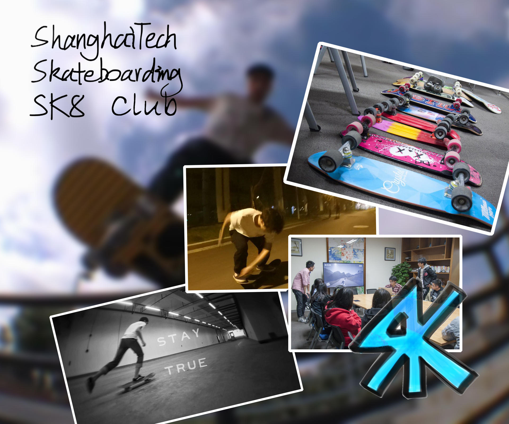

社团：SK8滑板

社团：SK8滑板

Skateboarding
Club由上科大的板仔们建立，社团提供滑板教学，引领校园内滑板代步的风潮，更有tricks交流切磋。社团将滑板的街头文化带入校园，组织滑板刷街，涂鸦等活动。

滑板社QQ群：81950395 欢迎加入！

### 物理社

物理社旨在为上科大各专业的物理爱好者提供学术讨论与交流的平台。物理社经常组织的活动有：数学、物理兴趣小组，物理社social
event，物理学术竞赛。

QQ群：240197110

### Icon & Font社

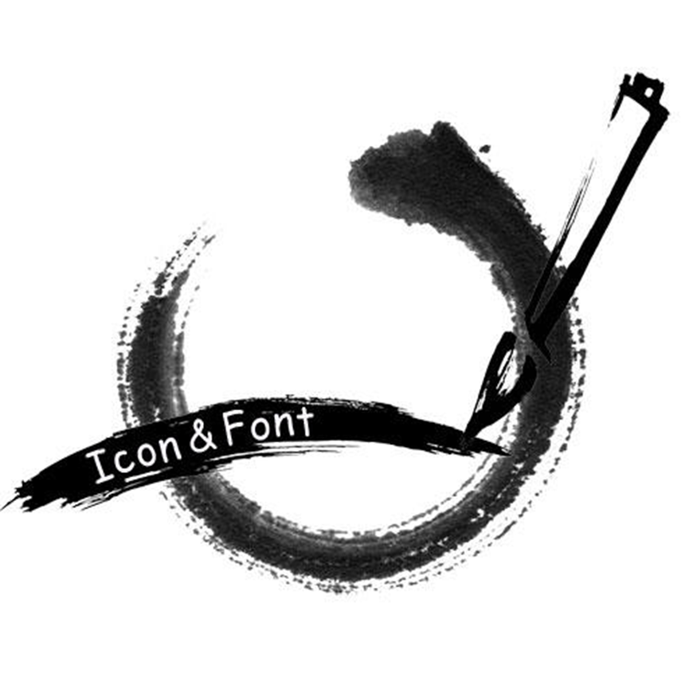

社团：Icon & Font

社团：Icon & Font

Icon &
Font社团是由上科大的图标与字体设计爱好者组成的艺术类社团。社团提供AI、PS等设计类软件教学，以及设计理念的讲座等。让社员学会并有机会设计并拥有属于自己的一套字体和代表图标。

### Prism漫研社（下属Mneme舞团、Plasma乐队、Lucifer WOTA艺团）

Prism漫研社是由上科大的ACG爱好者们组成的文艺类社团。社团以"向更多人传递ACG文化的美好"为宗旨。社团以ACG文化为主题开展各种形式的活动，常规活动有动画放映会、动画讲座、宅舞、WOTA艺、动画歌曲乐队翻唱、偶像研究等等。漫研社B站主页：<https://space.bilibili.com/376373617/>。B站账号投稿了漫研各个分团的企划成果以及演出录像，不断更新中。漫研下属分团有：Mneme舞团、Plasam乐队和Lucifer
WOTA艺团。另有非分团组织偶像盐究院。

-   **Mneme舞团 from
    Prism漫研社：**Mneme舞团是漫研社的以宅舞为主要活动内容的分团，活动内容以各类宅舞、偶像曲目舞蹈为主，每周都会开展训练。每年都会多次在校级演出中登场，也多次参与了校际演出及全国宅舞比赛。

-   **Plasma乐队 from
    Prism漫研社：**Plasma乐队是漫研社的以乐队为主要活动内容的分团，诚邀会演奏各类乐器的同学加入，活动内容以动画及VOCALOID等曲目的翻唱、乐队翻奏为主，也有管弦乐翻奏的企划。乐队自有及向学校借用了可以满足正常排练需求的音响设备，成员部分乐器，多次在校级和校际演出中登场。

-   **Lucifer WOTA艺团 from Prism漫研社：**Lucifer
    WOTA艺团的核心活动内容是WOTA艺，即光棒艺，是一种基于挥动荧光棒、表现音乐节奏的艺术表现形式。WOTA艺团以每周的训练及新人教学为主要日常活动，每年的各类校级校际演出中也经常登台演出。目前团内有多民水平较高的打师，他们很乐意教学零基础的同学。

-   **偶像盐（研）究院：**主要活动内容为声优、2.5次元偶像和企划、日系三次元偶像组合的研究和鉴赏。

### 骑行社

上海科技大学骑行社是由骑行爱好者们所组成的体育类社团。社团不定期组织中短途骑行，并提供义务修车服务。

### 记者团

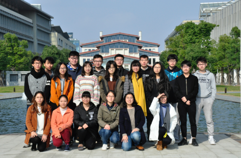

社团：记者团

讲座，采访，丰富多彩的校园活动，发生在科大的动人故事，可以由你来记录和讲述，还有丰厚的稿费可以拿噢。

我们说，只要你有想传播校园声音的心意与热情，加入这里，有情有梦，以手中的镜头和敲下的文字与心中的校园相许，于是...

### 分身·剧社

社团：分身剧社

到了新环境，想改变一下自己的形象？

装文艺、装淑女、装高冷、装逼......你知道如何举动能让人更加信服吗？

来戏剧社吧！我们给你站上舞台，孕育分身的机会！

我们都只能过一种人生，却可以通过表演，抑或欣赏表演，窥探、体会别人的人生。崇尚科学，也欣赏艺术。你的分身，何尝不是你。

### Eden文学社

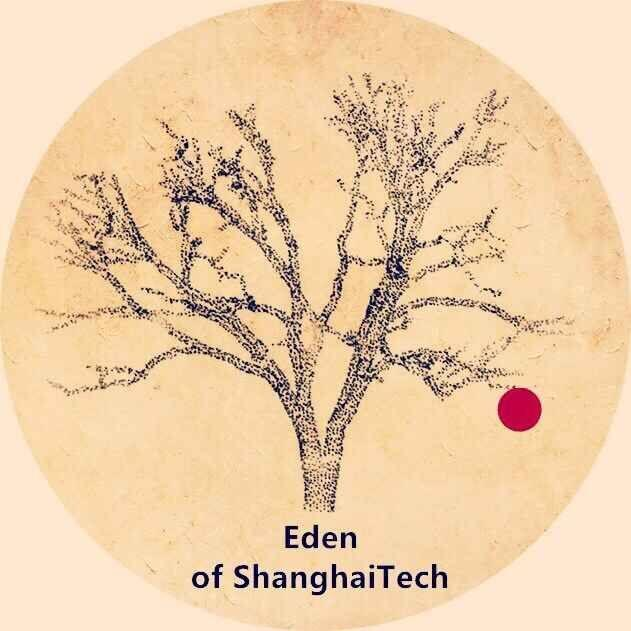

社团：Eden

社团：Eden

谁说理工生不浪漫？谁说理工生不诗意？

文学社给热爱文学的人一个交流的地方，给想要接触文学的人一个可及的平台。让这所理工科学校增添一些文艺的气质。

文学社主要活动有：每月一期的《书院NEWS》，内容涉及采访、热点事件、杂谈随想还有近期学校的讲座、学生活动等。每周的莎士比亚读书会，复旦大学的博士生陆建松作为读书会的指导老师，让同学们在阅读剧本的同时感受经典。以及不定期举办征稿文大赛。

欢迎有兴趣的同学加入我们!

### 跆拳道社

社团：跆拳道

社团：跆拳道

跆拳道精神为：礼义廉耻，忍耐克己，百折不屈。

我们秉着以武会友、以人为本、来去自由的宗旨。

希望跆拳道高手来汇合，使我们后继有人。

热烈欢迎有韧性的体育爱好者前来体验，并可增强力量、速度、柔韧与协调性。

每周由专业黑带教练于体育馆专用场地带领进行训练。

### 国风民族文化社

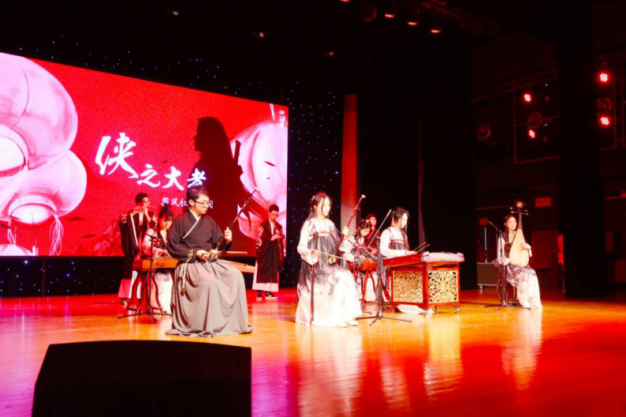

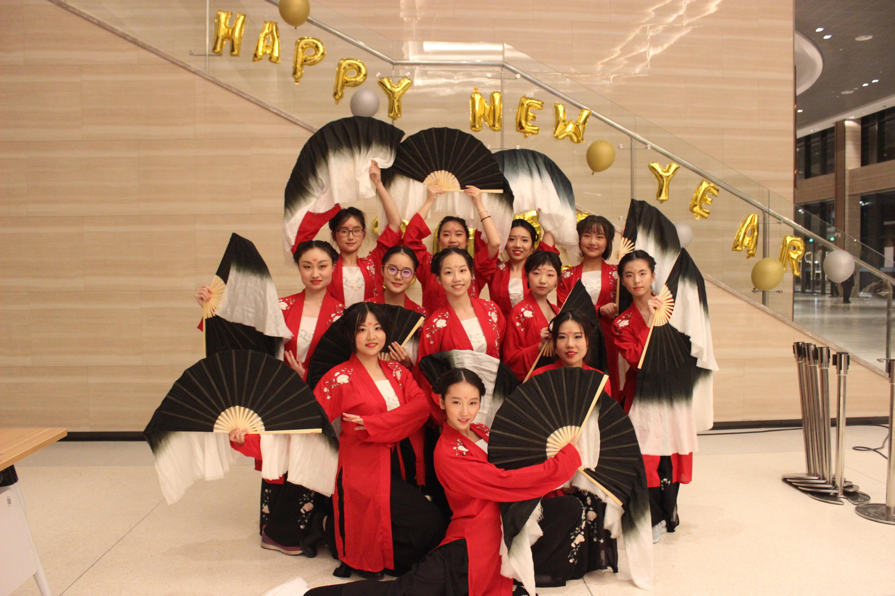

**民族乐团**在这！！**民族舞团**在这！！

一弹新月白，数曲暮山青。我们追寻历史中传来的袅袅之音。

罗袖动香香不已，红蕖袅袅秋烟里。我们重现自古画走出的绵绵深情。

如果觉得我社只是在研究茶道汉服，如果对民乐的印象只是二泉映月高山流水，如果对古典舞的记忆只存在古装剧里…**我们会改变你的想法的**。这里是古典文化艺术发光的地方，也是觅知音遇良缘之处（看看看这么多有颜有才的小哥哥小姐姐！）

乐团和舞团成立后，大大小小的活动也参与了十余场，有些经验，还在成长。我们不是复古者，社长比较佛没有什么宏大理想口号。我们是一群单纯地做着自己喜欢的事的人，想把我们喜欢的东西介绍给你。

（p.s.乐团和舞团平时要接活动的，所以没有基础不太好办哦…除非你是想跳古典舞的小哥哥）

### ACM社

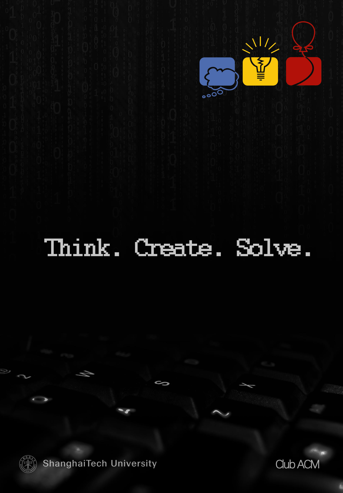

社团：ACM

社长很懒，什么字都没写。

### 尘音合唱团

*社团：尘音合唱团*

不要看到合唱就觉得自己搞不来然后溜了！

不要跳过！重复！不要跳过！

我敢肯定在看这段文字的你们中一定有人有合唱的经历，或者...想有合唱的经历。成立两年以来，我们已经成为学校联欢会的御用表演嘉宾（咳咳），今年7月份，我们也参加了我们的第一次市级合唱比赛。合唱团的每一位成员都非常享受陪伴这个团体一次次长大的过程。作为一个正在成长期的合唱团，我们欢迎所有有能力，有潜力，有意愿的小伙伴，和我们一起书写尘音的历史\~

PS：我们的指导老师实在是美得有点过分，就算是为了一睹芳容也得来参加个面试吧\~

### 管弦乐团

我们成立于2016年11月。最初，六位同学发起这个乐团，是因为我们对音乐------尤其是西方古典音乐有自己的热爱。上科大没有自己乐团是一个遗憾，但对于我们是一种机遇。我们可以定义自己的乐团，让乐团成为一个充满着科学气息、拥有着艺术灵魂的集体。

两年半以来，不断有与我们志趣相投的同学加入，我们也由最初的六个人发展到现在的二十多个人，声部也逐渐齐全。在这两年里半里面，我们总共进行了十余次演出，组织了两次夏季音乐会，一次春季音乐会，并且创办了自己的公众号（微信搜索：STU_orchestra）。通过我们的表演，我们希望能让每个同学能够了解到西洋古典音乐的魅力。

起初，我们认为能够对西洋古典音乐感兴趣的同学绝对是少数，但是在我们举办了第一次夏季音乐会后以及对校内同学初步的了解后，我们发现有西洋古典音乐基础的同学不在少数，对这方面感兴趣的同学则更多。

同时，对于一个大学，尤其是西方的大学，管弦乐团是与运动队并列为校园文化的两大支柱。我们是一个乐团，但所做的也绝不仅仅局限于乐团。我们希望通过我们的表演以及宣传，让同学们喜欢上西洋古典音乐。同时懂得如何去欣赏这一高雅的艺术。

管弦乐团与学校其他大部分的社团有那么些不同，加入的同学需要至少五年以上学习乐器的经历，虽然我们学生基数小，但是我们迫切地希望有更多的热爱音乐的同学加入我们，因为在这里，不仅可以提高演奏能力的技巧，也更是提升合作能力的地方。我们需要大家的支持来获得更完全的声部。

We need you to witness our glory, past, now and future.

### DIOM科创社

*社团：DIOM科创社*

DIOM科创社是上科大曾经在高中参加Destination
Imagination和OM（头脑奥林匹克）的老司机们和爱好者们共同创立的社团。社团每年会组队参加DI、OM两项比赛，一路过关斩将，从上海赛到美国的全球赛，你可以尽情的在DIOM的世界里绽放光彩。艺术、科技、表演、甚至抖一个机灵在这里都有用武之地。除此以外，也会有头脑挑战赛等即时挑战等待着大家，元旦晚会上的即时挑战还会送出丰厚的礼品。

快来加入我们吧！！！

### 音乐社

大家好我们是音乐社！

音乐社是上科大热爱音乐的人们凑在一起组成的同好团体。我们会定期不定期的开展一些靠谱的、有质量的活动，比如秋末live音乐会、十佳歌手大赛、吉他讲座等等等，当然也会经常和书院一起发发福利，比如请大家免费/半价看个音乐会什么的。同时社团里还有很多帅气的小哥哥们等着你们来撩！（我们不承认我们的女社员很少）总之希望大家的加入！一起来玩音乐吧！

社团邮箱：club-music\@

### 游戏制作社（筹）

游戏制作社是于2017年6月所成立的一个以制作自己的游戏为目的的社团。目前没有任何作品。

### 极限飞盘社

极限飞盘社成立于2017年9月，下属上科大可积飞盘队，队内现有核心队员20余名，每周固定训练一次。曾多次外出参加比赛，在第四届全国大学生极限飞盘联赛预选赛中获得华东地区第七名。曾举办过三次科大杯极限飞盘交流赛，其中第三届分组赛吸引了上百名选手参加。

顺便介绍一下，极限飞盘是一项七人制运动，零身体接触，男女同场竞技，易于上手同时又具有足够的竞技性，是目前世界上发展最快的运动之一。

我们极限飞盘社欢迎所有新朋友的参与！

### 体育俱乐部、校队

目前学校内有各种体育俱乐部，跆拳道俱乐部、舞蹈俱乐部、乒乓球俱乐部......

甚有各种足球校队（男）、篮球校队（男）、篮球校队（女）、羽毛球校队（男、女混合）......

以上这些体育组织都有相关的专业教练进行常驻带队哦\~并且已经在最近几年的大学生体育比赛中屡获佳绩。

只要你对体育项目有兴趣，并且能持之以恒训练的。不论你的体能如何，不论你一开始的技术如何，敢于拼搏，就可以加入我们！

篮球俱乐部合照------

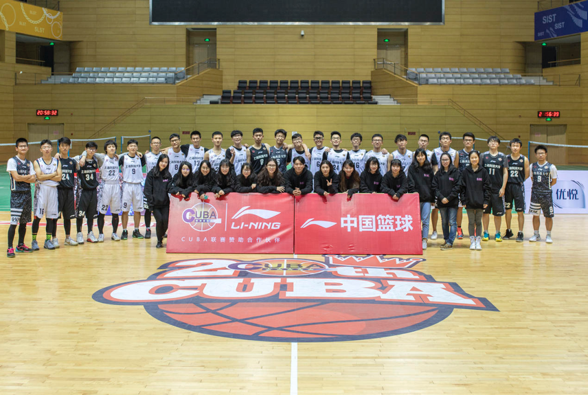

### 上海科技大学JA校园团队

如果你不想走纯学术科研的路线，

如果你想参与创新创业活动论坛，

如果你想体验活动从宣传到举办的一条龙流水线，

如果你想培养自己的摄影视频文案技能，甚至是领导力，

那么，

你应该停下来关注一下JA校园团队。这里提供各种花式培训和互动课程活动。

我们正式成立于17年9月，依托于青年成就的非营利性组织和学校的平台支持开展一系列有关于职业发展的活动，包括Career Go Workshop ，Job Shadow Day，Student Volunteer等等。我们将邀请500强企业精英（也就是陶氏化学、通用电器、伊士曼这种公司）进入校园进行职业规划发展的工作坊活动，你也有机会进入企业实地考察职场生活，日常小活动可能会包含但不限于金融理财与学业规划（学长学姐实战经验分享如何避免大坑及咨询业务233）

请萌新关注微信公众号：上科大JA

QQ兴趣群：685737606

From 现任Campus Leader曹锃钰

（地铁上即兴发挥编写）

学生组织
--------

### 上海科技大学学生会

全称：上海科技大学学生会（ShanghaiTech Student Union）

宗旨：为学生服务

学生会邮箱：studentunion\@shanghaitech.edu.cn

#### 基本架构

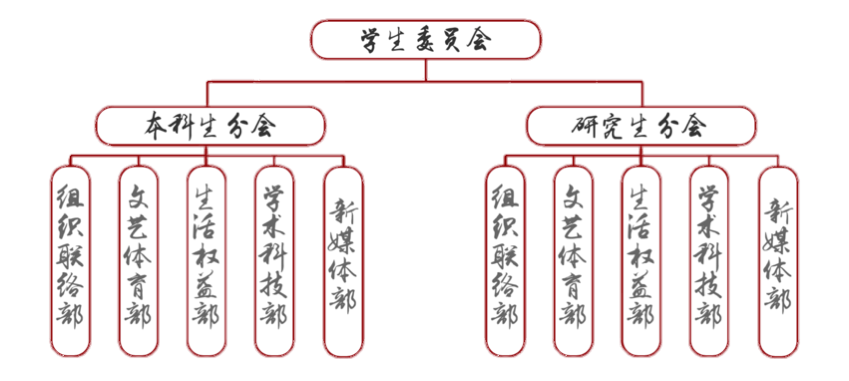

#### 学生会成员

学生会主席： 肖子坤（本科生）

本科生分会主席：肖子坤（本科生）

研究生分会主席：杜冠霖（研究生）

组织联络部部长：苗雨欣（本科生） 方瑜侃（研究生）

学术科技部部长：许腾（本科生） 万 悦（研究生）

文艺体育部部长：潘思佳（本科生） 匡媛媛（研究生）

生活权益部部长：曾子旭（本科生） 宋 宁（研究生）

新媒体部部长： 黄豆豆（本科生） 赵晓辉（研究生）

#### 部门介绍

*组织联络部*

组织联络部常设日常事务管理、外联、社团管理、记录档案考勤等多项职能，如遇全校活动，更是义不容辞。如果你认为自己执行能力很强，如果你认为自己在宣传上有一技之长，如果你对外联很感兴趣，如果你有志引导科大社团走向繁荣，就请加入组织联络部！

*学术科技部*

学术科技部主要为学习与科学研究方面服务于同学的部门。工作内容主要包括组织各类大中小型讲座，建立健全完善的校内信息发布与收集平台，营造良好学习氛围，举办或组织同学参加各类学术竞赛活动等。

*文艺体育部*

文艺体育部，是负责上海科技大学本科生、研究生及全校教职员工的文化艺术活动与体育健康活动的专门职能部门。部门主要以丰富大学生校园文化生活、陶冶大学生文化艺术情操、培养大学生对各项体育活的热情以及与校内各社团和与其他高校文体部共同开展文化艺术体育方面的活动为目的来开展工作。

*生活权益部*

生活权益部是学校和同学间沟通的桥梁。主要工作为解决同学们在学校生活中可能遇到的各种问题，集中反映，集中解决，为保障学生生活而不懈努力；开展和生活相关的各类活动，如传统美食制作，每周六晚免费提供水果和桌游的相约周末等，不定期举办学生交流会，为同学们直接和校方面对面沟通架起桥梁。同时也为同学们日常碰到的生活问题答疑解惑。如果想与校领导之间轻松地谈笑风生，如果经常有合理的想法改变学校又不知道如何提交的时候，欢迎加入生活权益部！

*新媒体部*

配合各个部门完成学校各个活动的宣传、转播、舞台效果等任务。日常管理学生会公众号、微博、B站等公共平台。通过海报及上述平台及时传达校园信息、

### 上海科技大学学生会－礼仪队

#### 成立初衷

上海科技大学作为一所小规模、高水平、国际化的科技大学，在日常或是正规活动中都非常需要一支具有上海科技大学风格的礼仪队来承担有关的接待工作。女生的美靠气质，我们希望礼仪队能够帮助我们学校非常聪慧的女孩子们在气质上也与众不同。所以首先招募了女生们加入礼仪队，并进行了一些最基础的培训～礼仪队成立周年后，我们发现男生礼仪队也是我们学校不可缺少的风景线～男女礼仪队在第二年中的表现更是有了新的突破～作为礼仪队的成员，我们希望能够在任何时候都代表着上科大出色的形象～

#### 展望

就如成立之初我们所希冀的那样，我们希望最终礼仪队会是具有上海科技大学特色的队伍～为此，我们希望能够在日常的训练中多下功夫；在团队形象的设计上再别出心裁一些；在安排活动接待、引导等工作时多开脑洞，想出一些特别的方式～让大家一眼就能认出这是上海科技大学的礼仪队～

我们欢迎上海科技大学的每一位同学来参与礼仪队，为共建上科大美好的学生形象努力～

### 上海科技大学学生会－VOT广播站

#### 成立初衷

广播站作为传统中国大学文化中不可或缺的一部分，肯定也应该出现在上科大的校园中。而上海科技大学作为一所小规模、高水平、国际化的科技大学，其广播站也应当是充满创新精神的。我们希望通过这样一个平台真正平等的传达学校和同学们的声音，用样也通过这个平台给同学们的生活带来更多色彩，为此我们引入了网络平台直播等功能，极大的丰富了广播站的功能，来为同学们带来更好的体验。

#### 展望

就如成立之初我们所希冀的那样，我们希望最终广播站会成为上海科技大学学生的生活中的一个非常重要的伴侣，为此，我们不仅仅将在技术方面做更多的努力来提高收听体验，更会在内容方面多下功夫，在达成平等自由传达信息的目标后，更要成为科大校园流行文化的重要源头之一。我们是低调的VOT广播站，我们这里的大门永远敞开着。

VOT x eMotiV：现在，VOT 和 eMotiV
一起开设直播账户啦：https://live.bilibili.com/3820307

### 上海科技大学学生团支部（筹）

学生团支部正在筹建过程中，主要以楼层为基层组织单位，与学生会密切配合，开展各类组织生活。

校园地图
--------

身为上科大的学子，倘若在校内迷路岂不是一件非常丢人的事情呢\~牢记学校的建筑布局和标准命名，有助于各位路痴们迷失在校园的时候呼唤警察叔叔哦。

同时，上科大智能视觉中心还开发了校园全景虚拟导览，欢迎大家提前认路：

<http://vic.shanghaitech.edu.cn/VR-shanghaitech/>

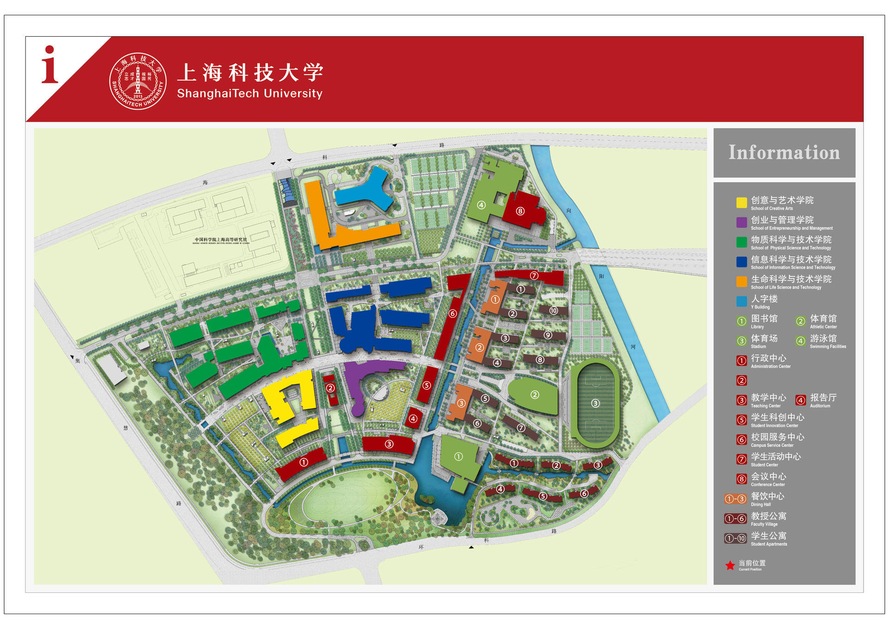

食
--

### 校园餐饮服务

-   新校区食堂：目前学校开放两个食堂：北侧的二号餐饮中心以及南侧的三号餐饮中心。

    -   北侧二号餐饮中心一楼食堂共设两个窗口，分别为面食窗口（面条、水饺以及馄饨）和自主选餐窗口。

    -   二号餐饮中心北侧一楼有清真食堂，供应清真美食。

    -   二号餐饮中心二楼食堂供应现炒窗口，有麻辣烫、水煮鱼、铁板、凉皮、小笼、锅贴等。

    -   二号餐饮中心二楼北侧还设有西餐厅，消费水平略高。

    -   南侧三号餐饮中心一楼设有炒饭、烧腊、面食、香锅以及自选菜窗口。

    -   三号餐饮中心二楼为教工食堂以及中餐厅，提供点菜，消费水平略高。

-   海科路99号、100号食堂凭上科大学生身份证明材料可以自行办理就餐证。

-   咖啡厅：位于学生活动中心建筑的西侧部分（近景观河），店主是法国人，对于上科大学生有7.5折优惠。

-   面包房：位于一号餐饮中心东侧一楼。开放时间为9 am. - 3
    pm.，其余时间面包转移到咖啡厅进行售卖。持校园卡消费可打8折。

    **友情提示：**上科大基本所有的食堂都需要一卡通消费，多数食堂的饭点为（早7:00-9:00，中午11:00-13:00，晚17:00-19:00），不接受现金以及微信支付宝转账。所以脑子可以不带，但饭卡一定要带啊啊啊！实在没带的同学可以选择移步至西餐厅、咖啡厅或全家便利店（也是错过饭点的选择），手头宽裕的同学可以选择去绿地或者长泰吃饭。

### 便利店与外卖

-   全家FamilyMart：能满足一般需求的24小时便利店，位于二号餐饮中心一楼东侧。建议开通尊享卡积累积分优惠。（需要缴纳会费，可以考虑和室友用同一张卡）

-   easy家乐福：位于学校东金科路对侧绿地缤纷广场一楼，目前非24小时营业。

-   外卖：外卖大部分送达时间为 30 分钟到 70
    分钟，学校有外卖红包分享的微信群。大多数同学选择饿了么以及美团，但请注意饮食卫生安全。

### 周边餐饮中心

-   绿地缤纷广场

-   长泰广场

-   传奇广场

-   万科2049翡翠公园

-   盛大青春里

乐
--

学校三号餐饮中心北侧设有礼品店，在工作日白天开放，可在此选购明信片、短袖衫、U盘等学校特色纪念品。

学校周边亦有较多购物与餐饮中心（然而作业那么多怎么出去浪【怨念脸）

-   绿地缤纷广场：金科路788号，离学校一街之隔的生活购物广场，从中科路1号门口出学校，走过第一个红绿灯即达，位于13号线中科路站3号口。两栋楼，多为中低端消费餐饮，包括金拱门和一大波奶茶铺，亦有人均数百元的日料和西餐厅，南座3楼有电影院。一层西侧还有药店。

-   长泰广场：金科路2889号，从环科路199号门口（环科路金科路公交站）或中科路1号门口（中科路海趣路公交站）乘坐浦东58路公交车至祖冲之路金科路站下车即达，位于2号线金科路站4号口。从地下到地上三层均有觅食处。地下拥有两个美食城，多为简餐、饮品店，偏中低端消费，人均50-100；地上为中高端消费，人均价格和海拔基本成正比，基本在100以上；地上也包括许多购物商店、酒吧，还有中影长泰国际影城。

-   汇智商业中心：金科路3057号，长泰广场对面，交通方式同上，位于2号线金科路站2号口。拥有颇多购物消费地点，1楼的药房，地下的欧尚超市。汇智内全楼层均有不少可以觅食的地点，一楼和五楼极佳。五楼有上影河马国际影城。

-   传奇广场：碧波路635号，从中科路1号门口（金科路中科路公交站）搭乘浦东25路公交车至终点站张江地铁站下车即达，位于2号线张江高科站5号口对面，是一个老牌的商业广场，以美食与小吃为主，但是与上两者相比，规模较小，且娱乐功能偏少。

-   宜家北蔡商场：在学校附近（华夏中路金科路公交站）乘坐南川线，或从中科路地铁站乘坐13号线即可到达，宜家不只是卖家具，餐饮也有口皆碑。周二会员日主食半价，人均消费
    30 到 50 元，传说中的"宜家一元冰淇淋"吃到饱。（为什么是吃东西的地方？）

-   翡翠公园：荣科路277号，从中科路1号门口沿中科路行至百业路右转一个路口即达，骑单车车程10分钟以内。以餐厅、饮品店为主，人均多为100以下；另有一家洗衣店（有干洗服务）、一家进口商品&生鲜超市。由于目前开业不久，日后还可能增加别的商铺。

-   迪士尼：这个不需要介绍吧（我们可能是全国离迪士尼最近的高校了）。可以到乘坐地铁13号线转16号线再转11号线到达。打车的话，时间在三十分钟左右。

住
--

目前而言，热水、网络、电全天候供应。本科生宿舍大部分楼层男女生分居同层两侧，中间有"天堂之门"隔开，晚10时关闭，早10时开启。

本科生宿舍一般是三人间，上床下桌，基本为全实木家具。身高过高的同学有几率可以分到两人间。宿舍内部带淋浴设施，有洗漱台盆。

研究生宿舍为两人间，带独立卫浴、大衣柜、书桌和书架，配备了落地玻璃窗以及凹式阳台。宿舍内的实木单人床尺寸为1m\*1.9m，床板下可储藏衣物。和本科生宿舍不同，研究生七号楼男女安排在不同层，其他研究生宿舍楼男女不同楼。

宿舍内半封闭阳台上安置了晾衣杆，需要注意的是风雨天气需要及时收衣服，以免淋湿甚至吹落。

冰箱位于学生公寓底楼，由物业定期清理过期食品。楼层两端的活动室内设有电吹风以及饮水机。电吹风、微波炉请在活动室使用，严禁搬移到活动室以外使用。而寝室内严禁使用电吹风、电暖器、冰箱等违禁电器。学生公寓底楼亦设有收费洗衣机、烘干机、自动售货机等设备。

上科大学生宿舍严禁留宿非本校人员。出租床位、借床位给朋友过夜等行为都是严重违反学生公寓管理规定的，一旦被发现，轻则被严重警告，重则记过处分。

请勿将宠物诱拐入学生公寓内，以照顾过敏体质的同学，并防止宠物在各种公共设施上爬来爬去，留下排泄物。

书院底楼地面为地毯，尽量避免在书院底楼饮用有色饮料或含糖饮料，因为一旦翻在地上会给保洁阿姨带来很大的麻烦。

上科大校园内目前几乎实现了无线网络全覆盖，入学后即可认证登陆 SSID 为ShanghaiTech、SHTULAN-student
的无线网络，上网账号是上科大邮箱账号前缀。校园内还有 eduroam无线网络，且该网络可在国内近200个学校和研究机构漫游使用。具体配置方法见后面「WiFi配置指南」章节。同时宿舍内也有网线接口供使用。

在上科大的北侧建有新开张的上海张江雅乐轩酒店，隶属于万豪国际集团。酒店内191间豪华“乐窝”客房，配备使用手机操作的无钥匙入住系统。雅乐轩品牌餐厅聚聚乐（Nook），提供全日制餐饮服务，有自助的早餐、单点式午餐和晚餐。每周五、周六晚上六点至九点，一楼餐厅提供自助晚餐服务，美食应有尽有，可以用于请客或聚会。

行
--

学校地处张江高科技园区核心区·中区，东临金科路，南抵华夏中路，西至集慧路，北接海科路。现在已经开通的轨道交通13号线经过校园，并在东门外设有中科路站。（从寝室到地铁站真的只要五分钟哦）

### 校内交通

校内交通以步行为主，许多区域仅可步行，其他载具不得进入。

电动车／共享单车／滑板／平衡车／自行车也可在校内交通中使用。使用各类车辆，请注意遵守校园禁行区域规定并在合适地点停放。

### 校外交通

#### 自行车

开学后公共服务处会联系自行车厂商来学校，届时大家也可以选购自己心仪的自行车作为大学期间的交通工具，同时还可以骑着自己的小车参加城市定向社精彩的活动。另有电动车充电桩和自行车出租服务。

#### 地面公交

浦东58路起始站——环科路金科路站在学校东南门外，亦可从东门外的中科路海趣路站上下车以避开绕路区段节省时间。浦东58路途径曙光医院东院、上海中医药大学、复旦张江校区等地，上行终点为金科路地铁站，在2号线金科路站3号口外，单程票价为2元（若使用交通卡在2小时内乘坐过地铁或其他公交，可减去1元）。抵达金科路地铁站后，稍作停留即再次按原路径返回。时刻表见<http://www.zhouzean.cn/bus/> 或站牌公示，在宿舍一层大屏也会有展示。

此外，可选公交浦东25路，与学校较近站点为中科路金科路站，上行终点张江高科地铁站。当你绝望地看着浦东58路弃你而去时，浦东25路或许正静静地等待着你。浦东25路工作日平峰发车间隔约20分钟，高峰发车间隔8-10分钟，双休日全天约20分钟一班，晚上末班车较早。相较于浦东58路，浦东25的优势在于走向较为直接，不怎么绕路。推荐想去2号线的优先选择浦东25路。后附上2019年4月12日拍摄的浦东25发车时间（时间可能已经有更改，但是大体不会变太多）：

推荐使用一款名为"上海公交"的APP，可以查询实时公交情况，为出行做好充分的准备。也可以在微信公众号"上海发布"底栏"市政大厅"中查询实时公交信息。

#### 地铁

学校东门外步行两分钟有13号线的中科路站，可直接前往世博园区、南京西路、新天地等站点，换乘一次即可到达上海火车站、上海虹桥站/虹桥机场等交通枢纽及人民广场、南京东路等站点。

此外，亦可乘坐浦东58路、浦东25路前往2号线金科路或张江高科站乘车。使用此路径前往陆家嘴、龙阳路、浦东机场等地可能更便捷一些。亦可自行前往16号线华夏中路站乘车。

上海地铁票价基本按站间里程计算，6千米内最低票价3元，此后每10千米加收1元。若乘坐5号线且不换乘至其它线路，则以最低票价2元开始计算。各车站均有自动售票机，可直接选择票价进行购票，也可选择目的车站计算票价进行购票。

使用单程票乘坐地铁，出站时需要将车票插入闸机内回收。若出站时车票从闸机顶部或投入口弹出，请携带车票至服务中心处理。有些旧款三杆闸机刷卡之后没有提示音，也不会自动打开，请留意屏幕上的提示信息，显示余额后推杆通行。

#### 远途交通指南

如果选择公共交通前往学校，建议在13号线中科路站下车4号口出，或乘坐2号线在金科路下车3号口出换乘浦东58路公交车。浦东58路时刻表可查询：<https://www.zhouzean.cn/bus/>或 <https://sjhstone.cn/bus/>。

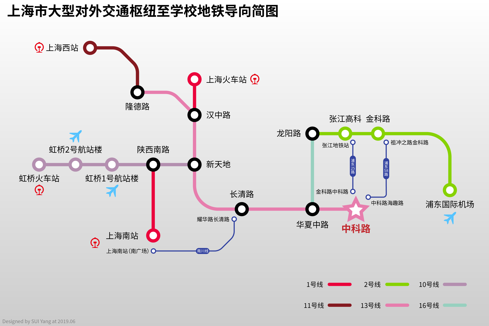

地铁路线示意图，仅列出了出发站、换乘站与终点站（中科路）

**铁路抵达**

在开学后，你才能获得购买学生票专用的磁条。12306网上订票取票时，需要刷取磁条信息，所以在12306网站购买的学生票无法取出。

但是，在人工售票点持本人身份证、录取通知书是可以购票的。请前往当地火车站售票点，不要到代售点，代售点不可购买新生学生票。

* 上海虹桥站：地铁10号线往新江湾城方向，至新天地站换乘13号线往张江路方向，至中科路站下车【预计车程1小时20分钟，票价6元】
  * Tips:对于小号站台到达的乘客（例如京沪高铁较快的几趟车停靠1站台），根据指引前往虹桥2号航站楼乘坐地铁距离更近且客流较少，但缺点在于会没有座位。

* 上海站：
  * 南广场：地铁1号线往莘庄方向，至汉中路站换乘13号线往张江路方向，至中科路站下车。【预计车程50分钟，票价4元】
  * 北广场：可从地下通道至南广场乘车，或乘坐4号线内圈方向，至世纪大道站换乘2号线浦东国际机场方向，至张江高科站换乘浦东25路，至金科路中科路站下车，或至金科路站换乘浦东58路，至中科路海趣路或环科路金科路站下车【预计车程1小时20分钟，票价共计6元（使用交通卡可优惠至5元）】
  * Tips:强烈建议从南广场出站，仅需换乘一次即可到达学校，方便快捷（特别是拎着大件行李的时候）。上海站的1号线和3、4号线的车站区域是分离的，购买单程票的旅客需要出站后重新购票才可在1号线和3、4号线之间换乘，使用交通卡的旅客可以在出站后30分钟之内进行换乘。请留意列车和车站内的提示信息。

* 上海南站：
  * 轨道交通：地铁1号线往富锦路方向，至陕西南路站换乘10号线往新江湾城方向，至新天地换乘13号线往张江路方向，至中科路站下车【预计车程1小时15分钟，票价5元】
  * 公交车：可前往上海南站公交站（市郊方向）乘坐南川线公交车，至华夏中路科苑路（殷家浜路）下车，之后向北走即是上海科技大学南门【预计车程1小时30分钟，票价6元】；或者可以乘坐南川线公交车，至耀华路长清路之后换乘地铁13号线往张江路方向，至中科路站下车。【预计车程1小时20分钟，票价共计6元（使用交通卡可优惠至5元）】
  * 上海西站：地铁11号线往迪士尼方向，至隆德路站换乘13号线往张江路方向，至中科路站下车。【车程1小时30分钟，票价5元】

**飞机抵达**

* 虹桥国际机场：地铁10号线往新江湾城方向，至新天地站换乘13号线往张江路方向，至中科路站下车【预计车程1小时20分钟，票价6元】

* 浦东国际机场：地铁2号线往徐泾东方向，至张江高科站换乘浦东25路，至金科路中科路站下车，或至金科路站换乘浦东58路，至中科路海趣路或环科路金科路站下车。由于2号线交路较为复杂，请留意车站及车厢内的提示，根据引导乘车。【预计车程50分钟，票价共计7元（使用交通卡可优惠至6元）】
* 磁浮至龙阳路站换乘16号线往滴水湖方向，至华夏中路站换乘13号线往张江路方向，至中科路站下车【预计车程35分钟，票价共计54元（使用交通卡或凭当日机票价格为44元）】

**出租车**

上海市的出租车均有统一标识，并配有计价器。下车前请拿好发票。建议不要乘坐非正规或无营运资格的私人车辆。请注意，有不少打车软件会将海科路100号作为上海科技大学地址，该地址距离生活区有一定距离，推荐将地址改在中科路1号（上海科技大学东门或学生宿舍）。

参考价格：

* 由虹桥枢纽（虹桥火车站、虹桥机场） 140元

* 由上海火车站 85元

* 由上海南站 70元

* 由浦东国际机场 85元

* 由金科路地铁站
  15元（1号口一出站就能看到出租车停靠点，但由于需要绕路掉头，在此处乘车车费会多两元左右。亦可由四号口出站后打车）

**共享单车**

学校附近有各种品牌的共享单车可供选择，一些提供电单车服务的公司可有效减少你的疲劳。如果想追求最近的路程，你可以由地铁华夏中路站骑行各种共享单车到达学校，如此亦可以避免骑车爬上坡度较陡的川杨河桥梁。从地铁华夏中路站出站后，你可沿罗山路向南，在罗山路华夏中路路口左转，再在华夏中路科苑路路口左转后直行即可看到学校正门。但请注意，按照现行校园交通管理规定，学校正门往内的路段是不允许自行车通行的，你需要右转绕行离宿舍区较近的环科路199号门骑车进入学校。

上海科技大学信息公开网关于校园交通管理的部分未有任何禁止共享单车驶入或将共享单车与学生自购自行车区别对待的规定，因此理论上你可以直接将大部分品牌的共享单车骑到宿舍楼下并在划定的自行车停放点锁好。然而，你仍需遵照上述网站中所述的自行车使用范围规定，不在规定的步行区域使用包括共享单车在内的各种车辆，并积极举报此等违规行为。

关于校内交通管理的规定，请参阅：<http://openinfo.shanghaitech.edu.cn/2016/0218/c127a477/page.htm>

**自驾车**

由外地自驾车至学校报到的同学请注意，报到当天（即9月2日）为周日，市区12条高架道路（包含学校附近的罗山高架路与中环路）及隧桥对悬挂外省机动车号牌车辆*不限制通行*，大家可以自由选择最合适道路到达学校。

自驾车设置导航定位点时，请优先设置中科路1号（或上海科技大学学生宿舍等，注意实际地址），若没有相应导航点，可先搜寻金科路/中科路路口或中科路地铁站。

如果需要办理自驾车停车证（同学你是真的有钱），请咨询公共服务处了解相关内容。

#### 上海公共交通卡

*官方网站：*[上海公共交通卡](http://www.sptcc.com/index.html)

需要办理上海公共交通卡的同学可以前往上海各地铁站的交通卡服务中心或自助售卡机办理，押金20元，退卡时退还余额和押金（不是所有服务中心都可以办理退卡业务，余额大于10元时需扣去5%的服务费），可用于：全上海的公交、地铁、磁浮、出租车和轮渡服务。

苹果、小米、华为、三星、拉卡拉部分型号均有绑定手机/智能手环的空发卡，可直接在手机/手表
App
端开卡使用、充值，刷NFC感应区域即可用卡。（请注意可能存在有些虚拟卡不支持上海出租车服务）

上海公共交通卡官方提供智能手机应用，在应用中你可以进行余额查询等操作，下载地址如下：

-   *iOS
    上海交通卡官方版：*[https://itunes.apple.com/cn/app/shang-hai-jiao-tong-ka-guan/id910068158](https://itunes.apple.com/cn/app/shang-hai-jiao-tong-ka-guan/id910068158?mt=8)

-   *Android 版：*<http://online.sptcc.com:8080/handapp_update/sptcc2.apk>

紫色交通卡（即现在办理统一发放的交通卡）也可适用于以下城市的公共交通服务，但不享受任何使用地的优惠：太仓（公交）、金华（公交）、宜兴（公交）、宁波（公交）、绍兴（公交）、湖州（公交）、台州（公交）、常熟（公交）、昆山（公交）、江阴（公交）、淮安（公交）、启东、无锡（公交）、南通（公交）、泰州（公交）、长兴（公交）、舟山（公交）、嘉兴（公交）、义乌（公交）、温州（公交、轮渡）。

此外，其他城市发行的、卡面带有“交通联合 China
T-Union”字样的卡也可在上海的公交车使用，但不能在地铁、磁浮、出租车、轮渡等其他服务使用，且不享受换乘优惠。

关于交通卡的使用优惠：

-   在需要出站换乘的地铁站（如上海火车站，虹桥2号航站楼，南京西路），使用交通卡的乘客可在出站后30分钟内换乘其他线路，享受里程连续计算的优惠。

-   使用公共交通卡乘坐地铁或地面公交（仅限空调车）的乘客，在购票或出站后2小时内换乘其他公共交通服务时可享受固定优惠（但地铁出站后再次进站乘坐不享受优惠），减免1元。例如，从金科路出站后2小时内乘坐浦东58路，用交通卡的话就可免去1元。

-   每个自然月内乘坐地铁消费满70元后，当月内乘坐地铁享受9折优惠票价。

-   使用交通卡乘坐磁浮列车可享受单程40元的优惠票价。

需要注意的是，上海公共交通卡无针对学生的任何特殊优惠。交通卡不记名，无挂失服务，因此请妥善保管。

交通卡充值：可前往部分仍支持充值交通卡的地铁服务中心，地铁站内终端机（支持支付宝和银联卡），部分便利店（校内没有）。

建议给交通卡做上特殊标记，以免乘坐出租车时被出租司机掉包。

### 二维码乘车

上海的公交和轮渡可使用微信与支付宝的二维码乘车。在微信中搜索“乘车码”小程序，在支付宝中的“付钱”-“乘车码”，即可开通二维码乘车业务，同时享受换乘优惠。此外还可使用银联钱包APP。

上海地铁可使用“Metro大都会”APP扫码乘车，直接将二维码对准闸机上的扫码窗口扫描即可，并可出站换乘。需要指出的是，Metro大都会使用蓝牙来和闸机交换数据，因而需要手机开启蓝牙，且可能不支持部分机型，详见APP内的说明。Metro大都会下载地址如下：

-   iOS 版 Metro 大都会：https://itunes.apple.com/cn/app/id1202750238?mt=8

-   Android 版 Metro 大都会请于各大软件商店中自行下载。

使用二维码乘车，有时会有普通交通卡没有的优惠活动。但需要注意的是，可用于公交的微信/支付宝乘车码和用于地铁的Metro大都会并不互通，也无法享受公交地铁之间换乘的换乘优惠。为提高效率，请提前打开二维码界面。

#### 共享单车

共享单车在上海是较为流行的短途出行工具。但请注意：目前共享单车的商业模式存在厂商倒闭后押金无法追回的潜在风险。建议仅使用信誉较佳的厂商提供的共享单车服务。

在校内使用共享单车，请注意自行车使用范围规定，不在规定的步行区域使用包括共享单车在内的各种车辆，并积极举报此等违规行为。此外，请不要乱停乱放共享单车。

#### 出租车

上海市市区出租车价格：

-   起步价14元（含3千米或15分钟等候）（途安车型起步价16元）

-   行驶里程在3千米至15千米的部分，每千米2.5元

-   行驶里程超出15千米后，每千米3.8元

-   低速行驶（车速低于12
    km/h）时，每4分钟记1千米。当遇到堵车以至于车辆连续15分钟没有移动时，可要求司机暂停计价器。

-   夜间（每日23:00至次日5:00）行驶加收30%夜间费

-   电话订车每次加收4元电调费（使用网约车App预约车辆暂时免收）

上科大周边也有沪C牌照、橘色涂装的郊区出租车，起步费12元。如有需要进入市区请不要乘坐郊区出租车。请养成索要小票收据的习惯，一旦掉落物品方便找回。

#### 非市区沪牌限行

郊区出租车（沪C牌照）价格除起步价为12元外，与市区出租车基本相同，但不得驶入市区范围（浦西外环线以内，浦东部分城区）。我校张江校区不处于沪C牌照限行区域。下图为沪C车牌限行范围（包含红线道路）：

服务网点
--------

### 购物

校内有全家超市，可以满足大部分生活需求且24小时营业，但价格略贵。如需购买其他物品，可选择网购，或去位于金科路绿地的欧尚超市批量补充生活用品。

### 邮政

校内设有快递服务中心（菜鸟驿站）和上海科技大学京东派。快递服务中心代收发中国邮政和多数主流快递，京东派则承担京东自营商品和京东物流的收发服务。

校内地址格式：

上海市浦东新区华夏中路393号学生公寓×号楼×××室×××收

邮政编码：201210

需要注意的是，快递服务中心的快件逾期未领将被退回。**今年不接受正式开学前的邮递行李**，若有需要邮递的行李，请在9月正式开学前后寄来。

### 医疗

校医务室地址：校园服务中心101室，联系电话：021-20685120，邮箱：clinic\@shanghaitech.edu.cn。建议非紧急情况不要拨打电话，而是发邮件询问。

学校到上海中医药大学附属曙光医院（东院）仅2公里，可步行前往，或乘坐浦东58路往祖冲之路金科路方向、浦东25路往张江地铁站方向，至张衡路科苑路站下车即可到达。危急情况下，若身体严重不适，请及时与宿管联系，以安排车辆前往医院。

*关于医疗保险等细节问题，请参阅上海科技大学大学生就诊服务指南：*<http://openinfo.shanghaitech.edu.cn/130/list.htm>*。*

如需自行购买非处方药，附近的零售药房有：

-   国大药房（金科路店）：位于绿地缤纷广场一层东侧

-   好药师大药房（华佗路店）：华佗路536号，上海中医药大学附近，价格较贵。

-   普安药房（汇智店/万科店）：前者在金科路地铁站汇智国际商业中心1楼南入口，后者在万科翡翠公园荣科路312号。

-   益丰大药房：张江盛荣路188弄4号，盛大天地青春里附近。

除此之外，对于不太急用的药品，可以使用京东大药房等在线服务，优惠省事。

### 运动

体育馆内目前开放健身房等设施。羽毛球场、舞蹈房等需要预约。

现有篮球场、排球场（露天）长期开放，由于离宿舍较近也请不要运动太晚以免扰民。

### 文印

*学校图书馆内有打印机可供师生使用。Windows
用户可以使用图书馆的打印软件（内网下载地址：*<http://software.lib.shanghaitech.edu.cn/Self-service%20printing/>*）在自己电脑上输出文件后到图书馆一楼东侧的文印室刷校园卡输出打印。其它操作系统的用户同学，可以使用设在文印室内的公共电脑输出打印。初次使用需要按照说明进行注册。黑白打印价格为0.08元/张，彩色打印价格为0.8元/张。*

同时，有的同学也在宿舍内购买安装了打印机，也可以私下联系宿舍内的同学打印。

校外周边也有一些文印店，比如位于蔡伦路和华佗路交界口处的辉旋图文打印店（蔡伦路1378号附近）。如果需要打印大量彩色的图文可以尝试前往，并记得索要发票用于报销。

### 理发

校内：

-   飞鸟理发店：位于研究生宿舍七号楼一层，可以使用一卡通、支付宝、微信以及现金支付。P.S.
    飞鸟理发店的关门时间很看理发师心情，且晚上理发人数较多，很多时候八点多去排不到了，理发还需趁早。

校外：

-   佑米造型（绿地店）：海趣路218号绿地3号办公楼1层。

-   V-LOOK：绿地缤纷广场4楼（电影院楼上），人均消费较高。

-   桔剪（万科翡翠店）：荣科路280号万科翡翠商场4层。

-   紫尚造型（原学城理发张江店）：蔡伦路1378号上海中医药大学附近。

-   侘寂形象（原文艺酷剪张江店）：蔡伦路1371号上海中医药大学附近。

-   星客多快剪（张江店/长泰广场店）：前者在金科路地铁站欧尚超市入口处，后者在长泰广场西区B1层。

安全
----

　　无论何时何地，同学们都需要注意自身安全。

　　河边戏水有危险！赛艇也不行！

　　大学不同于中学的封闭性，校园内会有很多校外人员出入，所以一定要注意保管好自己的财物。来跟我一起大声念出来：不要用手机、电脑、钱包（带钱带证的）、男女朋友（说的好像我们都有一样）等贵重物品占座！

　　你们将在军训的时候见到一个发熊（玩具）的警察怪蜀黍，他就是上海公安高校派出所的民（xióng）警，他会加进本科生群，一旦发现什么风吹草动等可疑的事情发生，请及时联系他。孙桥派出所的联系电话为58570402。

　　宿舍内不允许使用电饭锅，电磁炉，电吹风，电热器等一系列大功率用电设施，具体内容可以翻阅学生手册。由于我们的宿舍装修从床到地板皆为木制结构（来自新西兰的上好原木），为了自己和他人的安全，请不要怀有侥幸心理。

　　周边外卖时有传出腹泻，急性肠胃炎等新闻，所以点外卖前请尽量三思。

　　偶尔会有校外人员混进宿舍楼，假装自己是学长学姐，这种时候请不要犹豫直接叫保安，如遇其他可疑人员也请及时通知宿管和保安，毕竟洗衣房的微波炉要被搬走了晚上还怎么叮泡面。

　　校园木制家具较多，尤其是宿舍楼，校内不允许任何明火操作，诸如用酒精灯吃火锅，用酒精喷灯做烧烤的事情请不要尝试。也请不要在宿舍楼使用电烙铁，或是存放危化品、放射源等。

　　上科大寝室禁止外人留宿。无论父母、亲属、朋友、男女朋友等皆不允许，请勿挑战规则底线。

　　尽管上科大已经配备了较高标准的实验设施，但实验室安全更要靠每一个人对实验室安全管理的熟悉了解和细心遵守。2015年12月15日免化所细胞房火灾、2016年6月23日物质学院化学实验室爆炸等事故教训警钟长鸣。实验前务必仔细分析操作流程、熟记应急措施。一定要严格遵守实验规程！严格遵守实验规程！严格遵守实验规程！

（负责写这部分的学长似乎很喜欢卖萌=￣ω￣=）

常用信息
========

### 学校部门

*可见：*<http://www.shanghaitech.edu.cn/jgsz/list.htm>

#### 与学生密切相关的部门

格式：名称：部分有关职能； \@shanghaitech.edu.cn 的邮件地址

-   学生事务处/书院（学生活动中心东侧4楼）：党团事务、本科生事务、科创与拓展中心、文化与学术中心、心灵与健康中心、管理与发展中心、艺术与体育中心；life\@

-   教学事务处（行政中心1楼103---105）：教务、课程运行、教学评估、招生、奖助、学籍、学业证明、成绩单打印、培养方案；asa\@
    education\@

-   校园服务中心（食堂河西侧）公共服务处：园区物业、食堂、户籍证明、校园一卡通、医疗保险；ogs\@，熟记校园服务中心电话还是很有必要的：20685112（寝室报修要打这个电话）

-   图书信息中心：图书馆、数据库、软件正版化、信息基础建设、文印设施与服务；

    -   图书馆：library\@

    -   信息中心：it\@

#### 学生不太接触的部门

党委办公室、校长办公室、科技发展处、国际事务处、人力资源处、财务处、基建管理中心、设备与资产处

常用网站
--------

### 校内常用网站

上科大官方以及诸多同学和社团都开办了很多网站服务，从基本的校园信息查询到学术交流，再到学生社交，全方位为大家提供丰富的在线体验。

-   *学校官网：*<http://www.shanghaitech.edu.cn>

-   *学校邮箱：*<http://mail.shanghaitech.edu.cn>

-   *教学事务处：*[http://oaa.shanghaitech.edu.cn](http://asa.shanghaitech.edu.cn)

-   *学生事务处/书院：*<http://life.shanghaitech.edu.cn/>

-   *校园服务平台:* <http://egate.shanghaitech.edu.cn/>

-   *信息公开网：*[http://openinfo.shanghaitech.edu.cn](http://openinfo.shanghaitech.edu.cn/)

-   *活动成就签到系统：*<https://grade.geekpie.club>

-   *CourseBench 评课社区：*<https://www.coursebench.net>

-   *开源镜像站：*<https://mirrors.geekpie.club>

-   *WikiShanghaitech（重构中）：*<https://wiki.geekpie.club>

-   *陈浩爸爸的教学服务器（大概要删掉??）：*<https://shtech.org>

-   *eMotiV Studio 学生微电影工作室，已转移到相应视频网站服务，例如 Bilibili
    直播：*<https://live.bilibili.com/3820307>

-   *Geek Pie 社团：*<https://www.geekpie.club>

-   *则安的小站（动态公交时刻表）：*<http://www.zhouzean.cn>

-   *上科大云盘：*<http://pan.shanghaitech.edu.cn> *（仅限校内访问）*

### 常用站点

-   *Google* <https://www.google.com/>

-   *Wikipedia* <https://www.wikipedia.org/>

-   *Coursera* <https://www.coursera.org/>

-   *Piazza* <https://piazza.com/>

-   *LinkedIn* <https://www.linkedin.com/>

-   *YouTube* <https://www.youtube.com/>

-   *StackOverFlow* <http://stackoverflow.com/>

-   *AllAboutCircuits* <http://www.allaboutcircuits.com/>

-   *网易公开课* <http://open.163.com/>

-   *中国知网* <http://www.cnki.net/>

-   *WolframAlpha* <https://www.wolframalpha.com/>

-   *arXiv* <https://arxiv.org/>

-   *GitHub* <https://github.com/>

-   *图书馆电子数据库目录*
    <http://library.shanghaitech.edu.cn/library_resource/3.html>

（以上部分网站需要某些你懂我懂大家都懂的技巧，请自行解决）

生活类群
--------

-   上海科技大学快递查询QQ群 254475947

-   ShanghaiTech_跳蚤市场 QQ群 511927970

-   上科大深夜外卖报社群（分享饿了么红包、滴滴打车红包、大众点评红包等）

-   京东上海科技大学优惠群（向京东快递员询问即可加入）

-   上科大地铁志愿者 QQ群 625094653

-   上科大志愿者协会总群 QQ群 700279295

-   各类漫展资讯以及组团 QQ群 636457802

-   嘤一點點（奶茶拼zhang单biao群） QQ群 589096801

-   上科大选课友爱互助群 QQ群 643822203

-   shanghaitech-文具交流群 QQ群 498963277

-   上科大民间图书网店 QQ群 150688245

-   上科player QQ群 564992681

-   Surface-Tech QQ群（说是Surface群，其实是Microsoft产品讨论群） 316617658

-   ShanghaiMac QQ群（说是Mac群，其实是Apple产品讨论群） 364738521

-   Nintendo Power QQ群 273215657 （任天堂主机以及游戏交流群）

-   上科大狼人杀群 QQ群 581202696

-   并没有什么人的音游群 QQ群 490059120

-   ShanghaiTech Outing Club QQ群 112149009

-   上科大电影交流群 490185602

-   健忘者互助协会 QQ群 134522949

技巧经验
--------

### WiFi 配置指南

学校提供几乎完全覆盖校内的 WiFi 信号，通常会有四个不同的
SSID（名称）：ShanghaiTech、SHTULAN、SHTULAN-student 和 eduroam。其中 SHTULAN为教工专用。除 ShanghaiTech 为开放式链接，使用 Portal认证（就是经常在机场、咖啡店见到的那种需要登录的认证方法）外，其它都提供了更加安全的加密链接方式。而其中eduroam能够让你在国内外上千个其它教育科研机构（例如中科大、加州大学伯克利分校以及中科院各研究所）使用上科大的上网账号访问互联网。

同学们在拿到上网密码之后，到校就可以连接到学校的网络了。

对于 ShanghaiTech 网络，你只需在设备设置中连接到 ShanghaiTech网络，在浏览器中打开任意（非加密）网站（通常我们会用学校官网 :-)），在跳转出来的页面中输入你的账号和密码就可以上网了（第一次连接的时候可能需要设置新密码）。

在初始设置完成后，可以选择Geek Pie各位大神编写的网络登陆器来登录Shanghaitech，详见：<https://github.com/ShanghaitechGeekPie/WifiLoginer>

其它两个连接方式更为简单，和家用网络一样，你只需在连接后弹出的窗口中输入你的上网账号和密码，就可以了。但同时需要注意eduroam 的用户名和其它两个稍有不同，需要在用户名后面加上 \@shanghaitech.edu.cn
（和邮箱格式相同）。

如遇密码错误、无法上网等问题，可以联系IT运维（it-support\@或021-20685188）。

在电脑上，你可以在这个页面上输入你的登录信息。

移动设备上，你看到的登录界面将会是这样的。

### 校园邮箱各客户端配置指南

在[https://mail.shanghaitech.edu.cn](https://mail.shanghaitech.edu.cnXIA)最下方的FAQ里可见详细的配置指南。

邮箱客户端的初次同步耗时一般都不短，需要耐心等待。

为安全起见，学校邮箱有密码错误登录次数限制，多次输错密码会被后台锁定，在配置邮箱的时候需要尤为注意，小心手抖哦。

推荐同学们在假期学习一下邮件书写格式，以及养成定期查阅邮箱的好习惯。上科大的日常信息大多通过邮件形式推送，日常与教授之间的交流更多的也是邮件的形式，今后走上工作岗位也用处颇多。望各位同学利用好这一资源。（这句话应该讲三遍！）

#### Android / iOS

添加校园邮箱账户的流程类似，首先进入相应的配置页面。

图片

邮箱设置

注：有同学反映使用iOS的Exchange之后可以在邮箱后台设置中抹掉设备，如果不放心可以下载Outlook
App或其他第三方App来设置邮箱，或使用IMAP方式来配置。

#### macOS

macOS 自带的 "邮件（Mail）" App 支持学校的 Exchange 邮箱。直接前往  -"系统偏好设置（System Preferences）"中的 "互联网账户（Internet Account）"添加。当然使用 Microsoft Outlook 也没有问题。

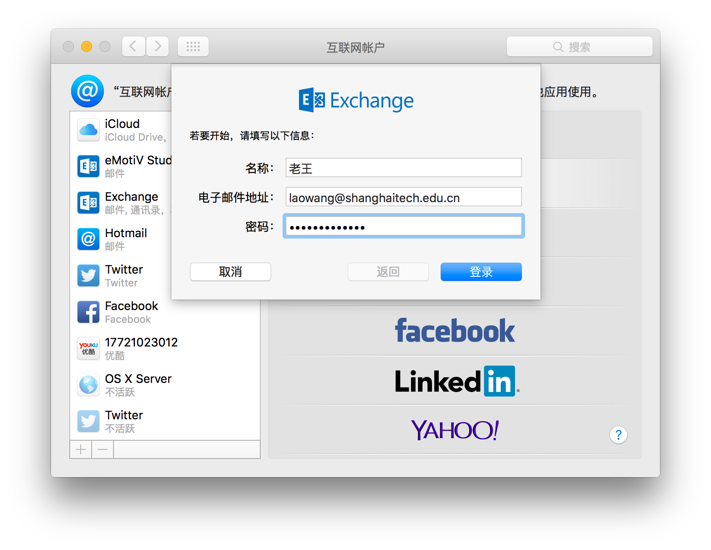

#### Windows

和其他平台一样，Windows下可使用系统自带的邮件APP，也可使用第三方软件。

如果你使用Outlook，那么就享受傻瓜式的邮箱使用吧！学校图书信息中心提供正版Microsoft Office
2019专业版。不过Outlook常出现卡死等问题，也可以使用eMClient等支持Exchange协议的邮件客户端。

提示：如果使用第三方客户端，Foxmail用POP3/IMAP配置会很好用

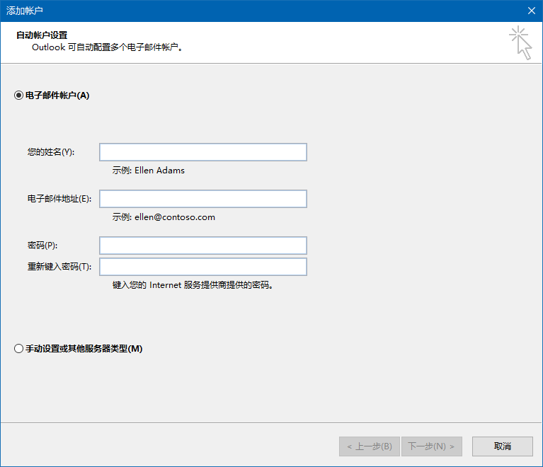

邮箱设置

#### Linux

以Ubuntu系统为例，Thunderbird Email为系统默认的邮件软件。在Edit选项页中选择Account Settings，在左侧竖框下方的Accout Actions下拉菜单中选择Add Mail Accout，填写好自己的邮箱地址、密码之后continue，程序会自动搜索配置剩余内容，傻瓜程度与Outlook无异。

除此之外ThunderBird也可以找到一款收费Exchange服务插件，使用这个插件可以无需配置一键链接，非常方便。（别跟我说贵）

### 校园VPN使用指南

*请参阅*[电子资源校外访问指南](http://library.shanghaitech.edu.cn/library_mission/20160411/160.html)*。*

相关
====

关于
----

上海科技大学 新生手册

主办：上海科技大学 学生联合会

技术支持：上海科技大学学生Geek Pie社团

*代码开源：*[GitHub](https://github.com/ShanghaitechGeekPie/fresh)

### 贡献者

#### Content

感谢以下同学参与本新生手册的撰写工作（排名不分先后，也遗漏了许多不留名的红领巾）

吕文涛 ◇ 郑纬彤 ◇ 石嘉禾 ◇ 赵尚书 ◇ 林东吴

王娇娇 ◇ 吉星宇 ◇ 刘心哲 ◇ 陶之钰 ◇ 张　尧

陈益帆 ◇ 宗　骏 ◇ 崔振宇 ◇ 邵乾瀚 ◇ 陈　宸

周则安 ◇ 周胡蝶 ◇ 丁　鹏 ◇ 刘宇翔 ◇ 林子恒

李振扬 ◇ 赵亚妮 ◇ 覃　昕 ◇ 谢佳轩 ◇ 袁蕴哲

王粱宇 ◇ 李俊蓉 ◇ 张崔政 ◇ 荣宇阳 ◇ 张嘉鑫

李鼎弘 ◇ 李逸柯 ◇ 尹毅明 ◇ 袁可一 ◇ 罗　放

唐一丰 ◇ 张子睿 ◇ 蒋承越 ◇ 蒋　睿 ◇ 夏寅岑

方　雪 ◇ 罗宸麒 ◇ 姚宇清 ◇ 刁子豪 ◇ 方治欣

方舟扬 ◇ 曹锃钰 ◇ 王子卓 ◇ 王典卓 ◇ 任怡静

谢　余 ◇ 王一玮 ◇ 党浩然 ◇ 黄文昊 ◇ 隋　洋

张启煊

#### Program & Operation

吕文涛 ◇ 夏寅岑

#### Photography

黄政嘉 ◇ 刘 勋 ◇ 毕 凝 ◇ 王佳琛 ◇ 马宇豪

#### Acknowledgement

*设计参考：*[浙江大学 求是潮](https://tech.zjuqsc.com/)
