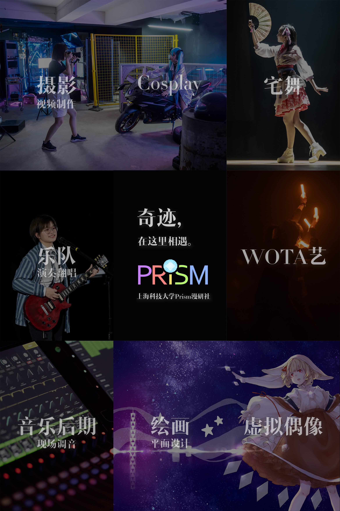
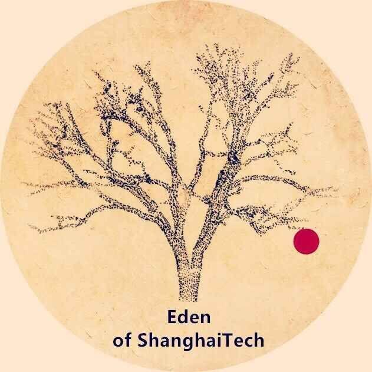
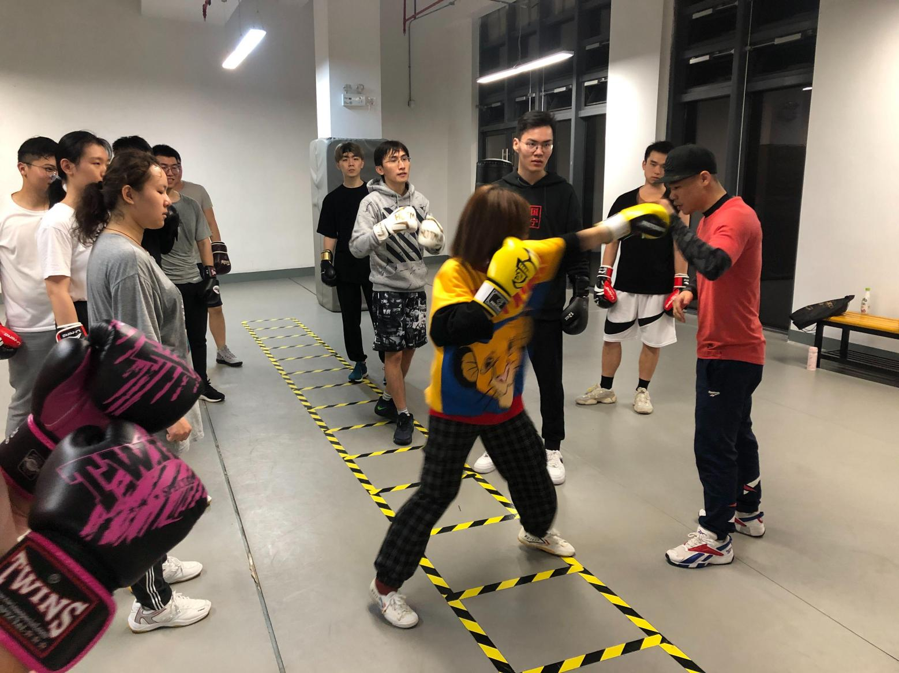
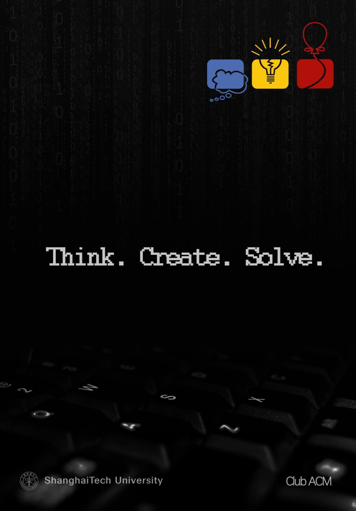
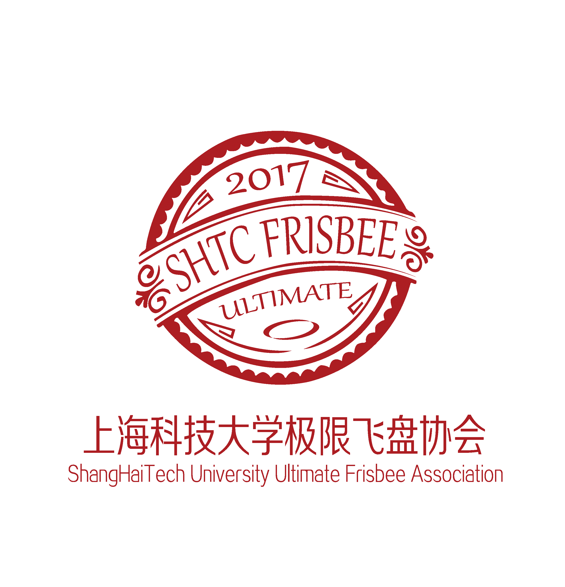
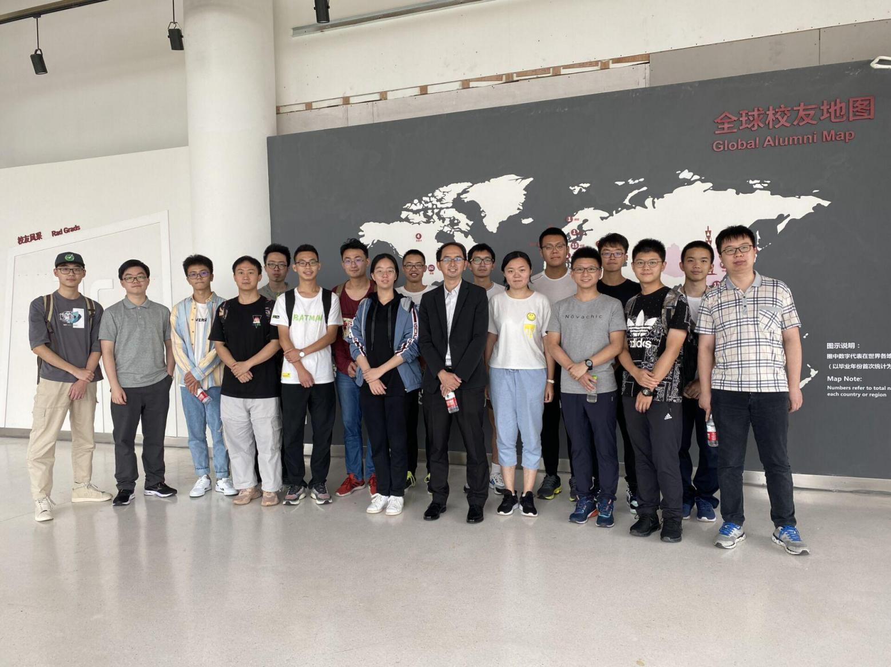
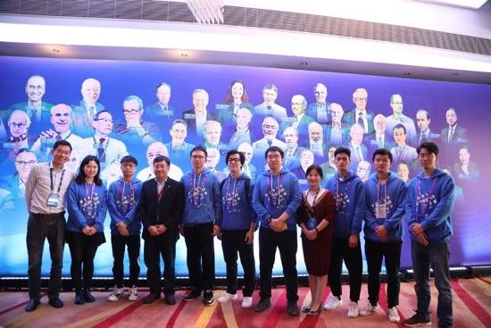
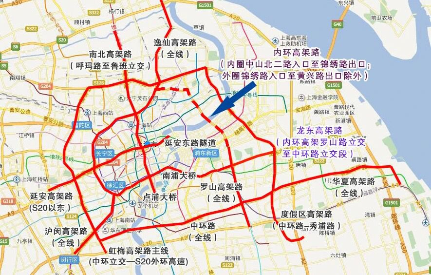
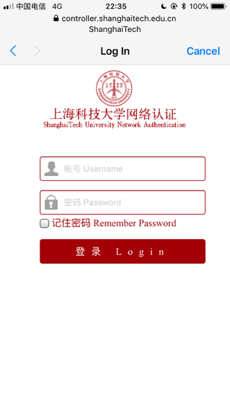

# 初来乍到

## 开学准备

### 加入新生群

在QQ群里，你可以和同学们一起相互了解、共享资源，也可以与老师和学长学姐交流。在熟悉使用学校邮箱之前，重要通知也会通过QQ群发布，记得加入：

-   21级本科生群 537152878

-   21级研究生群 738446310

新生群仅允许学生本人加入，请提醒你的家长避免给管理员带来额外的工作，申请时请注明自己的地区与姓名，请不要与外校同学分享QQ群号。

### 必备文件、身份证明与档案材料

-   身份证、团员证等身份证件及高中毕业证书的原件及复印件

-   录取通知书原件

-   证件照（备好1寸及2寸至少各一版）

-   户口材料（仅限计划迁户口的同学）

-   你自己

### 宿舍基本生活用品

-   衣物

-   洗漱用品

-   棉花毯或床垫（研究生床垫为1m\*1.9m，本科生为0.9m\*2m）

-   床单、枕头、被子、竹席

-   蚊帐或遮光帘（研究生宿舍还需要同时采购支撑杆/架）

-   排插（本科生宿舍每个床位下配备2个国标壁插，务必购买优质排插以避免安全隐患）

-   台灯

Tips：报到前学校会提供打包的全套基础生活用品（详见录取通知书），报到时学校也会组织厂商在校内售卖一些常用的生活用品，可根据需要自行购买。

## 手机卡与银行卡

### 手机卡

上科大在新生入学时不配发来自任何运营商的电话卡，在报到时，三大电信运营商均会前来设摊，提供的手机卡自带校园套餐资费一般优惠程度非常大，且在校外无法获得，需要的同学记得抓住报到时的机会购买新的上海本地手机号。

对于来自外地的同学而言如果已经在当地使用了不计漫游、长途、外地流量的手机号，那么也可以选择在上海直接使用现有的号码（三大运营商宣布从
2018 年 7 月 1
日起全面取消通话以及流量等漫游费用，不含港澳台，且均支持异地补卡业务，详情请咨询运营商）。

目前三大运营商在学校室外都有良好的 4G/5G 信号，学校在室内已经基本全范围覆盖 SSID
为 ShanghaiTech, SHTULAN-student 或 eduroam 等可用
Wi-Fi，配置方法见下文Wi-Fi配置指南。

### 银行卡/校园卡

入校后经过若干手续，每位同学都会领取到兼具**银行卡**与**校园一卡通**功能的上海银行-上海科技大学联名卡。这张卡一共有3种不同的余额账户。

-   **储蓄账户**：就是普通的活期储蓄存款，可用于网银等支付用途（需自行前往上行网点开通网银业务）；

-   **电子现金账户**：用于银联的离线闪付（非 Apple Pay /
    HEC云闪付）。大部分POS机与校外部分自动售货机支持，需要注意的是存入电子现金账户的圈存余额一旦存入后就无法转入储蓄账户或者提现；

-   **校园一卡通账户**：用于校内消费，如食堂就餐等，也属于圈存性质，可以使用现金充值或者储蓄账户余额转存。
    校园一卡通可通过微信、支付宝、现金、银行卡（银校转账/自助圈存机）等方式充值。

    -   **支付宝充值**:
        使用「校园生活-校园一卡通」应用。首次使用时，在卡号位置填写学号。详细请参考[支付宝充值操作手册](https://www.shanghaitech.edu.cn/_upload/article/files/da/29/b1c40bc04fd7be903620e2c68829/931f262e-3d1d-4609-b2cc-488ba6b5a525.pdf)。

    -   **微信充值**:
        使用「上海科技大学」微信企业号。首次使用需要绑定邮箱。详细请参考[微信企业号使用指南](https://www.shanghaitech.edu.cn/_upload/article/files/1a/a6/d8e6c9754517be2cfdbfc5f45471/1d4fa7b8-7e11-47b6-a62b-8a1cc3de8d47.pdf)。

    -   **银行卡**: 使用圈存机中的「银行服务 \>
        银校转账」功能。首次使用需要修改密码并绑定银行卡，详细请参考[校园一卡通充值操作说明](https://www.shanghaitech.edu.cn/_upload/article/files/f1/a2/7fcba26d4bb982db79fcb0cbfb92/601edd5e-059e-4c49-a7f2-4c0245aad54e.pdf)。

    -   **现金**:
        使用现金充值机的「现金充值」功能。现金充值机目前位于受理中心、二号食堂。详细请参考[自助充值机使用说明](https://www.shanghaitech.edu.cn/_upload/article/files/a2/70/5ea3e0dd42f0be3e9367fd13d875/18426eb2-e400-4d06-ad9f-2c0cfc2e3e87.pdf)。

若不慎丢失校园卡，可带上身份证到学生活动中心东侧一楼的上海银行办理补办。（营业时间：周一至周五10:00-17:00，周六9:00-12:00）

在办卡时可能会有问需不需要办理信用卡，这个根据个人情况决定，不是必须选项。银行工作人员可能会在不充分告知的情况下让前来领取校园卡的同学填写信用卡申请表格，请留意所填写表格的内容。

*上海银行-上海科技大学联名借记卡兼校园一卡通*

### 现金/电子支付

由于包括校园卡充值、交通费用、餐饮、网购、便利店/超市购物在内的大部分生活消费都能使用支付宝、微信或者网银，现金需求一般不大。学生活动中心一楼东侧有上海银行支行网点，图书馆有上海银行与的自助存取款一体机，其他银行发行的银行卡在进行业务操作时可能会收取跨行手续费。校外不远处亦有工商银行、招商银行、上海农商银行等银行的支行网点以及ATM机，部分地铁站内亦设有ATM机。

在上海，不管校内校外，电子支付已经是主流支付方式。因而来校前开通支付宝/微信支付是十分必要的。请在使用电子支付渠道之前完成银行卡的支持工作。如需使用学校的上海银行的银行卡进行网上/手机支付的话，需要在银行认证手机号，并办理相关服务，方可使用支付宝/微信支付进行银行卡的绑定。(但学校在开学一段时间之后才会统一办理上海银行电子业务，在此之前不能去上海银行认证手机号，请耐心等待，最好提前完成其他银行卡的支持工作)

# 学在科大

## 教学机构

上科大目前有物质、生命、信息、创管、创艺、数学所招收本科生，每位同学入校时都会依照所填志愿进入对应的学院。创管学院与创艺学院开设面向全校学生的辅修专业与其他学院专业相关的通识课程，人文科学研究院则开设语言类课程、文明通论系列课程以及人文艺术社科类通识选修课。

### 物质科学与技术学院 SPST

上海科技大学物质科学与技术学院（School of Physical Science and
Technology）秉承上海科技大学
“服务国家发展战略，培养创新创业人才”的办学使命，旨在启发、教育和培养物质科学领域的创新人才，并成为具备国际竞争力的原创性科研机构。

学院围绕材料、能源、环境等领域进行科研部署，旨在解决我国长远发展的核心科学问题。学院下设光子科学与凝聚态物理、系统材料学、化学与物理生物学、大科学平台发展四个研究部，并拥有分析测试中心、电镜中心，软物质微纳加工实验室、机械加工中心等科研平台。

学院依托上海科技大学的体制机制优势，与13家中科院科研院所进行科教融合培养学生并合作科研，在超强超短激光、量子电子学、低碳能源等领域建立了长期稳定的合作网络。同时，物质学院是上海科创中心建设的重要力量，牵头或参与建设硬X射线自由电子激光、软X射线自由电子激光、超强超短激光、上海光源二期、活细胞结构和功能成像等大科学装置，这些已成为发达国家争夺21世纪科技至高点的先进科研设施。学院也依托这些平台打造了一流的教学培养和科学研究环境。

物质学院于2013年招收了第一届研究生，2014年招收了第一届本科生。2017年6月，物理学、化学、材料科学与工程三个专业成功获批为学士学位授予专业。截止2021年2月，在籍本科生近400名，在籍研究生1000余名。

物质学院的本科生培养始终坚持“宽口径，厚基础，小规模，高水平，国际化”的教学培养理念，以及“因材施教”的原则，为本科生提供高质量的师资、课程及社会实践、产业实践、科研实践等实践机会，并通过多元化的创新举措提升学生的学习效果和体验。

物质学院的研究生培养坚持“国际化、高标准、强实践”的原则，制定“目标驱动、能力培养和质量导向”本硕博一体化的课程体系，建立了招生选拔、课程学习、博士资格考试、学位论文审核等多级选拔、分流淘汰的质量保证体系。通过加强学术道德诚信的具体举措及鼓励学生参与国家重大战略科研项目，真正实现“立志、成才、报国、裕民”的育人目标。*网站：*[*https://spst.shanghaitech.edu.cn*](https://spst.shanghaitech.edu.cn)

### 生命科学与技术学院 SLST

上海科技大学生命科学与技术学院的设立是以解决人类健康相关的科学问题为宗旨，以打造一所达到国际高水准的研究型学院为目标。学院地处被誉为中国“药谷”的张江高科技园区，这里聚集了大量国内外医药研发企业，利用张江地区的多学科研究力量和生物医药研发优势，同时从国内外大力引进生命科学基础研究优秀人才，积极探索教学、科研、转化三者相结合的发展模式，助力建设上海张江综合性国家科学中心，培养适应未来生命科学发展的高端研究人才，以及满足健康医学需求的新型技术人才。

学校全面采用国际通行的常任教授制度（Tenure track
system），截止2020年4月，生命学院已经拥有一支以65名常任教授为主体的教师队伍，其中正教授7名，副教授16名，助理教授42名。常任教授95%以上具有海外一流高校博士或博士后经历，形成一支以青年优秀人才为主力、资深教授为核心的金字塔式学术人才梯队。

学院自2013年依托中国科学院大学招收第一届硕士研究生，2017年开始独立招收研究生。截止2019年，已招收硕士研究生1180人，其中400名研究生通过转博资格考核转为博士研究生。已毕业硕士研究生172名，博士研究生41名。毕业生全部在国内外一流高校继续深造或在医药行业从业。在研究生培养过程中学院已建立“硕博连读”研究生培养基本模式：采用实验室轮转方式帮助学生选择感兴趣的学科方向和指导老师，通过课程考核、开题报告、中期考核等方式对学生培养过程进行管理；同时采用严格的转博资格考核（平均转博率在65%），严控博士生质量；着重培养学生成为一名成功的创新型研究人才，使学生具备知识获取和学术鉴别的能力，具备学术交流和学术创新的能力，能以宽广的知识储备和坚实的专业基础，探索生命科学领域中的重要科学技术问题。

学院现设有生物科学与生物医学工程两个本科生专业，从2014年开始招生第一届本科生。截止2019年，已招收六届本科生356人，已有两届毕业生100人。学院经过综合考察国内外知名高校的培养方案，确定了厚基础-宽口径-复合型的国际化培养模式，确立了通识课-数理化基础课-专业必修课-专业选修课的阶梯修课模式，为学生打下坚实的数理化基础，使学生掌握生命科学和生物医学工程的基础知识与前沿动态，并在此基础上培养学生宽阔的多学科交叉视野。从大学二年级开始，鼓励学生涉足实践型、研究型训练，培养良好的技术知识和操作能力，并为优秀学生提供参与高层次研讨活动的机会。通过小组讨论以及教师与学生的互动，培养学生的学术交流能力，引导学生进行开放性思考，强化学生的理解与批判能力。2018届本科生毕业深造率超过70%，2019届本科生毕业深造率更是高达94%，其中47%出国留学，47%国内读研。多名学生被哈佛大学、约翰霍普金斯大学、康奈尔大学等USNews世界大学排名Top20的高校录取为博士研究生，并获得全额奖学金。

学院科研实验室面积超过10000平米，拥有设备总值3.34亿元人民币，其中100万元以上仪器设备47台件。已搭建的分子和细胞生物学平台、影像平台及组学分析平台配备生物大分子相互作用分析系统、成像分析流式细胞仪、光片成像显微镜、透射电镜、四极杆串联飞行时间质谱仪、线性离子阱结合轨道阱XL质谱仪等四十余台先进仪器设备为本学科发展提供坚实的技术支撑服务。学院历经近7年的发展，科研成果不断涌现，尤其在国际顶级期刊发表论文不断增长突破，截止2021年3月30日，学院常任教授作为通讯作者在国际顶级期刊所发表论文就有Cell（8篇）、Nature（7篇）、Science（4篇）等。

*网站：*[*https://slst.shanghaitech.edu.cn*](https://slst.shanghaitech.edu.cn)

### 信息科学与技术学院 SIST

旗舰学术会议：Annual ShanghaiTech Symposium on Information Science and
Technology (ASSIST)、ShanghaiTech Workshop on Emerging Devices, Circuits and
Systems (SWEDCS)

信息科学与技术学院（School of Information Science and
Technology）致力于聚集和成就未来信息科学领域的学术大师，培养和团结信息技术及相关应用领域的创新人才和创业领袖，力争在信息科学与技术的重点领域取得突破性和前沿性的创新成果，实现新科学和新技术的快速转化和产业化，孕育并服务于信息通信领域的国际领军高科技企业。

本学院的科研工作将面向全球重大战和国家战略需求，充分发挥长三角地区在人才、资金、科技产业和政策等方面的优势，吸引和聚集一批具有国际声誉的学术带头人来建立国际领先的关键技术研究实验室，通过与国内外顶尖大学、科研机构和高科技企业通力协作，掌握并引导国际信息科技的发展趋势，集中力量攻克核心技术难题，踊跃承担和支撑国家重大科研任务。

本学院的教学工作将采用导师负责制，面向最前沿、最尖端的信息科技研究领域及其迅猛发展趋势，积极开展与国际顶尖大学、科研机构和高科技企业的合作与交流，为学生提供个性化教学和培养计划，开设先进实用的专业课程，提供国际合作的本硕双学位计划，强化结合实际的企业实习和社会实践活动，注重培养学生的国际视野、团队精神、领导才能、创新和创业能力。

本学院将以我们的毕业生之科技和创新成就为荣耀和成功标志，真正成为科学领导者、技术创新者与未来革新企业创办者的乐园和摇篮。

*网站：*[*https://sist.shanghaitech.edu.cn*](https://sist.shanghaitech.edu.cn)

*信息学院主办国际学术会议：*[SSIST](http://ssist.shanghaitech.edu.cn)、[SWEDCS](http://swedcs2016.shanghaitech.edu.cn/)

*信息学院民间slack交流频道：*[click
here](https://join.slack.com/t/shanghaitech-sist/shared_invite/zt-91yp1eeb-dMT5sXyuxDWQXJzBUGwrgg)

### 创业与管理学院 SEM

创业与管理学院（简称：创管学院）是为实现上海科技大学
“培养创新创业人才”的办学使命而搭建的教育服务平台。

我们的目标是鼓励和激发我校每一位学生与生俱来的好奇心和求知欲，提升他们的创造力和创造性信心。这里不仅教授学生批判性思维与技能，帮助学生学习如何创新；我们还将汇集设计思维、艺术及其他创新工具，为学生提供跨学科领域的形式多样的课程。对于那些拥有创业梦想的学生，我们也会提供诸如商业机会识别、创业融资以及公司运营等一系列的创业基础课程。

创管学院将定期举办各类活动，与国内外风险投资机构、成功的创业家（包括在大学任教的科学家）、律师以及企业高管合作，为学生们打造导师计划并提供实习机会。

我们的活动旨在不断向学生灌输社会责任感。我们希望学生们不仅以自己的热情和能力”办好事”、“把事办好”，还要努力解决当前社会所关注的、具有极大挑战的社会问题，如照料老人、城市交通拥堵、教育问题等。

在这里，你们将感受到不同于一般传统商学院的学习氛围：小班授课（每班20至30
个学生）以及高度强调互动体验式学习的授课形式。我们不支持老师一味灌输知识的授课方式，充分讨论、互动和实践才是我们坚持的课堂氛围和教学理念。我们的教授团队来自世界各地，其中不乏在加州大学伯克利分校、哈佛大学、斯坦福大学等世界著名高等院校执教的优秀教师。”

创管学院致力于让上海科技大学的每一位学生在学成离校之时，都能具备实现其梦想所需的能力和必备的核心技能，无论他们的梦想是成为诺贝尔奖获得者、自主创业的企业家，还是服务于社会的公务人员。

上海科技大学创业与管理学院热切期待着你们的到来！

*网站：*[*https://sem.shanghaitech.edu.cn*](https://sem.shanghaitech.edu.cn)

### 创意与艺术学院 SCA

创意与艺术学院致力于以领先科技推动艺术领域的创新。除了推动创意与艺术类课程（如绘画、游戏制作、剧本写作等）的建设，还积极在校园内外开展各类活动（创艺·说系列讲座、电影放映、校内展览、校外展览集体参观），并支持艺术类社团（如管弦乐团）的发展和成长。除此之外，创意与艺术学院还面向社会开设有与南加州大学合作的电影影视类非学历课程。

*网站：*[*https://sca.shanghaitech.edu.cn*](https://sca.shanghaitech.edu.cn)

### 生物医学工程学院 BME

上海科技大学生物医学工程学院 (BME School)
于2020年10月正式成立，创始院长由国际著名医学影像 AI
专家沈定刚教授担任。学院将服务于国家科技创新与健康中国两项重大战略，对接国家和地方健康科技发展、产业升级的迫切需求，建设多学科交叉融合的生物医学工程创新平台，致力于产生国际公认的原创成果并形成科创转化临床应用。

学院以建设全国顶尖、世界一流的生物医学工程学科为终极目标，打造具有学校特色和国际影响力的交叉学科，培养生物医学工程领域创新创业优秀人才。学院在初期重点建设医学影像、智能医学、智慧仪器等学科方向，在中长期规划中逐步覆盖生物材料、神经工程与基因工程等生物医学工程交叉学科主要研究方向。

医学影像聚焦于磁共振、分子影像、诊疗一体化等，旨在直接为临床一线问题提供应用技术与解决方案。智能医学包含人工智能与医学大数据等近年来大热的研究方向。智慧仪器方向包括可穿戴设备、康复仪器等。

*网站：*[*https://bme.shanghaitech.edu.cn*](https://bme.shanghaitech.edu.cn)

### 免疫化学研究所 SIAIS

旗舰学术会议：ShanghaiTech-SIAIS BioForum

上海科技大学免疫化学研究所隶属于上海科技大学,
成立于2012年10月12日，创始所长是免疫化学理论的奠基人和先驱理查德·乐纳教授。研究所秉承追求卓越和开拓创新的理念，以免疫化学基础理论为核心，专注抗体技术和药物研发，致力于打造生物医药研究领域的“贝尔实验室”，成为一所聚焦原创、面向重大疾病的创新型国际领先生物医药研究机构。

研究所实行科学和学术理事会领导下的所长负责制。理事会成员包括了抗体和生物研究领域先驱者、诺贝尔奖得主、中国科学院院士在内的多位世界知名科学家。研究所通过引进资深特聘研究员高起点、快速启动和推进前沿科研项目，引进尖端核心技术，积极招募国内外高水平生物技术人才。研究所现已建立免疫化学、细胞生物、计算生物和结构生化四个研究方向，拥有药物发现平台、分析化学平台、生物医学大数据平台和抗体筛选平台这四大技术支撑平台。

免疫化学研究所的发展策略是以核心实验室为单位开展多个方向的前沿基础研究，充分发挥各自的优势，针对生命科学领域的关键问题形成有特色的解决方案，产生突破性发现和颠覆性技术，实现各自科研上点的突破；同时核心实验室之间的科研交叉融合，协同促进和发展，打造整合型生物医学研究平台，形成有国际影响力的现代化研究所；在深入探索生命的本质的同时，精确把握国际科研发展的大趋势，鼓励和尝试科研产业化和技术变现的有效途径，不断推陈出新，成为充满活力可持续的现代化研究所。

免疫化学研究所的研究团队及平台，可以实现一个新型重要抗体从发现，到经过所有必要程序，到最终转变为药物的研发过程。研究所已逐渐形成具有自主知识产权的治疗性抗体研发与产业化能力，并加强国际合作，为海内外相关企业提供技术支持与服务。同时，研究所也将为研究者提供卓越的教育以面对未来的科研挑战。

*网站：*[*https://siais.shanghaitech.edu.cn/*](https://siais.shanghaitech.edu.cn/)

### iHuman研究所

旗舰学术会议：iHuman Forum

iHuman研究所是隶属于上海科技大学的一个国际化的高水平研究机构，iHuman研究所是了解方兴未艾的上海生命科学研究的窗口。iHuman
研究所的特色是其聚焦于跨空间和时间尺度的数据整合及通过构建原子分辨率的虚拟人体深入理解人类疾病，研发更加安全有效的新型药物。

上海科技大学iHuman研究所自成立以来，通过不断整合分子水平、细胞水平、人体器官影像研究相关数据，致力于构建原子分辨率的虚拟人体模型。研究所现已落成或在建的强大科研基础建设包含：（1）分子水平：X射线晶体学研究流水线、膜蛋白微聚焦X射线同步辐射线站（与SSRF共建）、核磁共振、电子显微镜成像；（2）细胞水平：超高分辨率、激光共聚焦、相干衍射成像（软X射线自由电子激光活细胞成像装置）；（3）人体水平：核磁共振和PET-CT等成像装置。iHuman研究所着力于将生物学、化学生物学、计算生物学、系统生物学、人工智能、新型计算机芯片及数据展示艺术紧密结合，以实现跨空间和时间尺度的科研数据整合。

iHuman研究所丰富的科研资源和雄厚的研究能力为其研究人员提供了优良的研究环境和事业提升空间。iHuman研究所由化学生物学、计算生物学、超高分辨率成像、结构生物学、系统生物学、细胞生物学、核磁共振影像、人工智能/机器学习、药物化学和医药转化研究等在内的跨学科研究团队组成。在iHuman人的共同努力下，虽然建所时间较短（自2012年底），iHuman研究所已经形成了研究所特有的文化，称为“iHuman
Culture”。iHuman要求各研究团队具有强烈的合作意识，彼此密切合作，协同攻关。

iHuman研究所坐落于美丽的上海科技大学校园内，周围遍布多个国家级研究机构或设施，包括：张江实验室、国家蛋白质科学研究中心-上海、上海光源、软X射线自由电子激光装置、硬X射线自由电子激光装置、国家化合物样品库、中国科学院上海药物研究所、中国科学院上海高等研究院、复旦大学、上海中医药大学、张江科学城及300余家生物/医药/计算科学/电子通信公司。*网站：*<http://ihuman.shanghaitech.edu.cn>

### 数学科学研究所 IMS

上海科技大学数学科学研究所以造就新一代数学和应用数学领域的独创型人才为使命，籍着上乘的教学和科研，促进数学的发展。为从全球招募而来的数学各个学科的青年才俊和知名专家提供理想的科研和教学环境，为有志于基础数学和应用数学理论研究以及数学应用人才提供严格和系统的训练。

崇尚学术自由，信奉诚实治学，强调原创研究和鼓励潜心钻研。提供充分的博士后研究人员岗位和博士研究生招生计划，为科研人员提供众多的中、长期访问学者合作机会和轻松活跃的学术氛围。研究所经常性地举办国际性学术会议，为全球科学家提供为期半年或一年的专题研究资助。

朱熹主张“读书无疑者,
须教有疑，有疑者却要无疑，到这里方是长进”。韩愈的《师说》曰：“弟子不必不如师，师不必贤于弟子，闻道有先后，术业有专攻，如是而已。”
研究所崇尚这些古老的智慧。教师将以诲人不倦的热情激发学生的兴趣，学生以学而不厌的意志迎接知识的挑战。有志于数学研究和应用的学子将在这里播种梦想，收获真知。

地处中国文化和经济发展最具活力的长三角地区，数学科学研究所将致力于为地区以至全国输送训练有素的创新型人才，以期在不久的将来跻身于国内一流的数学教育和研究中心之列。

举捷足，千里长路谙冰雪；抬望眼，一园桃李笑春风。我们期待着与研究所的同仁和同学们一起笃志寄身古翰墨，绘就数形新丹青。

*网站：*[*https://ims.shanghaitech.edu.cn/*](https://ims.shanghaitech.edu.cn/)

### 人文科学研究院

人文科学研究院（原通识教学中心）是各个学院以外专门设立的机构，负责通识课程的开设和管理。通识课程包括思政类、人文类、社科类、艺术类、科创类等课程。

*网站：*[*https://ge.shanghaitech.edu.cn*](https://ge.shanghaitech.edu.cn)

## 规划前程

新学期伊始，提前掌握好自己的前途规划、为未来做好准备，是非常有必要的。

### 明确培养方案

每个学院的各个专业都有各自不同的培养方案，其中规定了专业必修课、专业选修课、跨专业基础课、通识课等各个模块的学分要求，是每位同学进行学业规划以及选课时的重要参考。此外，培养方案会为每个学期该选哪几门课提供一个参考，同学们可以大致按照该参考进行每学期的选课规划。当然，如果你对你的课程学习安排有自己的想法和规划，那也不必严格按照培养方案来，量力而行即可。一般可以在[教务处](https://oaa.shanghaitech.edu.cn)或各学院网站查阅到，若有更新，各个学院负责教学的老师会以其他方式告知。

### 与导师经常沟通

入校后，你将进入某个书院导师组。每个导师组有三位来自不同学科背景的导师。平时的学校生活当中会有比较多的导师组活动的机会。导师一般都具有深厚的学术背景，你可以利用这些导师组活动的机会，与导师交流，规划思考专业领域的学习，抑或是和他探讨生涯规划等长远问题。如有可能，去导师的实验室参观一下，认识一些导师课题组的研究生学长学姐，建立沟通与联系，能获得不少有用的学业或生活经验。每个导师组都会有一个导生，一般都是很优秀的学长学姐，和他们交流也会有很大收获。具有竞赛经验的同学，也可以尝试参与导师课题组的科研工作，当然，不必局限于自己的导师，完全可以邮件联系其他导师询问情况。

总之，导师手册是大家手中重要的参考资料，学校的导师教授们也是大家前途规划的重要指导。不过，俗话说：师傅领进门，修行在个人。积极与导师沟通，积极参与各项学术科研才能把导师的作用发挥到极致。

### 参与科研活动

一般来说，这一部分需要你主动地和老师进行沟通。一般来说，认识老师的途径有很多，比如下课提一些较有意义的问题，导师组活动中提问等等。只要不是过于害羞的话（如果是请尽量克服）一般都会在一两次接触后和老师变得较为熟悉。当然，这也是你进一步了解自己兴趣，选择合适的方向和对应方向导师的一个过程。

与老师有较多的沟通后，就可以逐步加入实验室的一些工作了。一般来说都是打下手开始，从研究生师兄师姐那里学习技术。对不同学科的同学来说，进入实验室后需要掌握的一些常识是相当迥异的，对于有意研究生命科学的同学，可以参考Kathy
Barker的书：

At the bench: a laboratory navigator.

### GPA

对于有深造意愿的同学来说，GPA是反映你大学学术水平的一个关键指标。具体的成绩评定规定，请参阅[详细解释](https://oa.shanghaitech.edu.cn/weaver/weaver.file.FileDownload?fileid=41325)。高GPA固然好看、固然重要，但我们也不鼓励单一地追求高GPA。学习成绩只是体现学生综合水平的指标之一，我们还要在学习之余为自己未来做好规划，更深、更广地拓宽自己的专业知识视野、提高专业水平，尽早接触科研，培养实践操作能力。对于未来不同出路的同学而言，对GPA的要求也不尽相同，同学们需要尽早明确未来发展方向（是出国还是国内保研考研，等等），提前了解这些方向对GPA的要求，以便合理安排学习生活节奏。

### 英语

新生入学时会进行英语分级测试，往年的测评系统为EFSET，依据系统给出的CEFR等级进行分班。英语分级测试的目的是让大家进入适合的英语学习氛围进行学习，提前刷题没有什么意义。如果有国际交流或留学深造打算，暑期可以自行学习，对英语能力进行加强。

上科大并不将通过四六级考核作为毕业评判标准。依据目前的培养方案，本科生需通过学校的英语测试EPT方可获得毕业证书。英语相关培养的详细方案可参见[教务处网站上的解释](https://oaa.shanghaitech.edu.cn/2016/1028/c4094a35428/page.htm)。

考虑到国际学术界的现状，以及上科大的英文授课情况，英语在上科大生活中属于具有极强基础的需求技能，掌握好英语的沟通交流能力、书写能力，学会与教授口头或书面交流仍是必不可少的需要。

### 参与科创竞赛或项目

上科大与中科院的深厚联系使得同学们能够享有许多参与科创竞赛或者项目的机会，例如与中科院上海微小卫星工程中心联合举办的微小卫星科技创新竞赛，以及上海高等研究院每年的大学生创新实践训练计划等。有意参与的同学要记得留意自己的邮箱，以免错过良机。

除了学校组织参与的科创竞赛或项目外，学校也鼓励同学们自己组队参加竞赛，并视情况调配资源予以支持。例如OM（头脑奥林匹克）、DI（Destination
Imagination
创新思维大赛）、MCM（美国大学生数学建模比赛）、iGEM（国际遗传工程机器设计竞赛）、国内各大高校的ACM交流赛、黑客马拉松、CTF（信息安全竞赛）等竞赛或活动，主要都是由同学自己组队与报名参赛的。

学校也正在筹备学生创新中心的建设进展，学生会也先期提供了学生创新中心工作室开放给全体同学，有意向参与的同学可以注意积极留意相关信息。

### 学术诚信

在上科大，学术诚信可以说是至关重要的原则性问题，常见的学术不端行为包括但不限于：

-   作业抄袭或超出允许范围的交流

-   考试作弊

-   伪造变造实验数据

-   剽窃或部分剽窃论文内容

学术诚信是每位同学学业生涯中最为重要的一环，无论是作业抄袭还是考试作弊，无所谓大小轻重，皆是对自己和其他同学努力付出的不敬，也是对规章制度的无视与违逆。

每个学期，学校都会有不同的科目组织严查作业作弊等学术不端行为，一经发现，轻则单科取消成绩，重则开除学籍，有的学院还规定了对于有学术不端行为记录的学生，将不会再有资格获得任何学院层面负责推荐的奖励以及任何有竞争的学习机会。

鼓励大家在日常学习中了解一些学术规范，每次作业认真独立思考完成，养成良好的习惯，希望大家不要误入歧途，以免犯下后悔莫及的错误。

## 暑期预习

高考完的这个暑假，最主要的还是放松与调整，但为了更好的适应大学学习生活，做一些提前的准备是很有必要的。

在网易公开课等平台上，有许多名校公开课，可以对高等数学/数学分析、普通物理、普通化学等课程进行提前的熟悉与了解，应特别注意的是，作为一名理工科学生，数学的基础十分重要。

对于没有编程基础的同学，可以在Codecademy、计蒜客或是edX等平台上学习以Python
3为主要编程语言的一些入门性课程。

英语功底不是很好的同学可以利用假期时间提高英语水平，对于未来的学习很有必要。

注意留心后面的常用站点章节。

## 图书信息

图信中心提供大量电子学术资源、期刊数据库，可以下载安装学习所需要的正版软件，比如
MatLab, Mathematica, OriginLab
等等。在随录取通知书寄送的小册子中，有图书信息中心提供的许多资源指南，在[图书馆](http://library.shanghaitech.edu.cn/)也可以找到更多相关的信息。

# 科大生活

## 认识书院

上海科技大学实行书院制培养模式。学院、书院分工协作培养人才，其中学院侧重于专业能力的培养，书院侧重于综合素质培养和人格养成。书院围绕“立志、成才、报国、裕民”的办学理念，培养具有人文情怀、科学质疑、创新创业之人才。书院环境宜人，动静皆宜，充满创新创意的文化元素，富有攀登科学高峰的文化气息是书院的愿景。书院生活很充实，不同年级、不同专业的学生同住一个书院，可以自由选择各类跨学科学习、社团活动、创新实践和朋辈交流的机会，每一天都在朝着理想的目标，畅想并努力。上科大书院培育人文精神，形成科学精神，推动创新精神。
书院实行本科生导师制。书院导师注重学生综合素质培养和家国情怀、人文情怀养成，培养学生成为“德智体美劳全面发展的社会主义建设者和接班人”。导师以个人的丰富学识、高尚师德、严谨的治学态度和健全的人格感召学生，引导学生，充分发挥“育人”功能。原则上，根据至少一位常任教授架构配备书院导师组。每个导师组由三位导师构成，分别来自不同专业，与学生同专业或相近专业的常任教授为书院导师组组长。原则上每个导师组有一位中共党员。
书院的院舍是一个小型社区，除有学生宿舍外，还有供书院师生研讨、修读、活动、生活的各类场所，如导师办公室、图书阅览室、咖啡吧、谈心室、成长驿站、自修室、洗衣房、简易厨房等，可以开展各种学习、交流活动，每一名学生在书院都会感受到家的温暖。每一个学生都有着双重身份，既隶属于书院，同时也是所在专业学院的同学。书院鼓励不同专业背景的学生互相学习交流，也鼓励学生主动与本专业的学生相伴学习讨论，促进学生的个性拓展和全面发展。
书院在平时日常生活中，开展人文教育、道德教育，鼓励发展社团文化，实行体育俱乐部制，指导学生参与社会实践、产业实践及创新创业实践。不仅注重广泛深入的人文、社会和自然知识的跨学科教育，更着眼于对学生的人格教化与思想塑造，培养远大眼光、通融识见，具有新时代优美情感与高尚精神的人。

## 上道书院

上道书院以“上善若水”的思想为启迪，秉承
“志存高远、善学敢拼、求是创新、全面发展”的教育理念，积极开展博雅教育并提供丰富多彩的实践拓展活动，致力于培养掌握专业核心知识技能，具备扎实创新与实践能力、良好思想素质与科学人文素养的卓越人才，促进学生形成如水般刚柔相济的能力与海纳百川的情怀。

在学生发展方面，上道书院注重组织开展博雅教育与多样性的文体活动，指导学生参与多元化的社会、产业与科创实践，培养学生的可持续发展潜力与开拓创新能力，引领学生形成开放包容的人文情怀，塑造高尚的人格品性。

在学业学习方面，上道书院建设有一支具备国际化求学背景与视野的导师队伍，来自不同学科专业的三位导师组成导师小组，伴随学生四年专业学习，提供学业指导与思想引领，担任学生学习成长的引路人。

在校园生活方面，依托学生公寓10号楼，上道书院设计布置了典雅的中式庭院，环境宜人，温馨优雅，配备充足的生活空间，使上道书院的学子们感受到如家般的温暖与舒畅。

上道书院将以培养“上善之人”为己任，助力青年学子立志、成才，将来报国、裕民，成为社会主义现代化强国建设中的栋梁之材。期待优秀学子加入上道书院大家庭，共同努力，创出不一样的火花。

## 科道书院

科道书院创立于2020年，坐落于学生公寓8号楼，空间设计是中式园林风格，其中1楼为公共活动空间，2-13楼为学生住宿区，已建有导师研讨室、自习室、会议室、影音室、洗衣房、简易厨房等公共服务设施。

科道书院是同学们在上科大的家，致力于培养同学们快乐成长，全面发展，通过努力成为更好的自己。

科道书院特色：

校内课程：助力你成为更好的自己。

校外实践：支持你践行学以致用、知行合一。

丰富生活：科道家人与你一起庆祝成长中的每一个重要时刻。

## 大道书院

书院理念：大道不孤，天下一家

培养目标：德才兼备、多元化、全方位发展的科学探索者、行业引领者和创新创业者

学生发展：家国情怀、国际视野、强健体魄、高度自律

学生学习：诺奖得主领衔的强大导师团队对学业、生活、职业规划的个性化指导

学生生活：独有的英式庭院设计、充满创新创意的文化元素、家的舒适与温暖

## 学生社团

上科大当前有诸多学生社团，这些社团也将在开学逐步与大家见面，积极参与社团活动也是丰富的大学生活的一部分。

现有社团名录：

ACM社、Danceholic街舞社、Eden文学社、eMotiV工作室、HiFi研究社、Igem、Rhynic
Studio
游戏制作社、SK8滑板社、Tinyworld模型社、VOT广播社、尘音合唱团、城市定向社、分身剧社、国文社、极限飞盘社、记者团、排球俱乐部、拳击俱乐部、Geek
Pie（网络开发、创客活动）、Prism漫研社、辩论社、管弦乐团、击剑社、乒乓球俱乐部、网球俱乐部、国风民族文化社、跑步协会、音乐社、职业发展协会、篮球俱乐部、礼仪队、数学讨论社、跆拳道社、物理社（SPS）、心理协会、瑜伽社、羽毛球协会、志愿者协会、足球社、无人机社、MMA社、青逗相声社

[以下内容不定期更新]

### Geek Pie

*图片*

社团：Geek Pie

上海科技大学学生 GeekPie 社团由首届本科生创立于
2014年，是一个秉承开源共享理念，在校园内积极营造协作、开发、创意与创造氛围，立足于技术的综合性科创社团。社团成立四年来，已吸纳校内外本研成员四百五十余人，共在含高性能计算的共
8 个领域/方向建立了团队，涵盖机器人、FPGA、运维架构、应用与 Web
开发、信息安全、图形图像等多个领域。社团鼓励同学们在贴近业界/学界前沿的各类实践学习机会中，锻炼融合不同领域间知识与技能的能力。四年以来，社团成员在国内国际各大赛事中累计斩获各类奖项四十余项，包括
KONE Hackathon 金奖、ASC银奖等。2017年暑期，GeekPie 社团合作举办了 hack.init()
青少年编程马拉松，2018 年还合作举办了THE Hack
创客马拉松，2019年GeekPie在全球各类科创比赛共获得19项奖项 。社团已与中科大
LUG、上大开源社区、同济计算机协会等同类社团已建立交流关系，并与高通（Qualcomm）、微软、赛灵思（Xilinx）、迪芝伦（Digilent）、DaoCloud、叠境、商汤等业界领军企业成果合作举办过活动或建立了长期合作关系。昨日可忆，未来可期，GeekPie
的全体社员将继续努力，在更多更高更险的山峰上插上上科大的旗帜。

*GeekPie科创工作室交流群*：217260786

*官方网站：*<https://www.geekpie.club>

*GitHub：*https://github.com/ShanghaitechGeekPie

### SK8滑板社

*图片*

社团：SK8滑板

Skateboarding
Club由上科大的板仔们建立，社团提供滑板教学，引领校园内滑板代步的风潮，更有tricks交流切磋。社团将滑板的街头文化带入校园，组织滑板刷街，涂鸦等活动。

滑板社QQ群：81950395 欢迎加入！

### 物理社/SPS联合会

*图片*

物理社旨在为上科大各专业的物理爱好者提供学术讨论与交流的平台。

SPS全称为Society of Physics
Students，中文译名为大学生物理学会，是一个面向物理学习者的专业性学术组织，总部设在美国马里兰州，其宗旨是鼓励和帮助大学生更好融入物理科学领域。SPS一直以在高校建立校园分会的形式运转，现已遍布MIT、斯坦福、耶鲁等众多名校。SPS已于2020年底在上科大建立分会，和物理社组织联合会，一同举行各类物理相关活动。

经常举办的活动有：物理研讨学习会Study Session
，参观同步辐射光源、微小卫星研究所等不同物理方向的科研机构，参与报名每年一次的物理竞赛，以及其他一些物理活动。

QQ群：724996349

### Prism漫研社

海报中图片均来自活动

Prism漫研社成立于2014年，是上科大最早的社团之一。目前社团有成员300多人，下属五个部门和多个小组。或许与大家印象中的动漫类社团有所不同，漫研社是一个综合文艺类社团。在动漫类社团的一般活动之外，还有由各个部门和小组带来的音乐、舞蹈、美术、摄影等丰富多彩的活动。

**◇ 社团活动简介**

-   漫研社本部：一般动漫类社团会有的活动

    -   漫研放映会：放映动画电影和各类[演出]()；

    -   漫展和演出的团票：漫展和演出的社团团票或赠票福利；

    -   “迷你漫展”：在每年校内各种有摆摊环节的活动中的微型漫展；

    -   偶像研究院：日系三次元偶像 [/]()2.5次元偶像企划[/]()声优粉丝聚集地；

    -   各种交流群：除了漫研大群之外，还有很多作品/游戏/企划的交流群；

    -   *详细介绍：*[*https://prism-club.com/about-us/hq*](https://prism-club.com/about-us/hq)

-   轻音部：乐队、演奏和翻唱，音乐后期和现场调音

    -   乐队：目前有两支乐队，都是主唱[/电]()吉他[/]()贝斯[/]()鼓[/]()键盘的常规配置。其中一支以动画歌曲和日音为主，另一支则是女子摇滚乐队。轻音部为乐队新人开展教学指导，也有专业老师的乐器课程名额；

    -   翻唱组：曲风以日音/日摇/动画歌曲等为主，有合唱企划/乐队合作/声乐训练等活动；

    -   后期组：参与乐队和翻唱组的录音、后期和现场调音，开展调音后期相关的讲座；

    -   其他活动：原声乐器合奏企划、音乐交流等；

    -   *详细介绍：*[*https://prism-club.com/about-us/kon*](https://prism-club.com/about-us/kon)

-   宅舞部：不仅仅有“宅舞”，还有舞台

    -   舞蹈风格[：宅舞]()并非[一种]()类型，可爱风的传统意义宅舞之外，更是包含了街舞、爵士、国风、偶像等元素的集合。在宅舞之外，也涉及日系偶像舞等其他类型；

    -   活动：开展各种团舞企划，针对不同舞蹈基础[的成员]()进行定期分层难度练习和教学，也对成员的个人企划提供支持，并有很多上台机会。

    -   *详细介绍：*[*https://prism-club.com/about-us/dance*](https://prism-club.com/about-us/dance)

-   WOTA艺部：每一次练习都是校园中最亮的风景

    -   WOTA艺：表演性质的“光棒舞”，是基于挥动荧光棒表现音乐节奏的一种表现形式，比想象中容易上手哦；

    -   Lucifer
        WOTA艺团：部门的演出用团名，是校内演出的常客，还负责过附属学校节目的培训。部门日常活动以WOTA艺练习和新人培养为中心，每年都带着很多新人走出新手村；

    -   校际交流：通过上萌会与上海各校打师有着密切交流，参与过其他高校的演出；

    -   *详细介绍：*[*https://prism-club.com/about-us/wota*](https://prism-club.com/about-us/wota)

-   摄影部：摄影和制作，Cosplay以及小众服饰

    -   前期拍摄：各部门视频投稿和照片的拍摄、校内演出活动的拍照和直播、漫展组团等；

    -   后期制作：视频投稿的剪辑与制作等；

    -   讲座：每学期开展包含视频照片拍摄、视频剪辑后期等多方面的零基础和进阶讲座；

    -   Costume组：组织Cosplay团片，为成员个人拍摄提供支持，以及开展面向新人的讲座；

    -   小众服饰：Costume组也包括JK、Lolita等方向哦；

    -   *详细介绍：*[*https://prism-club.com/about-us/cine*](https://prism-club.com/about-us/cine)

-   综合美术部：绘画与设计加上运营虚拟主播，才算得上综合

    -   绘画：部内交流、快乐摸鱼，[也会开展]()一些集体企划[，以及为社团活动画插图立绘]()；

    -   设计：综合美术部也参与社团的海报制作等设计工作；

    -   虚拟主播运营组：运营虚拟主播“氪姬”；

    -   *详细介绍：*[*https://prism-club.com/about-us/art*](https://prism-club.com/about-us/art)

漫研社大部分活动没有门槛，对零基础的同学也有教学计划。当然只是想找组织、找同好、水群也是完全没问题的！详情戳官网&加群！

**◇ 联系我们**

-   *社团官网：*[*https://prism-club.com*](https://prism-club.com)

-   *哔哩哔哩主页：*[*https://space.bilibili.com/376373617*](https://space.bilibili.com/376373617)

-   *官方QQ号（人工回复）：3075193371*

-   *漫研招新群（QQ）：816152389*

-   *详细招新信息：*[*https://prism-club.com/join-us*](https://prism-club.com/join-us)

### 分身·剧社

*图片*

社团：分身剧社

到了新环境，想改变一下自己的形象？

装文艺、装淑女、装高冷、装逼……你知道如何举动能让人更加信服吗？

来戏剧社吧！我们给你站上舞台，孕育分身的机会！

我们都只能过一种人生，却可以通过表演，抑或欣赏表演，窥探、体会别人的人生。崇尚科学，也欣赏艺术。你的分身，何尝不是你。

### Eden文学社

*图片*

社团：Eden

社团：Eden

谁说理工生不浪漫？谁说理工生不诗意？

文学社给热爱文学的人一个交流的地方，给想要接触文学的人一个可及的平台。让这所理工科学校增添一些文艺的气质。

文学社主要活动有：每月一期的《书院NEWS》，内容涉及采访、热点事件、杂谈随想还有近期学校的讲座、学生活动等。每周的莎士比亚读书会，复旦大学的博士生陆建松作为读书会的指导老师，让同学们在阅读剧本的同时感受经典。以及不定期举办征稿文大赛。

欢迎有兴趣的同学加入我们!

### 跆拳道社

*图片*

社团：跆拳道

社团：跆拳道

跆拳道精神为：礼义廉耻，忍耐克己，百折不屈。

我们秉着以武会友、以人为本、来去自由的宗旨。

希望跆拳道高手来汇合，使我们后继有人。

热烈欢迎有韧性的体育爱好者前来体验，并可增强力量、速度、柔韧与协调性。

每周由专业黑带教练于体育馆专用场地带领进行训练。

### 拳击俱乐部

拳击，是一项有趣[且]()富有挑战性的运动，每一次训练，都是对力量、体能和敏捷性的综合考验。

戴上拳套，[集中精神，让身体追随你的意志]()，然后拼尽全力！除了挥洒汗水的畅快淋漓，你还将

收获更强壮的体魄和更灵敏的头脑。

拳击俱乐部是一个氛围轻松愉快的大家庭，互相帮助，互相push。我们的教练是毕业于上海体育

学院的现役职业拳击手，每周带领大家一起（痛并）快乐地在专用的拳击房进行系统的训练。

欢迎热爱运动的你加入我们，不管是拳击小白还是老鸟，都可以在这里不断取得进步！

### 国风民族文化社

一弹新月白，数曲暮山青。我们追寻历史中传来的袅袅之音。

罗袖动香香不已，红蕖袅袅秋烟里。我们重现自古画走出的绵绵深情。

清颜白衫，青丝墨染，彩扇飘逸，若仙若灵。你是否向往穿上飘逸灵动的汉服，在舞台中央展现曼妙的身姿?是否渴望了解汉服知识，传承华夏几千年的文化积淀?快来加入国风民族文化社吧!

国风社成立于2014年，与学校一同成长，通过各种形式的活动，寓教于乐地推广中华优秀传统文化。现在有**民族舞团，民族乐团，国风综合部**三个分部，乐团和舞团成立后，大大小小的活动已参与了十余场，有些经验，还在成长。我们不是复古者，社长比较佛，没有什么宏大理想口号。我们是一群单纯地做着自己喜欢的事的人，2021年端午节，综合部举办了端午香囊活动，去中药房中抓取了多味传统药方，让同学们自己配出自己最爱的端午香囊；在正月的尾巴上，同学们还举办过窗花剪纸等活动；不仅线下活动办的有声有色，同学们也举办过线上活动，如三行格律情书征集等兼具古典与潮流元素的活动。国风民族文化社下属的舞团和乐团更是积极参加学校演出，以各种独具一格的活动形式，弘扬传统文化。欢迎大家了解并加入！

**国风民族舞团**

国风民族舞团衷心欢迎所有热爱舞蹈的大家加入我们的小家庭w！

这里有纯粹的古典舞，也有紧跟时代的电子国风，只要你想，我们就能一起创造无限可能(
﹡ˆoˆ﹡ )

舞蹈的世界里没有那么多的弯弯绕绕，可以尽情展现和释放自我，我们也会尽自己的努力为我们和即将加入的大家提供一个展现自我的舞台～

舞团现招收所有对中国舞有兴趣的同学，对基本功和舞蹈基础不设门槛和要求，**当然也非常欢迎和需要有基础的小可爱们加入呀**！啾咪！扫码进群

**国风民族乐团**

民乐团组建于2017年9月，作为国风社的重要组成部分，是一个**雅俗共赏、面向未来**的乐团，曾经受邀参与国际会议、文化节演出，也曾参加过快闪、在夏日信约大放光彩。2021年5月，在学校举办了首届“泮林怀音”民乐专场音乐会，**欢迎大家加入上科大民乐的艺术殿堂**。

民乐的张力很大，高山流水，下里巴人，都能掌握自如。我们既可以在云雾缭绕中弹奏出《**春江花月夜**》般的悠悠古韵，也可以在滚滚红尘中书写《**权御天下**》爱恨情仇。我们可以在古调新翻《**苏堤漫步**》中创造惊喜，也可以在天马行空、《**凤鸣九天**》中回归古法。进可怒写青春时尚潮流，表演**黑人抬棺**，退可轻吟古风小韵，共赏**残菊叶落**。在这里，**没有什么音乐的不可能**，就等你来创造不同。

民乐团招收**有一定功底**、对**乐理有一定理解**的同学，最重要的是对民乐**有热忱、有激情**。除了常规民乐以外，我们还欢迎**大提琴**、**低音提琴**以及**通乐理会编曲的**同学的加入。

欢迎关注 上科大国风民族乐团
微信公众号以及加入无门槛民乐爱好者qq群：602806968。（具体怎么招新社长没说，生疏的乐器可以先练习起来啦，等社长想好怎么招新我们再一起整活！）

:

**国风综合部**

**国风综合部诚邀对中国古代习俗文化服饰礼仪感兴趣的小伙伴们加入！**

综合部成立于社团建立之初，但由于种种原因于2019年才重新恢复。综合部恢复以后，我们逐渐拿回了许多属于我们的快乐。现阶段综合部已有对古代诗词感兴趣的吃瓜群众、对茶艺有独特兴趣的可爱小姐姐、热爱古代服饰的汉服唐服发烧友........

只要你有想法，我们就热烈欢迎！期待大佬们和萌新的加入。(秃头负责人还对以后的活动做了充分的规划，只要招新状况令人满意，新活动会源源不断哦)

**更多内容加群了解！群号291582811**

### 上科大瑜伽社

*图片*

*社团：上科大瑜伽社*

社团活动地点：主要为体育馆

上科大瑜伽社是由上科大学生组建，专业瑜伽老师指导，学校大力支持的非营利性学生体育社团。瑜伽社宗旨在让大家在忙碌的学习科研之余，通过定期上课形式的瑜伽锻炼来令全身心得到放松，将习练的模式和领悟融入生活，使得身体，心灵，工作获得最佳的平衡状态。这里有专业的瑜伽老师，爱好瑜伽的一群小伙伴。我们相信在瑜伽社上的每一次瑜伽课，都将会成为我们对上科大美好回忆的一部分。

### ACM社

*图片*

*图片*

社团：ACM

社团活动室： 信息学院一号楼 1B205

什么是 ICPC？ 国际大学生程序设计竞赛（英语：International Collegiate Programming
Contest,
ICPC）是一项旨在展示大学生创新能力、团队精神和在压力下编写程序、分析和解决问题能力的年度竞赛。经过40多年的发展，国际大学生程序设计竞赛已经发展成为最具影响力的大学生计算机竞赛。赛事之前仅由IBM公司赞助，2017年新增JetBrains公司赞助,
2018年起，美国计算机协会（ACM）不再赞助ICPC。
ICPC以团队的形式代表各学校参赛，每队由3名队员组成。比赛期间，每队使用1台计算机需要在5个小时内使用
Java、C、C++、Kotlin 或 Python
中的一种编写程序解决8到13个问题。程序完成之后提交裁判运行，运行的结果会判定为”AC(正确)/WA（错误）/TLE（超时）/MLE（超出内存限制）/RE（运行错误）/PE（格式错误）”中的一种并及时通知参赛队。

上科大相关参赛队伍在各项比赛中，目前还未曾获得过金牌和世界总决赛的参赛资格，其他奖项均有收获。今年的
ICPC 日程可以在 https://icpc.baylor.edu/regionals/upcoming 的 Asia East
分区查看。每个队可以参加所有赛区的网络赛，但只有通过网络赛的队伍可以参加现场赛，对于网络赛报名，队员可以只有一人。比赛人群：大一到研一

社团不仅专注于 ICPC 竞赛，也在各种 AI
对抗竞赛中有着活跃的表现（例如北大游戏对抗赛，清华智能体比赛等）。

### 尘音合唱团

*社团：尘音合唱团*

不要看到合唱就觉得自己搞不来然后溜了！

不要跳过！重复！不要跳过！

如果你曾在漫步向阳河边时哼唱一曲，如果你曾驻足聆听乐与声交织的恢弘，如果你倾心歌唱亦或热爱舞台，如果你想在享受美的同时邂逅可爱而有趣的灵魂，那么不妨搭乘上尘音合唱团这一班列车。

尘音合唱团是一支校级艺术类团队，有丰富的演出机会，是元旦晚会、迎新晚会和各类重要交流活动演出中的主力军，2020年12月更是举办了《飞鸿踏雪》专场音乐会。
无论你是受过专业训练，还是未经雕琢，尘音大家庭温暖的怀抱随时向你敞开！

招新计划：女高、女低、男高、男低声部成员及钢琴伴奏（划重点！）。
欢迎关注尘音合唱团的B站主页：上科大尘音合唱团（UID:670045446）里面有近两年的舞台和专场音乐会全程视频。

### 上科大管弦乐团

上海科技大学管弦乐团成立于2016年11月2日，由六位同学因为对音乐的热爱，而创立了这个社团。目前乐团由学生自主管理，我们可以定义自己的乐团，让乐团成为一个充满科学气息、拥有艺术灵魂的集体。
近五年来，不断有与我们志趣相投的同学加入，我们已由最初的六个人发展到现在的三十余人，声部也逐渐齐全。我们活跃在校园开放日、元旦晚会、毕业季演出等场合，从2017年起至今，已举办了四次夏季音乐会（2017，2018，2019，2020），一次春季音乐会（2019），并且创建了自己的公众号和b站账号。通过我们的演奏，我们希望能让每一位观众了解到管弦乐的魅力。

对于一个大学，尤其是西方的大学，管弦乐团是与运动队并列为校园文化的两大支柱。我们是一个乐团，但所做的也绝不仅仅局限于乐团。我们希望通过我们的表演以及宣传，让同学们了解、熟悉、喜欢上经典的管弦乐作品，同时懂得如何去欣赏一场音乐会。
我们迫切地希望有乐器基础的同学加入我们（教职员工或校外同学也是欢迎的！），同时，我们也期待着即使不会乐器但具有极大热情和责任心的同学参与乐团的谱务、宣传、协调等工作，甚至可以零基础快速学习简单的打击乐器然后加入合奏！（零基础选手表示管弦乐并！不！是！遥不可及的！）这里不仅是可以提高演奏能力的地方，也是能提升统筹、协商、合作能力的地方。2020年年底，我团参加了全国第六届大学生艺术展演上海市活动，并获得了表演类西乐合奏非专业组一等奖！这是我团，也是我校团队第一次参加大艺展，我们想和大家一同推动和见证乐团成长为一个声部齐全、具有较高演奏水平和影响力的管弦乐团。

我们招新的方向有——

木管：短笛、长笛、双簧管、单簧管、巴松、萨克斯等；（我们是需要sax的！！！）

铜管：小号、圆号、长号、大号等；

打击：定音鼓、镲、钟琴、三角铁、铃鼓、小军鼓、架子鼓、退堂鼓等；

键盘：钢琴、电子琴等；（强烈推荐会钢琴的同学参与电子琴、打击声部以及指挥等乐团事务）

弦乐：小提琴、中提琴、大提琴、低音提琴；

职能：指挥、谱务、财务、团务、宣传等。

更多信息可关注微信公众号/b站账号：上科大管弦乐团。我们目前的排练时间是每周日晚七点，欢迎开学后来学生活动中心201围观！还在犹豫要不要加入乐团？对我们乐团有建议？想和我们一起整活儿？欢迎填写问卷<https://www.wjx.cn/vj/wyKcbDs.aspx>
（非招新，只有6个题！）

无门槛交流合作整活分享群：772906433（非招新群，招新信息届时将通过邮件发送）

We need you to witness our glory, past, now and future. 期待你的加入！

### 音乐社

大家好我们是音乐社！

音乐社是上科大热爱音乐的人们凑在一起组成的同好团体。我们会定期不定期的开展一些靠谱的、有质量的活动，比如秋末live音乐会、十佳歌手大赛、吉他讲座等等等，当然也会经常和书院一起发发福利，比如请大家免费/半价看个音乐会什么的。同时社团里还有很多帅气的小哥哥们等着你们来撩！（我们不承认我们的女社员很少）总之希望大家的加入！一起来玩音乐吧！

音乐社是由一群热爱音乐的同学们组成的社团，下属原创音乐部、吉他部、摇滚俱乐部、The
Studio音乐工作室、HipHop部五个部门（没有你想去的部门？没关系，联系社长建立新部门吧！）。音乐社定期举办各种各样的丰富活动，吸引了一群最热爱音乐的社员，是上科大最活跃的一批社团之一！

加入我们，你可以：

\*结识一群志同道合的伙伴\*

\*参与吉他课、作曲课等由专业教师授课的长期课程\*

\*组建乐队，登台表演\*

\*参加定期音乐交流会、放映会\*

\*在秋末live等大型活动中一展风采\*

\*获得校外音乐活动的免费门票\*

我们随时欢迎你的到来！

更多资讯，请关注

微信公众号：SHTU音乐社

Bilibili账号：上海科技大学音乐社

音乐社交流群：311957297

### Danceholic街舞社

我校街舞社聘请优秀街舞教师为大家每周带来免费课程。如果你是街舞小白，我们会耐心地领你入门；如果你有一定基础并且愿意提升，我们也会安排另外的训练为你搭建舞台。目前我们教课的舞种为Hiphop和Jazz。欢迎各位同学在学期初观看我们的迎新表演并参加后续招新活动，我们在这里等着你！

### 极限飞盘社

*图片*

极限飞盘社成立于2017年9月，下属上科大可积飞盘队，队内现有核心队员20余名，每周固定训练一次。曾多次外出参加比赛，在第四届全国大学生极限飞盘联赛预选赛中获得华东地区第七名。曾举办过三次科大杯极限飞盘交流赛，其中第三届分组赛吸引了上百名选手参加。

顺便介绍一下，极限飞盘是一项七人制运动，零身体接触，男女同场竞技，易于上手同时又具有足够的竞技性，是目前世界上发展最快的运动之一。

我们极限飞盘社欢迎所有新朋友的参与！

### 排球俱乐部

无论你是初学还是精通，只要你有一颗热爱排球的心，我们就是一家人！

上科大排协公众号

排球俱乐部每周有两次训练，面对全校学生开放，会有热情的学长学姐带领大家练习。

每学期排球俱乐部会举行校内联赛，以院系为单位进行比赛，胜利的队伍会获得丰厚的奖品哦\~

我们也会定期与上海其他高校如上海海洋大学和上海海关学院等展开共同训练和对抗，有机会见到更多与你有共同爱好的同学！

我们每学期也会代表学校参加上海市的排球高校联赛，虽然我们还是一只年轻的队伍，但是从来不会轻言放弃！

与海洋和海关的共同训练

我们期待着每一位新同学的加入！

### 体育俱乐部、校队

目前学校内有各种体育俱乐部，跆拳道俱乐部、拳击俱乐部、舞蹈俱乐部、乒乓球俱乐部……

甚有各种足球校队（男）、篮球校队（男）、篮球校队（女）、羽毛球校队（男、女混合）……

以上这些体育组织都有相关的专业教练进行常驻带队哦\~并且已经在最近几年的大学生体育比赛中屡获佳绩。

只要你对体育项目有兴趣，并且能持之以恒训练的。不论你的体能如何，不论你一开始的技术如何，敢于拼搏，就可以加入我们！

篮球俱乐部合照——

*图片*

上科大学生职业发展协会

上海科技大学学生职业发展协会在学校成立之初就加入了社团大家庭。社团致力于以本研合作的形式，通过和校外企业、优秀校友的联系互动，为最广泛的同学们提供职业和生涯发展的经验知识，更为同学们创造一块可以锻炼自己能力，增长自己见识的社团舞台。

社团现已组织了企业参观、企业嘉宾沙龙讲座等活动，为同学们认知行业、认知自己的职业生涯发展提供了最直接的交流机会；社团也协办了学校的一些大型活动，通过参与这些活动为很多同学提供了接触企业界的机会；社团注重成员自我能力提升，举办成员培训，针对社团和成员的发展问题寻找解决方案。

**

*（一次关于自我认知的生涯发展午间沙龙）*

*有兴趣可加qq群：*

**

## 学生组织

### 上海科技大学学生会

全称：上海科技大学学生会（ShanghaiTech Student Union）

宗旨：全心全意为学生服务

学生会邮箱：studentunion@shanghaitech.edu.cn

学生会官方微信公众号：上海科技大学学生会

上海科技大学第二次学生代表大会于2020年11月22日顺利召开，根据《中华全国学生联合会章程》、《学联学生会组织改革方案》、《上海市学生联合会关于健全上海高等学校学生代表大会制度的若干规定》，由上海科技大学学生代表大会直选产生学生常任代表委员会和学生会主席团。学代会筹备过程中，学生会联合GEEKPIE社团开发制作代表投票程序，为每位同学定制投票通知、投票链接，真正做到学代会覆盖每个同学、代表由广大同学直选。

#### *基本架构*

#### *第一届学生常任代表委员会（以姓氏笔画为序）*
田维雅、吴迪、李霂桐、陈安琪、陈奕璇、张启煊、姚凯欣

#### *学生会成员*

-   学生会主席团:

罗宸麒、王远佳、刘仲宇

-   本科生分会：

-   组织联络部

>   部长： 张若隐 副部长：邱浩健、于睿佳

-   文艺体育部

>   部长：李安童 副部长：袁一睿、蔡佩珩

-   学术科技部

>   部长：姚凯欣 副部长：李文馨、张雨霏

-   生活权益部

>   部长：陆修齐 副部长：刘昊天、李汶轩

-   新媒体部

>   部长：张滨朔 副部长：连奕航、雷子月

-   研究生分会：

-   组织联络部

>   部长： 郭景慧 副部长：周东喆、廖小艺

-   文艺体育部

>   部长： 李晨星 副部长：陶之钰、刘子健

-   学术科技部

>   部长：田维雅 副部长：史述香

-   生活权益部

>   部长：朱望舒

-   新媒体部

>   部长：曹议元 副部长：崔佳迪

#### *部门介绍*

*组织联络部*

组织联络部常设日常事务管理、外联、社团管理、记录档案考勤等多项职能，如遇全校活动，更是义不容辞。如果你认为自己执行能力很强，如果你认为自己在宣传上有一技之长，如果你对外联很感兴趣，如果你有志引导科大社团走向繁荣，就请加入组织联络部！

*学术科技部*

学术科技部主要为学习与科学研究方面服务于同学的部门。工作内容主要包括组织各类大中小型讲座，建立健全完善的校内信息发布与收集平台，营造良好学习氛围，举办或组织同学参加各类学术竞赛活动等。

*文艺体育部*

文艺体育部，是负责上海科技大学本科生、研究生及全校教职员工的文化艺术活动与体育健康活动的专门职能部门。部门主要以丰富大学生校园文化生活、陶冶大学生文化艺术情操、培养大学生对各项体育活的热情以及与校内各社团和与其他高校文体部共同开展文化艺术体育方面的活动为目的来开展工作。

*生活权益部*

生活权益部是学校和同学间沟通的桥梁。主要工作为解决同学们在学校生活中可能遇到的各种问题，集中反映，集中解决，为保障学生生活而不懈努力；开展和生活相关的各类活动，如传统美食制作，每周六晚免费提供水果和桌游的相约周末等，不定期举办学生交流会，为同学们直接和校方面对面沟通架起桥梁。同时也为同学们日常碰到的生活问题答疑解惑。如果想与校领导之间轻松地谈笑风生，如果经常有合理的想法改变学校又不知道如何提交的时候，欢迎加入生活权益部！

*新媒体部*

配合各个部门完成学校各个活动的宣传、转播、舞台效果等任务。日常管理学生会公众号、微博、B站等公共平台，通过海报及上述平台及时传达校园信息。

### 上海科技大学团委

上海科技大学团委以思想引领、素质拓展、组织提升、服务维权为主要工作职能，密切联系团员青年，注重培养学生多方面能力，密切关注学生们的学习生活。通过开展主题活动、仪式教育引领青年，通过提升学生的领导力培养青年，通过各类志愿者活动锻炼青年，通过校外艺术鉴赏、各类文体活动等服务青年，带领各团支部加强自身建设，促进青年成长和发展。

图为团委组织同学们参与第二届顶尖科学家论坛志愿者活动

## 校园地图

校内地图电子版：<http://map.shanghaitech.edu.cn/>

## 食

### 校园餐饮服务

-   目前学校开放三个餐饮中心：**丝路餐厅**（一号餐饮中心）、**尚科美食广场/西餐厅**（二号餐饮中心）以及**白玉兰餐厅**（三号餐饮中心）。

    -   丝路餐厅供应清真美食；

    -   尚科美食广场一层共设两个窗口，分别为小食窗口（煎饼、鸡蛋仔、粥、豆浆等，7：00-19：00全时段开放）和自选餐窗口；

    -   尚科美食广场二层供应现炒与特色餐品，有麻辣烫、石锅拌饭、水饺、铁板等；

    -   西餐厅供应披萨、意面、牛排等西式餐饮，消费水平略高；

    -   白玉兰餐厅一层设有炒饭、铁板、面食、香锅以及自选菜窗口；

    -   白玉兰餐厅二层为**教工食堂**以及**中餐厅**，提供点菜，消费水平略高。

-   **海科路99号、100号食堂**凭上科大学生身份证明材料可以自行办理就餐证。

-   **耐思咖啡**：位于学生活动中心建筑的西侧部分（近景观河），持教师卡享受7折优惠，持学生卡享受7.5折优惠，持校园一卡通享受8折优惠。营业时间为9:00-17:00，双休日照常营业。

-   **耐思烘焙**：位于一号餐饮中心东侧一楼，持学校校园卡统一享受8折优惠。营业时间：周一至周五9:00-15:00，15:00后可至耐思咖啡购买，双休日及节假日不营业。

**友情提示**：上科大基本所有的食堂都需要一卡通消费，多数食堂的饭点为（早7:00-9:00，中午11:00-1:00，晚5:00-7:00），**不接受现金以及微信支付宝转账**。西餐厅、咖啡厅或全家便利店接受非一卡通消费（也是错过饭点的选择

### 便利店与外卖

-   **全家FamilyMart**：能满足一般需求的24小时便利店，位于二号餐饮中心一楼东侧（靠近3号宿舍楼）。建议开通集享卡积累积分优惠（分为集享卡和尊享版集享卡，后者需缴纳会费但有更多权益，可以考虑和室友共用）

-   **屈臣氏**：位于学校东金科路对侧绿地缤纷广场一楼，10:00-21:00营业。

-   **外卖**：外卖大部分送达时间为 30 分钟到 70
    分钟，学校有外卖红包分享的微信群。大多数同学选择饿了么以及美团，但请注意饮食卫生安全。

### 周边餐饮中心

学校周边诸多商业建筑提供餐饮服务，包括但不限于

-   绿地缤纷广场

-   长泰广场

-   汇智商业中心

-   传奇广场

-   万科2049翡翠公园

-   盛大青春里

在下一段中将有详细介绍。

## 乐

学校三号餐饮中心北侧设有礼品店，营业时间为周一至周五10:00-17:00，双休日及节假日不营业。可在此选购明信片、短袖衫、U盘等学校特色纪念品（如有特殊需求可至耐思咖啡询问及购买）。

学校周边亦有较多购物与餐饮中心：

-   绿地缤纷广场：金科路788号，离学校一街之隔的生活购物广场，从中科路1号门口出学校，走过第一个红绿灯即达，位于13号线中科路站3号口。两栋楼，多为中低端消费餐饮，包括金拱门、汉堡王和一大波奶茶铺，亦有人均数百元的日料和西餐厅，南座3楼有电影院。一层西侧还有药店。

-   长泰广场：金科路2889号，从中科路1号门口（中科路海趣路公交站）乘坐浦东58路公交车至终点站祖冲之路金科路站下车即达，位于2号线金科路站4号口。从地下到地上三层均有觅食处。地下拥有两个美食城，多为简餐、饮品店，偏中低端消费，人均50-100；地上为中高端消费，人均价格和海拔基本成正比，基本在100以上；地上也包括许多购物商店、酒吧，还有中影长泰国际影城。

-   汇智商业中心：金科路3057号，长泰广场对面，交通方式同上，位于2号线金科路站2号口。拥有颇多购物消费地点，包括1楼的药房，地下的欧尚超市等。汇智内全楼层均有不少可以觅食的地点，一楼和五楼极佳。五楼亦有上影河马国际影城。

-   传奇广场：碧波路635号，从中科路1号门口（金科路中科路公交站）搭乘浦东25路公交车至终点站张江地铁站下车即达，位于2号线张江高科站5号口对面，是一个老牌的商业广场，以美食与小吃为主，但是与上两者相比，规模较小，且娱乐功能偏少。

-   宜家北蔡商场：在学校附近（华夏中路金科路公交站）乘坐南川线，或从中科路地铁站乘坐13号线即可到达，宜家不只是卖家具，餐饮也有口皆碑。周二会员日主食半价，人均消费
    30 到 50 元，传说中的“宜家一元冰淇淋”吃到饱。

-   翡翠公园：荣科路277号，从中科路1号门口沿中科路行至百业路右转一个路口即达，骑单车车程10分钟以内，亦可乘浦东58路前往。以餐厅、饮品店为主，人均多为100以下；另有一家洗衣店（有干洗服务）、一家进口商品&生鲜超市。由于目前开业不久，日后还可能增加别的商铺。

-   迪士尼：这个不需要介绍吧（我们可能是全国离迪士尼最近的高校了）。可以到乘坐地铁13号线转16号线再转11号线到达。打车的话，时间在三十分钟左右。

## 住

目前而言，热水、网络、电全天候供应。本科生宿舍大部分楼层男女生分居同层两侧，中间有门禁隔开，晚10时关闭，早10时开启。

每层本科生宿舍两侧的休息室内都配有饮水机（全天有热水）和吹风机，有需要的同学可以自行前往使用。同时，为了保障学生的日常睡眠质量，目前吹风机的使用时间规定为9:30-23:30，如有需要可以到宿舍一楼洗衣房使用二十四小时开放的吹风机。

如果宿舍的热水无法供应或出现其他大规模问题，学校会酌情开放9号楼一楼的男生公共浴室和10号楼一楼的女生公共浴室，具体开放情况可以关注年级群消息。

本科生宿舍一般是三人间，上床下桌，基本为全实木家具。身高过高的同学有几率可以分到两人间。宿舍内部带淋浴设施，有洗漱台盆。家具尺寸如图所示：

研究生宿舍为两人间，带独立卫浴、大衣柜、书桌和书架，配备了落地玻璃窗以及凹式阳台。宿舍内的实木单人床尺寸为1m\*1.9m，床板下可储藏衣物。和本科生宿舍不同，研究生七号楼男女安排在不同层，其他研究生宿舍楼男女不同楼。

宿舍内半封闭阳台上安置了晾衣杆，需要注意的是风雨天气需要及时收衣服，以免淋湿甚至吹落。

冰箱位于学生公寓底楼，由物业定期清理过期食品。楼层两端的活动室内设有电吹风以及饮水机，请在活动室内使用，严禁搬移到活动室以外使用。为保证晚间寝室的安静环境，楼层两侧活动室内的电吹风可能设有规定的使用时间。寝室内严禁使用电吹风、电暖器、冰箱等违禁电器。学生公寓底楼亦设有收费洗衣机、烘干机、自动售货机等设备。

上科大学生宿舍严禁留宿非本校人员。出租床位、借床位给朋友过夜等行为都是严重违反学生公寓管理规定的，一旦被发现，轻则被严重警告，重则记过处分。

请勿将宠物诱拐入学生公寓内，以照顾过敏体质的同学，并防止宠物在各种公共设施上爬来爬去，留下排泄物。

书院底楼地面为地毯，尽量避免在书院底楼饮用有色饮料或含糖饮料，因为一旦翻在地上会给保洁阿姨带来很大的麻烦。

上科大校园内目前几乎实现了无线网络全覆盖，入学后即可认证登陆 SSID 为
ShanghaiTech、SHTULAN-student 的无线网络。校园内还有 eduroam
无线网络，且该网络可在国内近200个学校和研究机构漫游使用。具体配置方法见后面Wi-Fi配置指南节。同时宿舍内也有网线接口供使用。

在上科大的北侧建有新开张的上海张江雅乐轩酒店，隶属于万豪国际集团。酒店内191间豪华“乐窝”客房，配备使用手机操作的无钥匙入住系统。雅乐轩品牌餐厅聚聚乐（Nook），提供全日制餐饮服务，有自助的早餐、单点式午餐和晚餐。每周五、周六晚上六点至九点，一楼餐厅提供自助晚餐服务，美食应有尽有，可以用于请客或聚会。

## 行

学校地处张江高科技园区核心区·中区，东临金科路，南抵华夏中路，西至集慧路，北接海科路。现在已经开通的轨道交通13号线经过校园，并在东门外设有中科路站。（从寝室到地铁站大约需要10分钟）

### 校内交通

校内交通以步行为主，许多区域仅可步行，其他载具不得进入。

电动车／滑板／平衡车／自行车也可在校内交通中使用。使用各类车辆，请注意遵守校园禁行区域规定并在合适地点停放。

### 校外交通

#### *地面公交*

**重要：由于浦东58路已经进入了公交调整方案列表，在7-8月可能会有调整走向的计划，在报到时公交走向及时刻可能已经有所调整，请以实际公示的行驶路线及时刻为准。**

**浦东58路**起始站——**环科路金科路站**在学校东南门外，亦可从中科路门外、地铁中科路站附近的**中科路海趣路站**上下车，或出中科门左转沿向阳河步行至**海科路科苑路站**上下车（可以在中科路海趣路快要赶不上车时采用本方案），以避开绕路区段节省时间。浦东58路途径曙光医院东院、上海中医药大学、复旦张江校区等地，上行终点为**祖冲之路金科路**，在轨道交通2号线金科路站3号口外，单程票价为2元（若使用交通卡在2小时内乘坐过地铁或其他公交，可减去1元）。抵达金科路地铁站后，稍作停留即再次按原路径返回。目前本线路时刻与站牌公示可能有所不同，请通过“上海交通”APP查询实时到站时间。在手册编写时，本线路日间发车间隔在10至40分钟不等，晚间接近末班时间隔为45分钟。

此外，可选公交**浦东25路**，与学校较近站点为**中科路金科路站**，上行终点**张江地铁站**，在轨道交通2号线张江高科站5号口附近。浦东25路单程票价亦为2元，工作日平峰发车间隔约20分钟，高峰发车间隔8-10分钟，双休日全天约20分钟一班，晚上末班车较早。相较于浦东58路，浦东25的优势在于走向较为直接，不怎么绕路，推荐想去2号线的同学优先选择浦东25路。

上海的公交车大多为单一票价、无人售票，票价多为1-2元，从前门上车时刷卡、刷码，或按刷卡机票价在投币箱处投币即可。较新的车型设置有同时支持投币、刷卡和刷码的一体机，此类机器刷卡区域设置在正上方，如投币则需将纸币或硬币单张/枚依次投入对应的投币口。部分线路实行多级票价，依据乘车里程计费，此时请告知售票员目的地，并依售票员提示刷卡、刷码或购票。若乘坐途径高速公路的线路，请按司乘人员提示系好安全带。

诸多APP均提供实时公交信息，例如上海市政府推出的“上海交通”APP、高德、百度等地图软件以及第三方开发者开发的APP等。此外，也可以选择在微信公众号“上海发布”底栏“市政大厅”，或在“随申办”小程序或APP中查询。

#### *地铁*

学校东门外步行3分钟有13号线的**中科路站**，可直接前往世博园区、南京西路、新天地等区域，换乘一次即可到达上海火车站、上海虹桥站/虹桥机场、上海西站等交通枢纽及人民广场、南京东路等站点。此外，由西门出步行10分钟亦可抵达16号线**华夏中路站**。

此外，亦可乘坐浦东58路、浦东25路前往2号线**金科路站**或**张江高科站**乘车。使用此路径前往陆家嘴、龙阳路、浦东机场等地可能更便捷一些。

上海地铁票价基本按站间里程计算，6千米内票价3元，此后每10千米加收1元。各车站均张贴有本站出发的票价表，在自动售票机上可直接选择票价进行购票，也可选择目的车站进行购票，支付时可使用现金或微信、支付宝等支付平台。绝大部分车站的服务中心不办理售票、充值业务，请至自助设备办理。

使用单程票乘坐地铁，进站时刷卡，出站时需要将车票插入闸机内回收。若出站时车票从闸机顶部或投入口弹出，请留意屏幕提示，并携带车票至服务中心处理。有些旧款三杆闸机刷卡之后没有提示音，也不会自动打开，请留意屏幕上的提示信息，显示余额或提示信息后推杆通行。

上海地铁大部分线路设有大小交路（可以理解为全程车与区间车），同线路不同列车的终点站可能不同，乘车时请留意站台、车厢的广播及显示屏提示的终点站信息。4号线为环线，列车靠右行驶，内圈即为顺时针方向，外圈则为逆时针方向。3、4号线在宝山路至虹桥路区间共线运行，请根据列车显示屏、车门附近的贴纸、广播等信息选择列车，以避免上错线路。

部分车站换乘方式为出站换乘，在线路图上会以特殊方式标明，广播亦有“持交通卡的乘客，可在出站后30分钟内换乘X号线”的提示。此类换乘车站持单程票需出站后重新购票进站。若使用公交卡，可在出站后30分钟内换乘，享受连续计费。

#### *远途交通指南*

**重要：如前文所述，在报到时公交走向及时刻可能已经有所调整，请以实际公示的行驶路线及时刻为准。**

如果选择公共交通前往学校，建议在13号线中科路站下车4、5号口出；或乘坐2号线至张江高科站，由5号口出，换乘浦东25路（运营时间07:05-20:05）至金科路中科路站；亦或乘坐2号线在金科路下车，由3号口出，换乘浦东58路（运营时间07:30-22:50）公交车至中科路海趣路站。可通过“上海交通”APP查询浦东25路和浦东58路实时到站时间及发车时刻。

*公共交通导向简图，仅列出了下述建议方案中的出发站、换乘站与下车站*

**铁路抵达**

在获得学生证前，新生可在12306网站或车站人工窗口购买一次由家庭所在地至上海市的学生票。若在12306上购票，需将「旅客类型」选择为「学生」，并按要求在乘车前到车站售票窗口，凭录取通知书办理学生优惠资质核验，换取报销凭证后乘车。请预留充足的核验时间，并携带录取通知书乘车，以备列车工作人员检查。

-   上海虹桥站：

    -   地铁10号线往基隆路方向，至一大会址·新天地站换乘13号线往张江路方向，至中科路站下车。【预计车程1小时20分钟，票价6元】

    -   Tips:
        对于小号站台到达的乘客，就近根据指引前往虹桥2号航站楼乘坐地铁距离更近且客流较少，但缺点在于会没有座位。

-   上海站：

    -   南广场：地铁1号线往莘庄方向，至汉中路站换乘13号线往张江路方向，至中科路站下车。【预计车程50分钟，票价4元】

    -   北广场：可从地下通道至南广场乘车；或乘坐4号线内圈（开往宝山路）方向，至世纪大道站换乘2号线浦东国际机场方向，至张江高科站，由5号口换乘浦东25路（末班车20:05），至金科路中科路站下车，或至金科路站，由3号口换乘浦东58路（末班车22:55），至中科路海趣路站下车。【预计车程1小时20分钟，票价共计6元（使用交通卡可优惠至5元）】

    -   Tips:
        强烈建议根据站内指示由南广场、1号线方向出站，仅需换乘一次即可到达学校，方便快捷。上海火车站的1号线和3、4号线的车站区域是分离的，购买单程票的旅客需要出站后重新购票才可在1号线和3、4号线之间换乘，使用交通卡的旅客可以在出站后30分钟之内进行换乘。3、4号线在上海火车站共线运行，请留意电视、广播及列车车身上的提示信息，选择4号线内圈（开往宝山路）乘坐。

-   上海南站：

    -   公交轨道交通混合方案：可前往南广场公交站（市区方向），乘坐机场七线（发车间隔约20分钟，末班车21:30）往浦东国际机场方向，至华夏西路上南路站，换乘至6号线上南路站，乘坐往港城路方向的列车，至东明路站换乘13号线往张江路方向，至中科路站下车。【预计车程1小时，票价8元（机场线不参与交通卡换乘优惠）。本方案中机场七线车辆自带行李架，且下车后可直接搭乘无障碍电梯抵达地铁站厅，非常适合携带大件行李的同学】

    -   轨道交通：地铁1号线往富锦路方向，至徐家汇站换乘9号线往曹路方向，至马当路换乘13号线往张江路方向，至中科路站下车。【预计车程1小时15分钟，票价5元】

    -   公交轨道交通混合方案2：可前往南广场公交站（市郊方向），乘坐南川线公交车（末班车21:00）往华戴路川环南路方向，至耀华路长清路站，换乘至地铁13号线长清路站，乘坐往张江路方向的列车，至中科路站下车。【预计车程1小时30分钟，票价共计6元（使用交通卡可优惠至5元）】

    -   上海西站：地铁11号线往迪士尼方向，至隆德路站换乘13号线往张江路方向，至中科路站下车。【预计车程1小时30分钟，票价5元】

**飞机抵达**

-   虹桥国际机场：地铁10号线往基隆路方向，至一大会址·新天地站换乘13号线往张江路方向，至中科路站下车【预计车程1小时20分钟，票价6元】

-   浦东国际机场：

    -   轨道交通：地铁2号线往徐泾东方向，至张江高科站，由5号口换乘浦东25路（末班车20:05），至金科路中科路站下车，或至金科路站，由3号口换乘浦东58路（末班车22:55），至中科路海趣路站下车。【预计车程1小时20分钟，票价共计7元（使用交通卡可优惠至6元）】

    -   磁浮：磁浮至龙阳路站，换乘16号线往滴水湖方向，至华夏中路站换乘13号线往张江路方向，至中科路站下车[。]()【预计车程[45]()分钟，票价共计54元（使用交通卡或凭当日机票优惠价格为44元）[。目前磁浮发车间隔约为20分钟，运行速度为300km/h]()】

**出租车**

上海市的出租车均有统一标识，并配有计价器。下车前请拿好发票。建议不要乘坐非正规或无营运资格的私人车辆。请注意，有不少打车软件会将海科路100号作为上海科技大学地址，该地址距离生活区有一定距离，推荐将地址改在中科路1号（上海科技大学东门或学生宿舍）。

参考价格：

-   由虹桥枢纽（虹桥火车站、虹桥机场） 140元

-   由上海火车站 85元

-   由上海南站 70元

-   由浦东国际机场 85元

-   由金科路地铁站
    15元（1号口一出站就能看到出租车停靠点，但由于需要绕路掉头，在此处乘车车费会多两元左右。亦可由4号口出站后打车）

**共享单车**

学校附近有各种品牌的共享单车可供选择，一些提供电单车服务的公司可有效减少你的疲劳。如需前往2号线沿线，可由中科路门出，沿金科路一路北上至祖冲之路，即可到达2号线金科路站。如果想追求最近的路程，你可以由地铁华夏中路站1号口出站，沿旁边的道路向东可直接到达学校西门，如此亦可以避免骑车爬上坡度较陡的川杨河桥梁。

上海科技大学信息公开网关于校园交通管理的部分未有任何禁止共享单车驶入或将共享单车与学生自购自行车区别对待的规定，因此理论上你可以直接将大部分品牌的共享单车骑到宿舍楼下并在划定的自行车停放点锁好。然而，你仍需遵照上述网站中所述的自行车使用范围规定，不在规定的步行区域使用包括共享单车在内的各种车辆，并积极举报此等违规行为。

关于校内非机动车管理的规定，请参阅：<https://openinfo.shanghaitech.edu.cn/2019/1028/c127a45915/page.htm>

**自驾车**

上海部分路段对悬挂外地号牌、外地临时号牌、郊区号牌（沪C）及实习期驾驶员驾驶的机动车有限制通行的措施，详见本节最后两段“沪C号牌限行”和“外省市号牌与实习期驾驶员限行”。在周六、周日和全体公民放假日，外地号牌及实习期驾驶员在高架、内环地面均不限行，但包括外地临时号牌、郊区号牌在内的部分限行措施是不分工作日休息日、全天执行的。

自驾车设置导航定位点时，请优先设置中科路1号（或上海科技大学东门、学生宿舍等，注意实际地址），若没有相应导航点，可先搜寻中科路地铁站或金科路/中科路路口。

如果需要办理自驾车停车证（同学你是真的有钱），请咨询公共服务处了解相关内容。

#### *上海公共交通卡*

*官方网站：*[上海公共交通卡](http://www.sptcc.com/index.html)

需要办理上海公共交通卡的同学可以前往上海各地铁站的交通卡服务中心或交通卡自助服务设备办理。普通卡押金20元，退卡时退还余额和押金（自助机仅可办理余额小于10元的押金卡退卡业务；不是所有服务中心都可以办理退卡业务，余额大于10元时需扣去5%的服务费）；同时亦有卡面多样的纪念卡出售，此类卡不可办理退卡业务。

上海目前在发行使用的公共交通卡主要分为以下两种：

-   目前主要发行带有「交通联合 China
    T-Union」字样的红色交通卡。除上海市内使用外，还可在全国300余所支持交通联合的城市使用，是否享受优惠政策由当地决定。

-   紫色交通卡（老卡）可适用于以下城市的公共交通服务，但不享受任何使用地的优惠：太仓（公交）、金华（公交）、宜兴（公交）、宁波（公交）、绍兴（公交）、湖州（公交）、台州（公交）、常熟（公交）、昆山（公交）、江阴（公交）、淮安（公交）、启东、无锡（公交）、南通（公交）、泰州（公交）、长兴（公交）、舟山（公交）、嘉兴（公交）、义乌（公交）、温州（公交、轮渡）。

苹果、小米、华为、三星、拉卡拉部分型号均有绑定手机/智能手环的空发卡，可直接在手机/手表
App
端开卡使用、充值，刷NFC感应区域即可用卡。手机等智能设备开通的交通卡功能与对应颜色的实体卡相同，且诸多品牌开卡是无需服务费的。但请注意虚拟卡对公交、地铁、轮渡以外的场景支持和实体卡可能略有不同，例如Apple
Pay的红色交通联合卡不支持松江有轨电车、奉浦快线BRT、出租等极个别场景。

上海公共交通卡官方提供智能手机应用，在应用中你可以进行余额查询等操作，下载地址如下：

-   *iOS：*<https://itunes.apple.com/cn/app/shang-hai-jiao-tong-ka-guan/id910068158>

-   *Android：*<http://online.sptcc.com:8080/handapp_update/sptcc2.apk>

使用交通卡乘坐地铁，在需要出站换乘的地铁站（如上海火车站、虹桥2号航站楼、南京西路、长清路[等]()）可在出站后30分钟内换乘其他线路，里程[、票价]()连续计算。

上海本地发行的公共交通卡的使用优惠：

-   使用公共交通卡乘坐地铁或地面公交（机场专线、旅游专线除外）的乘客，在刷卡（地铁以出站计）后2小时内换乘其他公共交通服务时可减免1元，但地铁出站后再次进站除外。例如，从金科路地铁站出站后2小时内乘坐浦东58路，用交通卡的话就可免去1元。

-   每个自然月内乘坐地铁消费满70元后，当月内乘坐地铁享受9折优惠票价。

-   使用交通卡乘坐磁浮列车可享受单程40元的优惠票价。

-   使用交通卡乘坐轮渡，当日内从第2笔交易开始享受原票价减免1元的优惠。

需要注意的是，上海公共交通卡无针对学生的任何特殊优惠。交通卡不记名，无挂失服务，因此请妥善保管。

交通卡充值：可前往部分仍支持充值交通卡的地铁服务中心，地铁站内终端机（支持支付宝和银联卡），部分便利店（校内没有）。

此外，其他城市发行的、卡面带有「交通联合 China
T-Union」字样的卡也可在上海的公交、地铁、轮渡使用，但异地发行的交联卡不享受上述本地交通卡的优惠政策，不支持透支，不可在上海进行充值、退卡、坏卡维修等业务。

建议给交通卡做上特殊标记，以免乘坐出租车时被出租司机掉包。

#### *二维码乘车*

上海的公交和轮渡可使用微信、支付宝与银联云闪付的二维码乘车。在微信中搜索“乘车码”小程序，在支付宝中的“付钱”-“乘车码”，或在银联云闪付中的“乘车码”里按提示操作，即可开通二维码乘车业务。

上海地铁可使用“Metro 大都会”APP
扫码乘车，直接将二维码对准闸机上的扫码窗口扫描即可，并可出站换乘。Metro
大都会使用蓝牙来和闸机交换数据，因而需要手机开启蓝牙，且可能不支持部分机型，详见
APP 内的说明。Metro 大都会下载地址如下：

-   iOS 版 Metro 大都会：https://itunes.apple.com/cn/app/id1202750238

-   Android 版 Metro 大都会请于各大软件商店中自行下载。

此外，北京、广州、重庆、南京、苏州、无锡、徐州、常州、杭州、宁波、温州、合肥、青岛、厦门、兰州的地铁二维码APP也内置有上海地铁的乘车码，使用方式、注意事项与
Metro 大都会相同，但可能不享受上海本地的优惠。Metro
大都会也内置上述城市的乘车码，可在当地轨道交通使用，但也可能不享受当地的优惠。

使用二维码乘车可享受上述交通卡的大部分优惠，有时会有交通卡没有的优惠活动。然而，可用于公交的乘车码和用于地铁的
Metro
大都会并不互通，因此无法享受公交地铁之间的换乘优惠。为提高效率，请提前打开二维码界面，扫描二维码时需与摄像头保持一定距离。

#### *出租车*

上海市市区出租车价格：

-   起步价14元（含3千米或15分钟等候）（途安车型起步价16元）

-   行驶里程在3千米至15千米的部分，每千米2.5元

-   行驶里程超出15千米后，每千米3.8元

-   低速行驶（车速低于12
    km/h）时，每4分钟记1千米。当遇到堵车以至于车辆连续15分钟没有移动时，可要求司机暂停计价器。

-   夜间（每日23:00至次日5:00）行驶加收30%夜间费

-   电话订车每次加收4元电调费（使用网约车App预约车辆暂时免收）

上科大周边也有沪C牌照、橘色涂装的郊区出租车，起步价12元。如有需要进入市区请不要乘坐郊区出租车，详见“沪C号牌限行”章节。请养成索要小票收据的习惯，一旦掉落物品方便找回。

#### *沪C号牌限行*

沪C号牌（即郊区牌照）**全天**禁止在以下路段通行：

-   中环路（杨高南路立交桥至华夏高架路）

-   华夏高架路

-   外环隧道（含两侧地面泰和路）—S20外环高速（外环隧道以西至杨高南路立交桥，含两侧地面泰和路、泰和西路至顾太路）—杨高南路—龙阳路立交—龙阳路—龙东大道—金桥路—金桥立交桥—杨高中路—杨高北路—杨高北一路及长江边线、黄浦江边线所围合的区域（含上述道路）

下图所示（包含边界）即为限行范围。学校张江校区的位置不属于该限行范围。沪C牌照的出租车同样不得驶入限行范围。

#### *外省市号牌与实习期驾驶员限行*

**高架限行：**每日7-20时（周六、周日和全体公民放假日除外），以下道路禁止**外地牌照小客车、临时号牌小客车、实习期驾驶员驾驶的小客车**通行：

-   延安高架路（S20外环高速以东段）

-   南北高架路（呼玛路至鲁班立交段）

-   逸仙高架路（全线）

-   沪闵高架路（全线）

-   中环路（全线）

-   华夏高架路（全线）

-   罗山高架路（全线）

-   度假区高架路（中环路至秀浦路段）

-   内环高架路（含南浦大桥，除内圈中山北二路入口至锦绣路出口、外圈锦绣路入口至黄兴路出口以外的路段）

-   龙东高架路（罗山路至中环路段）

-   虹梅高架路（中环路至S20外环高速段）

-   北翟路地道

-   延安东路隧道

下图所示的红线即为限行路段。学校附近的罗山高架路、中环路均属于该限行范围，由外地驾车前来或考取了驾照但仍处在实习期同学，请注意相关限行规定。

**内环限行：**每日7-9时、17-19时（周六、周日和全体公民放假日除外），以下路段禁止**外地牌照小客车**通行：

杨浦大桥地面投影—宁国路—黄兴路—中山北二路—中山北一路—中山北路—中山西路—中山南二路—中山南一路—中山南路—南浦大桥地面投影—龙阳路—罗山路合围区域内的道路（不含上述道路）

下图所示（不含最外侧红圈）即为限行范围。学校张江校区的位置不属于该限行范围。

**外地临牌限行：**使用外省市公安机关核发的临时机动车号牌的机动车，全天禁止在外环线（含）以内行驶。学校的位置属于该限行范围。

## 服务网点

### 购物

校内有全家便利店，可以满足大部分生活需求且24小时营业，但价格略贵。如需购买其他物品，可选择网购，或去位于金科路地铁站2号口的欧尚超市批量补充生活用品。

### 邮政

校内设有快递服务中心（菜鸟驿站）和上海科技大学京东派，所有寄往学生公寓的快件均会集中在快递服务中心等待领取。快递服务中心代收发中国邮政，顺丰、中通、德邦、百事等主流国内物流公司，以及TNT、FedEx等国际物流公司的快件；京东派则承担京东自营商品和京东物流的收发服务。

快递服务中心包括室内的货架与室外的4个自提柜，对于前者会收到诸如XX-X-XXXX格式的取件码，而后者的短信提示则通常包含自提柜编号和一个六位数取件码。包括京东在内，所有室内的快件在取走时均需要扫描支付宝或菜鸟APP中的身份码，以避免冒领或丢失的情况。

校内学生公寓地址格式：

*上海市浦东新区中科路1号学生公寓×号楼×××室 ×××收*

*邮政编码：201210*

快递服务中心室内部分通常开放至晚上19:30，双十一等快件高峰期会有所延长；室外自提柜则是24小时开放。需要注意的是，快件逾期未领将可能被移至滞留仓库或被退回，前者可能需要电话预约才能领取。**今年不接受正式开学前的邮递行李**，若有需要邮递的行李，请在9月正式开学前后寄来。

快递服务中心电话：20684440

此外，如需亲自前往邮政网点寄递信件或包裹（如挂号信或国际包裹），学校附近有位于春晓路/科苑路路口的邮政支局，由中科路门外乘坐浦东25路至科苑路晨晖路站下车步行5分钟即到。

### 医疗

校医务室地址：校园服务中心101室，联系电话：021-20685120，邮箱：clinic@shanghaitech.edu.cn。建议非紧急情况不要拨打电话，而是发邮件询问。

学校到上海中医药大学附属曙光医院（东院）仅2公里，可步行前往，或乘坐浦东58路往祖冲之路金科路方向、浦东25路往张江地铁站方向，至张衡路科苑路站下车即可到达。危急情况下，若身体严重不适，请及时与宿管联系，以安排车辆前往医院。

根据医疗保险要求，在前往医院门诊就医前必须先经医务室转诊方可报销，转诊后在医院挂自费号即可。在就诊结束后，需持医生撰写的病历、相关检查报告、医疗费用发票等前往医务室报销。如遇周末、节假日门诊就医或假期在户籍所在地门诊就医时，可发邮件申请开具转诊单。上海本地急诊和户籍所在地急诊（仅限假期）均不受转诊要求的限制。

关于医疗保险覆盖范围、转诊/报销要求等细节问题，请参阅[大学生医保制度及学校相关管理办法](https://openinfo.shanghaitech.edu.cn/130/list.htm)，或咨询医务室。

如需自行购买非处方药，附近的零售药房有：

-   国大药房（金科路店）：位于绿地缤纷广场一层东侧，亦可在“饿了么”上下单配送

-   好药师大药房（华佗路店）：华佗路536号，上海中医药大学附近，价格较贵。

-   普安药房（汇智店/万科店）：前者在金科路地铁站汇智国际商业中心1楼南入口，后者在万科翡翠公园荣科路312号。

-   益丰大药房：张江盛荣路188弄4号，盛大天地青春里附近。

除此之外，对于不太急用的药品，可以使用京东大药房等在线服务，优惠省事。

### 运动

体育馆内目前开放健身房等设施。羽毛球场、舞蹈房等需要预约。体育馆关门时间为晚上22:00。

现有篮球场、排球场（露天）长期开放，由于离宿舍较近也请不要运动太晚以免扰民。晚上22:30将会熄灭户外灯光。

会议中心旁边的游泳馆也已开放，环境良好，设施先进。截止手册编写时，学生凭校园卡每次费用为20元（非夏季）或24元（夏季），且每学期凭校园卡会有一定的免费体验次数，教职员工及未成年子女30/36元，教职员工成年家属或校内其他人员50/60元，亦可办理10次卡、月卡或年度会员以获得一定优惠。除体育课中的游泳课外，游泳馆也会开展收费的游泳培训。游泳馆营业时间为——夏季：2021年6月28日至9月12日，每周一至周日14:00-21:00；非夏季：每周二至周日11:00—20:30(周一闭馆)。开放前15分钟，开始办票入场，结束前30分钟，停止办理入场手续。营业时间及价格如有调整，以游泳馆通知为准。

### 文印

学校图书馆内有打印机可供师生使用。Windows
用户可以使用图书馆的打印软件（内网下载地址：<http://software.lib.shanghaitech.edu.cn/Self-service%20printing/>）在自己电脑上输出文件后到图书馆一楼东侧的文印室刷校园卡输出打印。其它操作系统的用户同学，可以使用设在文印室内的公共电脑输出打印。初次使用需要按照说明进行注册，双面打印、彩色打印等设置在系统打印对话框内调整即可。黑白打印价格为0.08元/面，彩色打印价格为0.8元/面。复印（尤其是身份证、学生证等）可参考墙壁上的操作提示进行操作，价格同打印。亦可携带支持格式的U盘到打印机上进行扫描，目前免费。

同时，有的同学也在宿舍内购买安装了打印机，也可以私下联系宿舍内的同学打印。

校外周边也有一些文印店，比如位于学校东门外的和舒图文快印、蔡伦路和华佗路交界口处的辉旋图文打印店（蔡伦路1378号附近）等，如果需要打印大量高质量彩色的图文，或有特殊印刷需求的可以尝试前往，并记得索要发票用于报销。

### 理发

校内：

-   理发店：位于学校丝路餐厅隔壁，使用一卡通消费可享受优惠价30元。

校外：

-   佑米造型（绿地店）：海趣路218号绿地3号办公楼1层。

-   V-LOOK：绿地缤纷广场4楼（电影院楼上），人均消费较高。

-   桔剪（万科翡翠店）：荣科路280号万科翡翠商场4层。

-   紫尚造型（原学城理发张江店）：蔡伦路1378号上海中医药大学附近。

-   侘寂形象（原文艺酷剪张江店）：蔡伦路1371号上海中医药大学附近。

-   星客多快剪（张江店/长泰广场店）：前者在金科路地铁站欧尚超市入口处，后者在长泰广场西区B1层。

## 安全

无论何时何地，同学们都需要注意自身安全。

河边戏水有危险！赛艇也不行！

大学不同于中学的封闭性，校园内会有很多校外人员出入，所以一定要注意保管好自己的财物。来跟我一起大声念出来：不要用手机、电脑、钱包（带钱带证的）、男女朋友（说的好像我们都有一样）等贵重物品占座！

你们可能在新生讲座的时候见到一个发熊（玩具）的警察怪蜀黍，他就是上海公安高校派出所的民（xióng）警，他会加进本科生群，一旦发现什么风吹草动等可疑的事情发生，请及时联系他。孙桥派出所的联系电话为58570402。

宿舍内不允许使用电饭锅，电磁炉，电吹风，电热器等一系列大功率用电设施，具体内容可以翻阅学生手册。由于我们的宿舍装修从床到地板皆为木制结构（来自新西兰的上好原木），为了自己和他人的安全，请不要怀有侥幸心理。

周边外卖时有传出腹泻，急性肠胃炎等新闻，所以点外卖前请尽量三思。

校内装有多台AED设备，但更要注意自己的身体健康，毕竟这东西还是永远不要用上的好。（题外话，可以利用空余时间学习一下基本的急救技能，上海市红十字会即开展包括AED使用在内的培训，通过其公众号即可报名）

偶尔会有校外人员混进宿舍楼，假装自己是学长学姐，这种时候请不要犹豫直接叫保安，如遇其他可疑人员也请及时通知宿管和保安，毕竟洗衣房的微波炉要被搬走了晚上还怎么叮泡面。

校园木制家具较多，尤其是宿舍楼，校内不允许任何明火操作，诸如用酒精灯吃火锅，用酒精喷灯做烧烤的事情请不要尝试。也请不要在宿舍楼使用电烙铁，或是存放危化品、放射源等。

上科大寝室禁止外人留宿。无论父母、亲属、朋友、男女朋友等皆不允许，请勿挑战规则底线。

尽管上科大已经配备了较高标准的实验设施，但实验室安全更要靠每一个人对实验室安全管理的熟悉了解和细心遵守。2015年12月15日免化所细胞房火灾、2016年6月23日物质学院化学实验室爆炸等事故教训警钟长鸣。实验前务必仔细分析操作流程、熟记应急措施。一定要严格遵守实验规程！严格遵守实验规程！严格遵守实验规程！

（负责写这部分的学长似乎很喜欢卖萌=￣ω￣=）

# 常用信息

## 学校部门

可见：<http://www.shanghaitech.edu.cn/jgsz/list.htm>

### 与学生密切相关的部门

**格式：**名称（办公地点）：部分有关职能； @shanghaitech.edu.cn 的邮件地址

-   学生事务处（学生活动中心东侧4楼）：奖助贷勤、团学组织与活动，就业与生涯发展，校友工作，学生事务办理；studentaffairs@

-   书院（学生活动中心东侧4楼）：党团事务、本科生事务、科创与拓展中心、文化与学术中心、心灵与健康中心、管理与发展中心、艺术与体育中心；life@

-   教务处（行政中心103）：本科日常教学事务，学籍、教务、课程运行、教学评估、奖助、学籍、学业证明、排名证明、培养方案；asa@、education@、studyabroad@（国际交流）；

-   研究生院（行政中心104）：研究生招生录取、培养过程、学籍与奖助、学位授予等管理与服务工作。

    *注：打印成绩单和在读证明的职能已转移至教学中心一层大厅的自助打印终端，无需前往教务处人工办理。排名证明仍需前往教务处办理，详见Egate上相关模块的说明。*

-   本科招生办公室（行政中心105）本科生招生、录取相关事务；admission@

-   校园服务中心（食堂河西侧）公共服务处：园区物业、食堂、户籍证明、校园一卡通、医疗保险；ogs@、clinic@（医务室）

    *注：被困电梯、寝室报修等事宜可直接拨打校园服务中心电话20685112；紧急状况需要医疗处置，可拨打医务室电话20685120。这两个电话均24小时有人值守，当然非紧急的事情就尽量不要半夜麻烦工作人员了。*

-   图书信息中心：图书馆一楼助管处或前台。电话：20685191。图书馆、数据库、软件正版化、信息基础建设、文印设施与服务；library@（图书馆）、it@
    it-support@（IT服务）

-   宿舍事务：各宿舍一楼管理部。电话：206855XX（备注：电话中 XX 为宿舍楼号，例如
    5 号楼=20685505，10 号楼=20685510）

### 学生不太接触的部门

综合办公室、校长办公室、科技发展处、国际事务处、人力资源处、财务处、基建管理中心、设备与资产处、技术转移办公室、环境安全与健康处

## 常用网站

### 校内常用网站

上科大官方以及诸多同学和社团都开办了很多网站服务，从基本的校园信息查询到学术交流，再到学生社交，全方位为大家提供丰富的在线体验。

-   学校官网：<https://www.shanghaitech.edu.cn>

-   学校邮箱：<https://mail.shanghaitech.edu.cn>

-   教务处：<https://oaa.shanghaitech.edu.cn/>

-   书院：<https://life.shanghaitech.edu.cn/>

-   校园服务平台Egate: <https://egate.shanghaitech.edu.cn/>

-   图书馆电子数据库目录: <https://library.shanghaitech.edu.cn/>

-   信息公开网：[https://openinfo.shanghaitech.edu.cn](https://openinfo.shanghaitech.edu.cn/)

-   活动成就签到系统：<https://grade.geekpie.club>

-   CourseBench 评课社区：<https://www.coursebench.net>

-   开源镜像站（迁移中）：<https://mirrors.geekpie.club>

-   WikiShanghaitech（重构中）：<https://wiki.geekpie.club>

-   Geek Pie 社团：<https://www.geekpie.club>

-   上科大云盘：<http://pan.shanghaitech.edu.cn> （仅限校内访问）

### 常用站点

-   Google <https://www.google.com/>

-   Wikipedia <https://www.wikipedia.org/>

-   Coursera <https://www.coursera.org/>

-   Piazza <https://piazza.com/>

-   GradeScope <https://gradescope.com>

-   LinkedIn <https://www.linkedin.com/>

-   YouTube <https://www.youtube.com/>

-   StackOverFlow <https://stackoverflow.com/>

-   AllAboutCircuits <http://www.allaboutcircuits.com/>

-   网易公开课 <http://open.163.com/>

-   中国知网 <https://www.cnki.net/>

-   WolframAlpha <https://www.wolframalpha.com/>

-   arXiv <https://arxiv.org/>

-   GitHub <https://github.com/>

-   BiliBili <https://www.bilibili.com>

（以上部分网站需要某些你懂我懂大家都懂的技巧，请自行解决）

## 生活类群

-   上海科技大学快递查询QQ群 254475947

-   ShanghaiTech_跳蚤市场 QQ群 511927970/895494545

-   上科大深夜外卖报社群（分享饿了么红包、滴滴打车红包、大众点评红包等）

-   京东上海科技大学优惠群（向京东快递员询问即可加入）

-   上科大地铁志愿者 QQ群 625094653

-   上科大志愿者协会总群 QQ群 700279295

-   各类漫展资讯以及组团 QQ群 636457802

-   嘤一點點（奶茶拼zhang单biao群） QQ群 589096801

-   上科大选课友爱互助群 QQ群 643822203

-   shanghaitech-文具交流群 QQ群 498963277

-   上科大民间图书网店 QQ群 150688245

-   上科player QQ群 564992681

-   Surface-Tech QQ群（说是Surface群，其实是Microsoft产品讨论群） 316617658

-   ShanghaiMac QQ群（说是Mac群，其实是Apple产品讨论群） 364738521

-   Nintendo Power QQ群 273215657 （任天堂主机以及游戏交流群）

-   上科大狼人杀群 QQ群 581202696

-   并没有什么人的音游群 QQ群 490059120

-   ShanghaiTech Outing Club QQ群 112149009

-   上科大电影交流群 490185602

-   健忘者互助协会 QQ群 134522949

-   SIST
    Slack:https://join.slack.com/t/shanghaitech-sist/shared_invite/zt-91yp1eeb-dMT5sXyuxDWQXJzBUGwrgg

## 技巧经验

### WiFi 配置指南

学校提供几乎完全覆盖校内的 WiFi 信号，通常会有四个不同的
SSID（名称）：ShanghaiTech、SHTULAN、SHTULAN-student 和 eduroam。其中
SHTULAN为教工专用。除 ShanghaiTech 为开放式链接，使用 Portal
认证（就是经常在机场、咖啡店见到的那种需要登录的认证方法）外，其它都提供了更加安全的加密链接方式。而其中
eduroam
能够让你在国内外上千个其它教育科研机构（例如中科大、加州大学伯克利分校以及中科院各研究所）使用上科大的上网账号访问互联网。

同学们在拿到上网密码之后，到校就可以连接到学校的网络了。

对于 ShanghaiTech 网络，你只需在设备设置中连接到 ShanghaiTech
网络，在浏览器中打开任意（非加密）网站（通常我们会用学校官网
:-)），在跳转出来的页面中输入你的账号和密码就可以上网了（第一次连接的时候可能需要设置新密码）。

SHTULAN-student
更为简单，和家用网络一样，你只需在连接后弹出的窗口中输入你的上网账号和密码，就可以了。

eduroam 的连接方式和 SHTULAN-student 稍有不同，其用户名（需加
@shanghaitech.edu.cn）和密码与邮箱相同，修改邮箱密码一段时间后需使用新密码重新登录，但不会影响其他两者的密码。

如遇密码错误、无法上网等问题，可以联系IT运维（邮件it-support@，或021-20685188）。

在初始设置完成后，可以选择Geek Pie各位大神编写的网络登陆器来登录无线网络
ShanghaiTech，使用方式详见：<https://github.com/ShanghaitechGeekPie/WifiLoginer>

*在电脑上，你可以在这个页面上输入你的登录信息。*

*移动设备上，你看到的登录界面将会是这样的。*

### 校园邮箱各客户端配置指南

在[https://mail.shanghaitech.edu.cn](https://mail.shanghaitech.edu.cnXIA)最下方的FAQ里可见详细的配置指南。

邮箱客户端的初次同步耗时一般都不短，需要耐心等待。

为安全起见，学校邮箱有密码错误登录次数限制，多次输错密码会被后台锁定，在配置邮箱的时候需要尤为注意，小心手抖哦。

推荐同学们在假期学习一下邮件书写格式，以及养成定期查阅邮箱的好习惯。上科大的日常信息大多通过邮件形式推送，日常与教授之间的交流更多的也是邮件的形式，今后走上工作岗位也用处颇多。望各位同学利用好这一资源。（这句话应该讲三遍！）

#### *Android / iOS*

添加校园邮箱账户的流程类似，首先进入相应的配置页面。

*图片*

图片

邮箱设置

*图片*

注：有同学反映使用iOS的Exchange之后可以在邮箱后台设置中抹掉设备，如果不放心可以下载Outlook
App或其他第三方App来设置邮箱，或使用IMAP/SMTP方式来配置。（然而SMTP和Exchange的已发送邮件似乎是不互通的……如果找不到已发邮件的话不要急，在你当时发出去的设备上找找就好）

#### *macOS*

macOS 自带的 “邮件（Mail）” App 支持学校的 Exchange
邮箱。直接前往“系统偏好设置（System Preferences）”中的 “互联网账户（Internet
Account）”添加。当然使用 Microsoft Outlook 也没有问题。

*图片*

#### *Windows*

和其他平台一样，Windows下可使用系统自带的邮件APP，也可使用第三方软件。

如果你使用Outlook，那么就享受傻瓜式的邮箱使用吧！学校图书信息中心提供正版Microsoft
Office
2019专业版。不过Outlook常出现卡死等问题，也可以使用eMClient等支持Exchange协议的邮件客户端。

提示：如果使用第三方客户端，Foxmail用POP3/IMAP配置会很好用

*图片*

邮箱设置

#### *Linux*

以Ubuntu系统为例，Thunderbird
Email为系统默认的邮件软件。在Edit选项页中选择Account
Settings，在左侧竖框下方的Accout Actions下拉菜单中选择Add Mail
Accout，填写好自己的邮箱地址、密码之后continue，程序会自动搜索配置剩余内容，傻瓜程度与Outlook无异。

除此之外ThunderBird也可以找到一款收费Exchange服务插件，使用这个插件可以无需配置一键链接，非常方便。（别跟我说贵）

### 校园VPN使用指南

请参阅[电子资源校外访问指南](http://library.shanghaitech.edu.cn/4032/list.htm)。在Windows和Linux下也可使用与macOS
10.12及以上版本相同的L2TP/IPSec协议进行配置，以免去安装软件的繁杂。

使用学校VPN的目的是为了访问学校内网资源，或利用学校已经购买、需要校园网IP使用的数据库。在校外通过VPN系统访问电子资源过程中，请大家注意合理使用电子资源，相关规定请参见[数字文献信息资源合理使用公告](https://library.shanghaitech.edu.cn/2017/0321/c4049a30945/page.htm)。

### 身份证过期/遗失补办指南

1.  自行前往教学中心或校园服务中心的一体机上打印学籍证明。

2.  前往校园服务中心开具户籍证明。

3.  带好学生证复印件。

4.  前往**孙桥**派出所，可在民警的帮助下先拍好照，再取号办理补办手续。

5.  办证预计需要一个月时间，派出所周日休息，请选择工作时间前往。

学生证因保管不善而损坏或因发生学籍异动确实须更换的，登录上海科技大学校园服务平台“学生证”模块进行申请，审批通过后，携本人一寸照片及“学生证办理申请表”打印件，到学生活动中心4楼学生事务处办公室办理。其他信息可查看《上海科技大学学生证管理办法》。

校园卡/银行卡/一卡通补办请先在egate上挂失后在工作时间携带身份证至上海银行。

# 相关

## 关于

上海科技大学 新生手册

主办：上海科技大学学生会

技术支持：上海科技大学学生Geek Pie社团

*代码开源：*[GitHub](https://github.com/ShanghaitechGeekPie/fresh)

### 贡献者

#### *Content*

感谢以下同学参与本新生手册的撰写工作（排名不分先后，也遗漏了许多不留名的红领巾）

吕文涛 ◇ 郑纬彤 ◇ 石嘉禾 ◇ 赵尚书 ◇ 林东吴

王娇娇 ◇ 吉星宇 ◇ 刘心哲 ◇ 陶之钰 ◇ 张 尧

陈益帆 ◇ 宗 骏 ◇ 崔振宇 ◇ 邵乾瀚 ◇ 陈 宸

周则安 ◇ 周胡蝶 ◇ 丁 鹏 ◇ 刘宇翔 ◇ 林子恒

李振扬 ◇ 赵亚妮 ◇ 覃 昕 ◇ 谢佳轩 ◇ 袁蕴哲

王粱宇 ◇ 李俊蓉 ◇ 张崔政 ◇ 荣宇阳 ◇ 张嘉鑫

李鼎弘 ◇ 李逸柯 ◇ 尹毅明 ◇ 袁可一 ◇ 罗 放

唐一丰 ◇ 张子睿 ◇ 蒋承越 ◇ 蒋 睿 ◇ 夏寅岑

方 雪 ◇ 罗宸麒 ◇ 姚宇清 ◇ 刁子豪 ◇ 方治欣

方舟扬 ◇ 曹锃钰 ◇ 王子卓 ◇ 王典卓 ◇ 任怡静

谢 余 ◇ 王一玮 ◇ 党浩然 ◇ 黄文昊 ◇ 隋 洋

高 翔 ◇ 顾娄艺

#### *Program & Operation*

吕文涛 ◇ 夏寅岑 ◇ 张启煊 ◇ 秦斐然

#### *Photography*

黄政嘉 ◇ 刘 勋 ◇ 毕 凝 ◇ 王佳琛 ◇ 马宇豪

#### *Acknowledgement*

*设计参考：*[浙江大学 求是潮](https://tech.zjuqsc.com/)
