# 初来乍到

## 开学准备

### 加入新生群

在QQ群里，你可以和同学们一起相互了解、共享资源，也可以与老师和学长学姐交流。在熟悉使用学校邮箱之前，重要通知也会通过QQ群发布，记得加入：

- 25 级本科生群： <null>

新生群仅允许学生本人加入，请提醒你的家长避免给管理员带来额外的工作，申请时请注明自己的地区与姓名，请不要与外校同学分享QQ群号。

### 必备文件、身份证明与档案材料

- 身份证、团员证等身份证件及高中毕业证书的原件及复印件
- 高中档案
- 录取通知书原件
- 证件照（备好1寸及2寸至少各一版）
- 户口材料（仅限计划迁户口的同学）
- 你自己

### 宿舍基本生活用品

- 衣物

- 洗漱用品

- 棉花毯或床垫（研究生床垫为 1 \* 1.9m ，本科生为 0.9 \* 2 m ，加长床为 1 \* 2.1 m ，每栋本科生宿舍楼加长床有限，仅身高特殊情况学生可申请加长床）

- 床单、枕头、被子、竹席

- 蚊帐或遮光帘（研究生宿舍还需要同时采购支撑杆/架）

- 排插（本科生宿舍每个床位下配备2个国标壁插，务必购买优质排插以避免安全隐患）

- 台灯

Tips：报到前学校会提供打包的全套基础生活用品（详见录取通知书），报到时学校也会组织厂商在校内售卖一些常用的生活用品，可根据需要自行购买。

## 手机卡与银行卡

### 手机卡

上科大在新生入学时不配发来自任何运营商的电话卡，在报到时，三大电信运营商均会前来设摊，提供的手机卡自带校园套餐资费一般优惠程度非常大，且在校外无法获得，需要的同学记得抓住报到时的机会购买新的上海本地手机号。

对于来自外地的同学而言如果已经在当地使用了不计漫游、长途、外地流量的手机号，那么也可以选择在上海直接使用现有的号码（三大运营商宣布从 2018 年 7 月 1日起全面取消通话以及流量等漫游费用，不含港澳台，且均支持异地补卡业务，详情请咨询运营商）。

目前三大运营商在学校室外都有良好的 4G/5G 信号，学校在室内已经基本全范围覆盖 SSID 为 `ShanghaiTech`、`ShanghaiTech-Guest` 和 `eduroam` 等可用 Wi-Fi，配置方法见下文 Wi-Fi 配置指南。

### 银行卡/校园卡

入校后经过若干手续，每位同学都会领取到兼具**银行卡**与**校园一卡通**功能的上海银行-上海科技大学联名卡。请注意：在开通一卡通时，请特别留意所填写的任何表格的内容。银行工作人员可能会在不充分告知的情况下要求填写信用卡申请表格并申请信用卡，请根据自身需求选择。

这张卡一共有3种不同的余额账户。

- **储蓄账户**：就是普通的活期储蓄存款，可用于网银等支付用途（需自行前往上行网点开通网银业务）；

- **电子现金账户**：用于银联的离线闪付（极少使用，非 Apple Pay / HEC云闪付）。大部分POS机与校外部分自动售货机支持，需要注意的是存入电子现金账户的圈存余额一旦存入后就无法转入储蓄账户或者提现；

- **校园一卡通账户**：用于校内消费，如食堂就餐等，也属于圈存性质，可以使用现金充值或者储蓄账户余额转存。
  校园一卡通可通过微信、支付宝、现金、银行卡（银校转账/自助圈存机）等方式充值。

  - **支付宝充值**: 使用「校园生活-校园一卡通」应用。首次使用时，在卡号位置填写学号。详细请参考[支付宝充值操作手册](https://www.shanghaitech.edu.cn/_upload/article/files/da/29/b1c40bc04fd7be903620e2c68829/931f262e-3d1d-4609-b2cc-488ba6b5a525.pdf)。
  - **微信充值**：

    使用`上科大CampUs`（ID:shanghaitech2013）微信公众号。

    选择`CampUs-一卡通充值`绑定校园卡，并提交：

    - 姓名：个人姓名；
    - 学号/卡号：办理校园卡的学工号；
    - 查询密码：校园卡查询密码（非银行卡和 `egate` 密码），初始密码为123456；

  - **银行卡**: 使用圈存机中的「银行服务 \> 银校转账」功能。首次使用需要修改密码并绑定银行卡，详细请参考[校园一卡通充值操作说明](https://www.shanghaitech.edu.cn/_upload/article/files/f1/a2/7fcba26d4bb982db79fcb0cbfb92/601edd5e-059e-4c49-a7f2-4c0245aad54e.pdf)。
  - **现金**: 使用现金充值机的「现金充值」功能。现金充值机目前位于受理中心、二号食堂。详细请参考[自助充值机使用说明](https://www.shanghaitech.edu.cn/_upload/article/files/a2/70/5ea3e0dd42f0be3e9367fd13d875/18426eb2-e400-4d06-ad9f-2c0cfc2e3e87.pdf)。

若不慎丢失校园卡，可带上身份证到学生活动中心东侧一楼的上海银行办理补办。（营业时间：周一至周五10:00-17:00，周六9:00-12:00，节假日以银行门口公示为准）

在办卡时可能会有问需不需要办理信用卡，这个根据个人情况决定，不是必须选项。银行工作人员可能会在不充分告知的情况下让前来领取校园卡的同学填写信用卡申请表格，请留意所填写表格的内容。

_上海银行-上海科技大学联名借记卡兼校园一卡通_

### 现金/电子支付

由于包括校园卡充值、交通费用、餐饮、网购、便利店/超市购物在内的大部分生活消费都能使用支付宝、微信或者网银，现金需求一般不大。学生活动中心一楼东侧有上海银行支行网点，图书馆有上海银行与的自助存取款一体机，其他银行发行的银行卡在进行业务操作时可能会收取跨行手续费。校外不远处亦有工商银行、招商银行、上海农商银行等银行的支行网点以及ATM机，部分地铁站内亦设有ATM机。

电子支付已经是主流支付方式。因而来校前开通支付宝/微信支付是十分必要的。请在使用电子支付渠道之前完成银行卡的支持工作。如需使用学校的上海银行的银行卡进行网上/手机支付的话，需要在银行认证手机号，并办理相关服务，方可使用支付宝/微信支付进行银行卡的绑定。您可以在领取银行卡时询问工作人员以获取有关网上银行的有关操作)

# 学在科大

## 教学机构

上科大目前有物质、生命、信息、创管、创艺、数学所、人文院招收本科生，每位同学入校时都会依照所填志愿进入对应的学院。创管学院与创艺学院开设面向全校学生的辅修专业与其他学院专业相关的通识课程，人文科学研究院则开设语言类课程、文明通论系列课程以及人文艺术社科类通识选修课。

### 物质科学与技术学院 SPST

上海科技大学物质科学与技术学院（School of Physical Science and Technology）秉承上海科技大学
“服务国家发展战略，培养创新创业人才”的办学使命，旨在启发、教育和培养物质科学领域的创新人才，并成为具备国际竞争力的原创性科研机构。

学院围绕材料、能源、环境等领域进行科研部署，旨在解决我国长远发展的核心科学问题。学院下设光子科学与凝聚态物理、系统材料学、化学与物理生物学、大科学平台发展四个研究部，并拥有分析测试中心、电镜中心，软物质微纳加工实验室、机械加工中心等科研平台。

学院依托上海科技大学的体制机制优势，与13家中科院科研院所进行科教融合培养学生并合作科研，在超强超短激光、量子电子学、低碳能源等领域建立了长期稳定的合作网络。同时，物质学院是上海科创中心建设的重要力量，牵头或参与建设硬X射线自由电子激光、软X射线自由电子激光、超强超短激光、上海光源二期、活细胞结构和功能成像等大科学装置，这些已成为发达国家争夺21世纪科技至高点的先进科研设施。学院也依托这些平台打造了一流的教学培养和科学研究环境。

物质学院于2013年招收了第一届研究生，2014年招收了第一届本科生。2017年6月，物理学、化学、材料科学与工程三个专业成功获批为学士学位授予专业。截止2021年2月，在籍本科生近400名，在籍研究生1000余名。

物质学院的本科生培养始终坚持“宽口径，厚基础，小规模，高水平，国际化”的教学培养理念，以及“因材施教”的原则，为本科生提供高质量的师资、课程及社会实践、产业实践、科研实践等实践机会，并通过多元化的创新举措提升学生的学习效果和体验。

物质学院的研究生培养坚持“国际化、高标准、强实践”的原则，制定“目标驱动、能力培养和质量导向”本硕博一体化的课程体系，建立了招生选拔、课程学习、博士资格考试、学位论文审核等多级选拔、分流淘汰的质量保证体系。通过加强学术道德诚信的具体举措及鼓励学生参与国家重大战略科研项目，真正实现“立志、成才、报国、裕民”的育人目标。_网站：_[_https://spst.shanghaitech.edu.cn_](https://spst.shanghaitech.edu.cn)

### 生命科学与技术学院 SLST

上海科技大学生命科学与技术学院的设立是以解决人类健康相关的科学问题为宗旨，以打造一所达到国际高水准的研究型学院为目标。学院地处被誉为中国“药谷”的张江高科技园区，这里聚集了大量国内外医药研发企业，利用张江地区的多学科研究力量和生物医药研发优势，同时从国内外大力引进生命科学基础研究优秀人才，积极探索教学、科研、转化三者相结合的发展模式，助力建设上海张江综合性国家科学中心，培养适应未来生命科学发展的高端研究人才，以及满足健康医学需求的新型技术人才。

学校全面采用国际通行的常任教授制度（Tenure-track system），截止2020年4月，生命学院已经拥有一支以65名常任教授为主体的教师队伍，其中正教授7名，副教授16名，助理教授42名。常任教授95%以上具有海外一流高校博士或博士后经历，形成一支以青年优秀人才为主力、资深教授为核心的金字塔式学术人才梯队。

学院自2013年依托中国科学院大学招收第一届硕士研究生，2017年开始独立招收研究生。截止2019年，已招收硕士研究生1180人，其中400名研究生通过转博资格考核转为博士研究生。已毕业硕士研究生172名，博士研究生41名。毕业生全部在国内外一流高校继续深造或在医药行业从业。在研究生培养过程中学院已建立“硕博连读”研究生培养基本模式：采用实验室轮转方式帮助学生选择感兴趣的学科方向和指导老师，通过课程考核、开题报告、中期考核等方式对学生培养过程进行管理；同时采用严格的转博资格考核（平均转博率在65%），严控博士生质量；着重培养学生成为一名成功的创新型研究人才，使学生具备知识获取和学术鉴别的能力，具备学术交流和学术创新的能力，能以宽广的知识储备和坚实的专业基础，探索生命科学领域中的重要科学技术问题。

学院现设有生物科学与生物技术两个本科生专业，从2014年开始招收第一届本科生。截至2021年底，已招收八届本科生。学院经过综合考察国内外知名高校的培养方案，确定了“厚基础-宽口径-复合型”的国际化培养模式，确立了“通识课-数理化基础课-专业必修课-专业选修课”的阶梯修课模式，为学生打下坚实的数理化基础，使学生掌握生命科学和技术的基础知识与前沿动态，并在此基础上培养学生宽阔的多学科交叉视野。从大学二年级开始，鼓励学生涉足实践型、研究型训练，培养良好的技术知识和操作能力，并为优秀学生提供参与高层次研讨活动的机会。通过小组讨论以及教师与学生的互动，培养学生的学术交流能力，引导学生进行开放性思考，强化学生的理解与批判能力。2018届本科生毕业深造率超过70%，2019届本科生毕业深造率更是高达94%，其中47%出国留学，47%国内读研。2020届本科生深造率为87%，2021届本科生深造率为90%。多名学生被哈佛大学、约翰霍普金斯大学、康奈尔大学等USNews世界大学排名Top20的高校录取为博士研究生，并获得全额奖学金。

学院科研实验室面积超过10000平米，拥有设备总值3.34亿元人民币，其中100万元以上仪器设备47台件。已搭建的分子和细胞生物学平台、影像平台及组学分析平台配备生物大分子相互作用分析系统、成像分析流式细胞仪、光片成像显微镜、透射电镜、四极杆串联飞行时间质谱仪、线性离子阱结合轨道阱XL质谱仪等四十余台先进仪器设备为本学科发展提供坚实的技术支撑服务。学院近年来科研成果不断涌现，截至2022年5月，上科大生物学学科已发表SCI论文2442篇，其中第一作者或通讯作者论文1499篇，包括Cell(10篇)、Nature(9篇)、Science(8篇)等国际顶级期刊论文。

_网站：_[_https://slst.shanghaitech.edu.cn_](https://slst.shanghaitech.edu.cn)

### 信息科学与技术学院 SIST

旗舰学术会议：Annual ShanghaiTech Symposium on Information Science and Technology (ASSIST)、ShanghaiTech Workshop on Emerging Devices, Circuits and Systems (SWEDCS)

信息科学与技术学院（School of Information Science and Technology）致力于聚集和成就未来信息科学领域的学术大师，培养和团结信息技术及相关应用领域的创新人才和创业领袖，力争在信息科学与技术的重点领域取得突破性和前沿性的创新成果，实现新科学和新技术的快速转化和产业化，孕育并服务于信息通信领域的国际领军高科技企业。

本学院的科研工作将面向全球重大战和国家战略需求，充分发挥长三角地区在人才、资金、科技产业和政策等方面的优势，吸引和聚集一批具有国际声誉的学术带头人来建立国际领先的关键技术研究实验室，通过与国内外顶尖大学、科研机构和高科技企业通力协作，掌握并引导国际信息科技的发展趋势，集中力量攻克核心技术难题，踊跃承担和支撑国家重大科研任务。

本学院的教学工作将采用导师负责制，面向最前沿、最尖端的信息科技研究领域及其迅猛发展趋势，积极开展与国际顶尖大学、科研机构和高科技企业的合作与交流，为学生提供个性化教学和培养计划，开设先进实用的专业课程，提供国际合作的本硕双学位计划，强化结合实际的企业实习和社会实践活动，注重培养学生的国际视野、团队精神、领导才能、创新和创业能力。

本学院将以我们的毕业生之科技和创新成就为荣耀和成功标志，真正成为科学领导者、技术创新者与未来革新企业创办者的乐园和摇篮。

_网站：_[_https://sist.shanghaitech.edu.cn_](https://sist.shanghaitech.edu.cn)

_信息学院主办国际学术会议：_[SSIST](http://ssist.shanghaitech.edu.cn)、[SWEDCS](http://swedcs2016.shanghaitech.edu.cn/)

_信息学院民间slack交流频道：_[click here](https://join.slack.com/t/shanghaitech-sist/shared_invite/zt-91yp1eeb-dMT5sXyuxDWQXJzBUGwrgg)

### 创业与管理学院 SEM

创业与管理学院（简称：创管学院）是为实现上海科技大学“培养创新创业人才”的办学使命而搭建的教育服务平台。

我们的目标是鼓励和激发我校每一位学生与生俱来的好奇心和求知欲，提升他们的创造力和创造性信心。这里不仅教授学生批判性思维与技能，帮助学生学习如何创新；我们还将汇集设计思维、艺术及其他创新工具，为学生提供跨学科领域的形式多样的课程。对于那些拥有创业梦想的学生，我们也会提供诸如商业机会识别、创业融资以及公司运营等一系列的创业基础课程。

创管学院将定期举办各类活动，与国内外风险投资机构、成功的创业家（包括在大学任教的科学家）、律师以及企业高管合作，为学生们打造导师计划并提供实习机会。

我们的活动旨在不断向学生灌输社会责任感。我们希望学生们不仅以自己的热情和能力”办好事”、“把事办好”，还要努力解决当前社会所关注的、具有极大挑战的社会问题，如照料老人、城市交通拥堵、教育问题等。

在这里，你们将感受到不同于一般传统商学院的学习氛围：小班授课（每班20至30个学生）以及高度强调互动体验式学习的授课形式。我们不支持老师一味灌输知识的授课方式，充分讨论、互动和实践才是我们坚持的课堂氛围和教学理念。我们的教授团队来自世界各地，其中不乏在加州大学伯克利分校、哈佛大学、斯坦福大学等世界著名高等院校执教的优秀教师。”

创管学院致力于让上海科技大学的每一位学生在学成离校之时，都能具备实现其梦想所需的能力和必备的核心技能，无论他们的梦想是成为诺贝尔奖获得者、自主创业的企业家，还是服务于社会的公务人员。

上海科技大学创业与管理学院热切期待着你们的到来！

_网站：_[_https://sem.shanghaitech.edu.cn_](https://sem.shanghaitech.edu.cn)

### 创意与艺术学院 SCA

创意与艺术学院致力于以领先科技推动艺术领域的创新。除了推动创意与艺术类课程（如绘画、游戏制作、剧本写作等）的建设，还积极在校园内外开展各类活动（创艺·说系列讲座、电影放映、校内展览、校外展览集体参观），并支持艺术类社团（如管弦乐团）的发展和成长。除此之外，创意与艺术学院还面向社会开设有与南加州大学合作的电影影视类非学历课程。

创艺学院的工业设计专业在开学后面向全体学生开展二次面试，同时还有交互设计等辅修专业可供同学们选择。

_网站：_[_https://sca.shanghaitech.edu.cn_](https://sca.shanghaitech.edu.cn)

### 生物医学工程学院 BME

上海科技大学生物医学工程学院 (BME School)于2020年10月正式成立，创始院长由国际著名医学影像 AI
专家沈定刚教授担任。学院将服务于国家科技创新与健康中国两项重大战略，对接国家和地方健康科技发展、产业升级的迫切需求，建设多学科交叉融合的生物医学工程创新平台，致力于产生国际公认的原创成果并形成科创转化临床应用。

学院以建设全国顶尖、世界一流的生物医学工程学科为终极目标，打造具有学校特色和国际影响力的交叉学科，培养生物医学工程领域创新创业优秀人才。学院在初期重点建设医学影像、智能医学、智慧仪器等学科方向，在中长期规划中逐步覆盖生物材料、神经工程与基因工程等生物医学工程交叉学科主要研究方向。

医学影像聚焦于磁共振、分子影像、诊疗一体化等，旨在直接为临床一线问题提供应用技术与解决方案。智能医学包含人工智能与医学大数据等近年来大热的研究方向。智慧仪器方向包括可穿戴设备、康复仪器等。

同时，学院将探索建立跨学科、复合型人才培养创新模式，打造教学经验丰富、科研实力强劲的教师团队，并大力引进高端科研人员。在中长期建设规划中，学院常任教授将增加至50人，科研人员将达到100人，并根据学科发展的动态不断调整。

学院致力于培养一批既懂医疗、又懂技术的复合型、战略型高级人才。本科课程模块化设计将结合通识教育，专业教育与实践教育：通识课程夯实好学生扎实的数理化基础与良好的人文素养，专业课程覆盖生物医学工程学科基础与前沿方向，实践课程以项目为导向鼓励学生参与竞赛。除此之外，我院十分重视培养学生的国际化视野、团队精神、领导才能与创新创业能力，通过采用本科生导师负责制为学生提供个性化教学和培育计划。学院将面向最前沿、最尖端的生物医学工程发展趋势，积极开展与国际顶尖大学、科研机构和高科技企业的合作与交流；并开设与国际接轨的专业课程，提供国际合作的本硕双学位计划，强化结合实际的企业实习和社会实践活动。

_网站：_[_https://bme.shanghaitech.edu.cn_](https://bme.shanghaitech.edu.cn)

### 免疫化学研究所 SIAIS

旗舰学术会议：ShanghaiTech-SIAIS BioForum

上海科技大学免疫化学研究所隶属于上海科技大学, 成立于2012年10月12日，创始所长是免疫化学理论的奠基人和先驱理查德·乐纳教授。研究所秉承追求卓越和开拓创新的理念，以免疫化学基础理论为核心，专注抗体技术和药物研发，致力于打造生物医药研究领域的“贝尔实验室”，成为一所聚焦原创、面向重大疾病的创新型国际领先生物医药研究机构。

研究所实行科学和学术理事会领导下的所长负责制。理事会成员包括了抗体和生物研究领域先驱者、诺贝尔奖得主、中国科学院院士在内的多位世界知名科学家。研究所通过引进资深特聘研究员高起点、快速启动和推进前沿科研项目，引进尖端核心技术，积极招募国内外高水平生物技术人才。研究所现已建立免疫化学、细胞生物、计算生物和结构生化四个研究方向，拥有药物发现平台、分析化学平台、生物医学大数据平台和抗体筛选平台这四大技术支撑平台。

免疫化学研究所的发展策略是以核心实验室为单位开展多个方向的前沿基础研究，充分发挥各自的优势，针对生命科学领域的关键问题形成有特色的解决方案，产生突破性发现和颠覆性技术，实现各自科研上点的突破；同时核心实验室之间的科研交叉融合，协同促进和发展，打造整合型生物医学研究平台，形成有国际影响力的现代化研究所；在深入探索生命的本质的同时，精确把握国际科研发展的大趋势，鼓励和尝试科研产业化和技术变现的有效途径，不断推陈出新，成为充满活力可持续的现代化研究所。

免疫化学研究所的研究团队及平台，可以实现一个新型重要抗体从发现，到经过所有必要程序，到最终转变为药物的研发过程。研究所已逐渐形成具有自主知识产权的治疗性抗体研发与产业化能力，并加强国际合作，为海内外相关企业提供技术支持与服务。同时，研究所也将为研究者提供卓越的教育以面对未来的科研挑战。

_网站：_[_https://siais.shanghaitech.edu.cn/_](https://siais.shanghaitech.edu.cn/)

### iHuman研究所

旗舰学术会议：iHuman Forum

iHuman研究所是隶属于上海科技大学的一个国际化的高水平研究机构，iHuman研究所是了解方兴未艾的上海生命科学研究的窗口。iHuman 研究所的特色是其聚焦于跨空间和时间尺度的数据整合及通过构建原子分辨率的虚拟人体深入理解人类疾病，研发更加安全有效的新型药物。

上海科技大学iHuman研究所自成立以来，通过不断整合分子水平、细胞水平、人体器官影像研究相关数据，致力于构建原子分辨率的虚拟人体模型。研究所现已落成或在建的强大科研基础建设包含：（1）分子水平：X射线晶体学研究流水线、膜蛋白微聚焦X射线同步辐射线站（与SSRF共建）、核磁共振、电子显微镜成像；（2）细胞水平：超高分辨率、激光共聚焦、相干衍射成像（软X射线自由电子激光活细胞成像装置）；（3）人体水平：核磁共振和PET-CT等成像装置。iHuman研究所着力于将生物学、化学生物学、计算生物学、系统生物学、人工智能、新型计算机芯片及数据展示艺术紧密结合，以实现跨空间和时间尺度的科研数据整合。

iHuman研究所丰富的科研资源和雄厚的研究能力为其研究人员提供了优良的研究环境和事业提升空间。iHuman研究所由化学生物学、计算生物学、超高分辨率成像、结构生物学、系统生物学、细胞生物学、核磁共振影像、人工智能/机器学习、药物化学和医药转化研究等在内的跨学科研究团队组成。在iHuman人的共同努力下，虽然建所时间较短（自2012年底），iHuman研究所已经形成了研究所特有的文化，称为“iHuman Culture”。iHuman要求各研究团队具有强烈的合作意识，彼此密切合作，协同攻关。

iHuman研究所坐落于美丽的上海科技大学校园内，周围遍布多个国家级研究机构或设施，包括：张江实验室、国家蛋白质科学研究中心-上海、上海光源、软X射线自由电子激光装置、硬X射线自由电子激光装置、国家化合物样品库、中国科学院上海药物研究所、中国科学院上海高等研究院、复旦大学、上海中医药大学、张江科学城及300余家生物/医药/计算科学/电子通信公司。_网站：_<http://ihuman.shanghaitech.edu.cn>

### 数学科学研究所 IMS

上海科技大学数学科学研究所以造就新一代数学和应用数学领域的独创型人才为使命，籍着上乘的教学和科研，促进数学的发展。为从全球招募而来的数学各个学科的青年才俊和知名专家提供理想的科研和教学环境，为有志于基础数学和应用数学理论研究以及数学应用人才提供严格和系统的训练。

崇尚学术自由，信奉诚实治学，强调原创研究和鼓励潜心钻研。提供充分的博士后研究人员岗位和博士研究生招生计划，为科研人员提供众多的中、长期访问学者合作机会和轻松活跃的学术氛围。研究所经常性地举办国际性学术会议，为全球科学家提供为期半年或一年的专题研究资助。

朱熹主张“读书无疑者,须教有疑，有疑者却要无疑，到这里方是长进”。韩愈的《师说》曰：“弟子不必不如师，师不必贤于弟子，闻道有先后，术业有专攻，如是而已。”研究所崇尚这些古老的智慧。教师将以诲人不倦的热情激发学生的兴趣，学生以学而不厌的意志迎接知识的挑战。有志于数学研究和应用的学子将在这里播种梦想，收获真知。

地处中国文化和经济发展最具活力的长三角地区，数学科学研究所将致力于为地区以至全国输送训练有素的创新型人才，以期在不久的将来跻身于国内一流的数学教育和研究中心之列。

举捷足，千里长路谙冰雪；抬望眼，一园桃李笑春风。我们期待着与研究所的同仁和同学们一起笃志寄身古翰墨，绘就数形新丹青。

_网站：_[_https://ims.shanghaitech.edu.cn/_](https://ims.shanghaitech.edu.cn/)

### 人文科学研究院

人文科学研究院是上海科技大学文科建设的主要平台，它的目标同样是建设成为小规模、高水平、国际化的教学和科研机构。研究院力图打破传统的学术壁垒，侧重跨学科、跨国别、贯穿古今中外的综合研究，以融会贯通和兼收并蓄的视野和胸怀研究前沿、高端的学问为己任。

人文科学研究院主要提供思政理论课、文明通论课程、大学英语课程、文学与写作课程、文明经典导读课程和文史哲选修课。

_网站：_ [人文科学研究院](https://ih.shanghaitech.edu.cn/)

## 规划前程

新学期伊始，提前掌握好自己的前途规划、为未来做好准备，是非常有必要的。

### 明确培养方案

每个学院的各个专业都有各自不同的培养方案，其中规定了专业必修课、专业选修课、跨专业基础课、通识课等各个模块的学分要求，是每位同学进行学业规划以及选课时的重要参考。此外，培养方案会为每个学期该选哪几门课提供一个参考，同学们可以大致按照该参考进行每学期的选课规划。当然，如果你对你的课程学习安排有自己的想法和规划，那也不必严格按照培养方案来，量力而行即可。一般可以在[教务处](https://oaa.shanghaitech.edu.cn)或各学院网站查阅到，若有更新，各个学院负责教学的老师会以其他方式告知。

### 与导师经常沟通

入校后，你将进入某个书院导师组。每个导师组有三位来自不同学科背景的导师。平时的学校生活当中会有比较多的导师组活动的机会。导师一般都具有深厚的学术背景，你可以利用这些导师组活动的机会，与导师交流，规划思考专业领域的学习，抑或是和他探讨生涯规划等长远问题。如有可能，去导师的实验室参观一下，认识一些导师课题组的研究生学长学姐，建立沟通与联系，能获得不少有用的学业或生活经验。每个导师组都会有一个导生，一般都是很优秀的学长学姐，和他们交流也会有很大收获。具有竞赛经验的同学，也可以尝试参与导师课题组的科研工作，当然，不必局限于自己的导师，完全可以邮件联系其他导师询问情况。

总之，导师手册是大家手中重要的参考资料，学校的导师教授们也是大家前途规划的重要指导。不过，俗话说：师傅领进门，修行在个人。积极与导师沟通，积极参与各项学术科研才能把导师的作用发挥到极致。

### 参与科研活动

一般来说，这一部分需要你主动地和老师进行沟通。一般来说，认识老师的途径有很多，比如下课提一些较有意义的问题，导师组活动中提问等等。只要不是过于害羞的话（如果是请尽量克服）一般都会在一两次接触后和老师变得较为熟悉。当然，这也是你进一步了解自己兴趣，选择合适的方向和对应方向导师的一个过程。

与老师有较多的沟通后，就可以逐步加入实验室的一些工作了。一般来说都是打下手开始，从研究生师兄师姐那里学习技术。对不同学科的同学来说，进入实验室后需要掌握的一些常识是相当迥异的，对于有意研究生命科学的同学，可以参考Kathy Barker的书：At the bench: a laboratory navigator.

### GPA

对于有深造意愿的同学来说，GPA是反映你大学学术水平的一个关键指标。具体的成绩评定规定，请参阅[详细解释](https://oa.shanghaitech.edu.cn/weaver/weaver.file.FileDownload?fileid=41325)。高GPA固然好看、固然重要，但我们也不鼓励单一地追求高GPA。学习成绩只是体现学生综合水平的指标之一，我们还要在学习之余为自己未来做好规划，更深、更广地拓宽自己的专业知识视野、提高专业水平，尽早接触科研，培养实践操作能力。对于未来不同出路的同学而言，对GPA的要求也不尽相同，同学们需要尽早明确未来发展方向（是出国还是国内保研考研，等等），提前了解这些方向对GPA的要求，以便合理安排学习生活节奏。

### 英语

上海科技大学本科英语能力培养旨在帮助学生尽快在英语学习中接近母语水平，提升人文素养，接受高水平通识教育；同时帮助学生奠定参与国际交流合作项目的语言及沟通基础。

新生入学时会进行英语分级测试，根据成绩进行分班。英语分级测试的目的是让大家进入适合的英语学习氛围进行学习，提前刷题意义不大。如果有国际交流或留学深造打算，暑期可以自行学习，对英语能力进行加强。

上科大并不将通过四六级考核作为毕业评判标准。大学英语不计入140总学分，但属于必修学分环节，必须通过才能毕业。英语相关培养的详细方案可参见[上海科技大学本科生英语能力培养与课程修读办法（2021版）](https://oaa.shanghaitech.edu.cn/2021/1210/c4712a193065/page.htm)。

考虑到国际学术界的现状，以及上科大的英文授课情况，英语在上科大生活中属于具有极强基础的需求技能，掌握好英语的沟通交流能力、书写能力，学会与教授口头或书面交流仍是必不可少的需要。

### 参与科创竞赛或项目

上科大与中科院的深厚联系使得同学们能够享有许多参与科创竞赛或者项目的机会，例如与中科院上海微小卫星工程中心联合举办的微小卫星科技创新竞赛，以及上海高等研究院每年的大学生创新实践训练计划等。有意参与的同学要记得留意自己的邮箱，以免错过良机。

除了学校组织参与的科创竞赛或项目外，学校也鼓励同学们自己组队参加竞赛，并视情况调配资源予以支持。例如OM（头脑奥林匹克）、DI（Destination Imagination 创新思维大赛）、周培源力学竞赛（需自学材料力学）、CUPT（中国大学生物理学术竞赛）、CUMCM（全国大学生数学建模竞赛）、MCM（美国大学生数学建模比赛）、iGEM（国际遗传工程机器设计竞赛）、NUEDC（全国大学生电子设计竞赛）、国内各大高校的ACM交流赛、黑客马拉松、CTF（信息安全竞赛）、各种数据科学竞赛（如Kaggle）等竞赛或活动，主要都是由同学自己组队与报名参赛的。

GeekPie社团是CTF安全竞赛、hackathon黑客马拉松、HPC超算系列比赛与各类创客大赛的主要组织主体。DataTech社团前身是GeekPie社团数据科学方向，后独立建社，曾举办过Alchimest Cup等数据科学竞赛、组织人工智能课题相关Club Research活动。同学们可以加入GeekPie、DataTech社团，与社团的小伙伴们一同交流学习，备赛参赛。

### 学术诚信

在上科大，学术诚信可以说是至关重要的原则性问题，常见的学术不端行为包括但不限于：

- 作业抄袭或超出允许范围的交流

- 考试作弊

- 伪造变造实验数据

- 剽窃或部分剽窃论文内容

学术诚信是每位同学学业生涯中最为重要的一环，无论是作业抄袭还是考试作弊，无所谓大小轻重，皆是对自己和其他同学努力付出的不敬，也是对规章制度的无视与违逆。

每个学期，学校都会有不同的科目组织严查作业作弊等学术不端行为，一经发现，轻则单科取消成绩，重则开除学籍，有的学院还规定了对于有学术不端行为记录的学生，将不会再有资格获得任何学院层面负责推荐的奖励以及任何有竞争的学习机会。

鼓励大家在日常学习中了解一些学术规范，每次作业认真独立思考完成，养成良好的习惯，希望大家不要误入歧途，以免犯下后悔莫及的错误。

## 暑期预习

高考完的这个暑假，最主要的还是放松与调整，但为了更好的适应大学学习生活，做一些提前的准备是很有必要的。

在网易公开课等平台上，有许多名校公开课，可以对高等数学/数学分析、普通物理、普通化学等课程进行提前的熟悉与了解，应特别注意的是，作为一名理工科学生，数学的基础十分重要。

对于没有编程基础的同学，可以在Codecademy、计蒜客、慕课或是edX等平台上学习以Python3为主要编程语言的一些入门性课程。

英语功底不是很好的同学可以利用假期时间提高英语水平，对于未来的学习很有必要。

注意留心后面的常用站点章节。

## 图书信息

图信中心提供大量电子学术资源、期刊数据库，可以下载安装学习所需要的正版软件，比如 MatLab, Mathematica, OriginLab 等等。在随录取通知书寄送的小册子中，有图书信息中心提供的许多资源指南，在[图书馆](https://library.shanghaitech.edu.cn/)也可以找到更多相关的信息。

<!-- 新生福利：在九号楼一楼活动室里提供志愿者归类整理的毕业生丢弃书本，主要为各类教辅书，内容包括但不限于：数学类（高数，数分，线代，离散.etc)，物理类（普物，力学，量子力学.etc)，化学类，生物类，英语类（出国，考研，四六级.etc)，文学类，信息类，通识课（思修，马原，毛概，近纲.etc)，政治类等等等等。书本免费自取，希望能够帮助到你们。（请不要随意打乱书本摆放顺序，请保持整洁以便后来者翻看） -->

# 科大生活

## 认识书院

上海科技大学的书院目标定位：围绕“立志、成才、报国、裕民”理念，培养具有人文情怀、科学质疑、创新创业之人才。

书院的愿景是能够达到书院环境宜人，动静皆宜，充满创新创意的文化元素，富有攀登科学高峰的文化气息。书院生活充实不同年级、不同专业的学生同住一个书院，可以自由选择各类跨学科学习、社团活动、创新实践和朋辈交流的机会，每一天都在朝着理想的目标畅想并努力。最终完成书院的使命:培育人文精神，形成科学精神，推动创新精神。

书院实行本科生导师制。书院导师注重学生综合素质培养和家国情怀、人文情怀养成，培养学生成为“德智体美劳全面发展的社会主义建设者和接班人”。导师以个人的丰富学识、高尚师德、严谨的治学态度和健全的人格感召学生，引导学生，充分发挥“育人”功能。

书院的院舍是一个小型社区，除有学生宿舍外，还有供书院师生研讨、修读、活动、生活的各类场所，可以开展各种学习、交流活动，每一名学生在书院都会感受到家的温暖。书院鼓励不同专业背景的学生互相学习交流，也鼓励学生主动与本专业的学生相伴学习讨论，促进学生的个性拓展和全面发展。

书院在平时日常生活中，开展人文教育、道德教育，鼓励发展社团文化，实行体育俱乐部制，指导学生参与社会实践、产业实践及创新创业实践。

不仅注重广泛深入的人文、社会和自然知识的跨学科教育，更着眼于对学生的人格教化与思想塑造，培养远大眼光、通融识见，具有新时代优美情感与高尚精神的人。

## 上道书院

上道思想：上道书院以“上善若水”的思想为启迪，秉承“志存高远、善学敢拼、求是创新、全面发展”的教育理念，积极开展博雅教育并提供丰富多彩的实践拓展活动，致力于培养掌握专业核心知识技能，具备扎实创新与实践能力、良好思想素质与科学人文素养的卓越人才，促进学生形成如水般刚柔相济的能力与海纳百川的情怀。

学生发展：组织上道讲坛、导师沙龙等特色活动，开拓社会实践和产业实践基地，培养学生的可持续发展潜力与创新能力，引领学生形成开放包容的人文情怀，塑造高尚的人格品性。

课程学业：紧密围绕培养目标和学生需求，打造专属课程体系，建设具有国际化背景和视野的导师队伍。来自不同学科专业的三位导师组成导师小组，伴随学生四年学习和生活，提供学业指导与思想引领，引路学生成长。

校园生活：依托学生公寓10号楼，设计布局典雅的中式庭院，环境宜人，温馨优雅，配备充足的生活空间，使上道书院的学子们感受到如家般的温暖与舒畅。

上道书院将以培养“上善之人”为己任，助力青年学子立志、成才，将来报国、裕民，成为社会主义现代化强国建设中的栋梁之材。期待优秀学子加入上道书院大家庭，共同努力，创出不一样的火花。

上道书院网站: https://shangdao.shanghaitech.edu.cn/

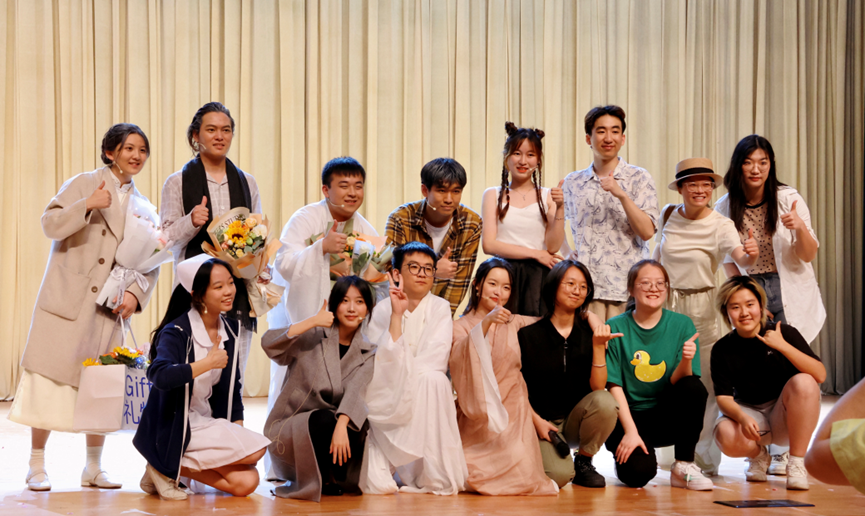

## 科道书院

科道理念：科道书院秉持“科道融一”理念，致力于培养同学们全面发展，通过校内课程和校外实践锻炼同学们学以致用、知行合一。

科道文化：打造“科道家人”文化，坚持以导师和学生为主体，强调导师与学生、学生与学生间的思想交流与相互促进，注重“浸润”“熏陶”“养成”“感染”和“培育”。

学生成长：开展一系列教育与文化活动，促进师生在活动过程中建立情感纽带，构建启发式温暖育人环境。

学生生活：坐落于学生公寓8号楼，空间设计是中式园林风格。

科道书院网站: https://kedao.shanghaitech.edu.cn/

科道书院特色：

校内课程：助力你成为更好的自己。

校外实践：支持你践行学以致用、知行合一。

丰富生活：科道家人与你一起庆祝成长中的每一个重要时刻。

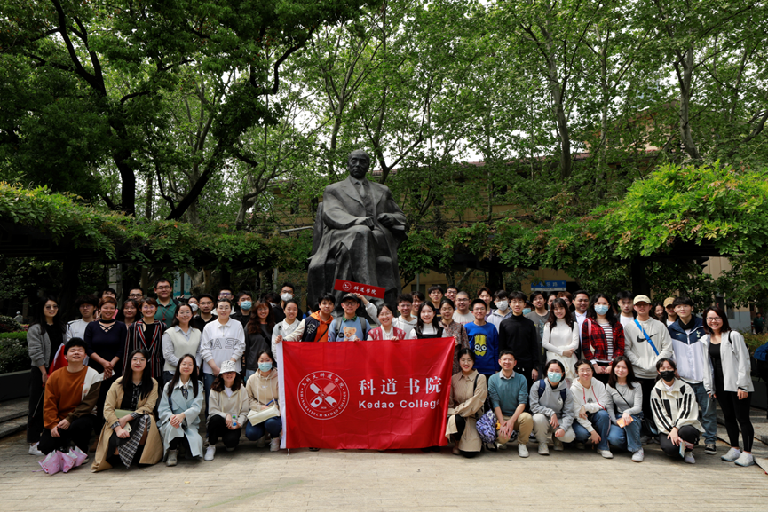

## 大道书院

书院理念：大道不孤，天下一家

培养目标：德才兼备、多元化、全方位发展的科学探索者、行业引领者和创新创业者

学生发展：家国情怀、知识广博、强身健体、健全人格、高度自律、创新精神国际视野

学生学习：诺奖得主领衔的强大导师团队对学业、生活、职业规划的个性化指导

学生生活：独有的英式庭院设计、充满创新创意的文化元素、家的舒适与温暖

大道书院网站: https://dadao.shanghaitech.edu.cn/

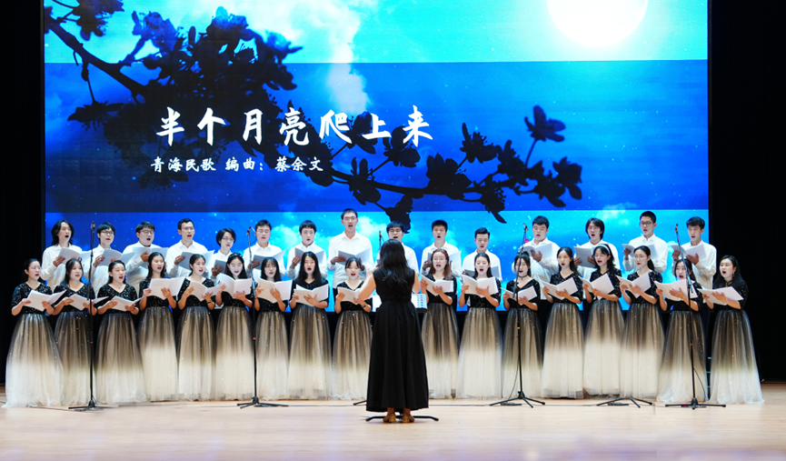

## 学生社团

上科大当前有诸多学生社团，这些社团也将在开学逐步与大家见面，积极参与社团活动也是丰富的大学生活的一部分。

**加入部分社团前请一定要深思，咨询学长学姐，谨防“图片与实物不符”，自己没有得到收获而白白付出时间精力**

现有社团名录：

ACM社、Danceholic街舞社、DataTech（数据科学）、HiFi研究社、Igem、Rhynic Studio游戏制作社、SK8滑板社、尘音合唱团、城市定向社、剧社、国文社、极限飞盘社、记者团、排球俱乐部、拳击俱乐部、GeekPie（网络开发、创客活动）、Prism漫研社、辩论社、管弦乐团、乒乓球俱乐部、网球俱乐部、国风民族文化社、跑步协会、音乐社、职业发展协会、篮球俱乐部、跆拳道社、物理社（SPS）、心理协会、瑜伽社、羽毛球协会、志愿者协会、足球社、无人机社。

另外还有学校的非官方社团：Magician、CSGO@ShanghaiTech

[以下内容不定期更新]

### GeekPie

社团：GeekPie

上海科技大学学生 GeekPie 社团由首届本科生创立于 2014 年，是一个秉承开源共享理念，在校园内积极营造协作、开发、创意与创造氛围，立足于技术的综合性科创社团。社团成立八年来，已吸纳校内外本研成员一千余余人，共在含高性能计算的共 8 个领域/方向建立了团队，涵盖机器人、FPGA、运维架构、应用与 Web 开发、信息安全、图形图像等多个领域。社团鼓励同学们在贴近业界/学界前沿的各类实践学习机会中，锻炼融合不同领域间知识与技能的能力。八年以来，社团成员在国内国际各大赛事中累计斩获各类奖项七十余项，包括 KONE Hackathon 金奖、ASC银奖、SC银奖等。2017年暑期，GeekPie 社团合作举办了 hack.init()青少年编程马拉松，2018 年还合作举办了THE Hack 创客马拉松，2019-2022年GeekPie在全球各类科创比赛共获得28项奖项 。GeekPie_HPC战队在SC21世界超算大赛中取得全球第二的优异成绩。社团已与中科大 LUG、上大开源社区、同济计算机协会等同类社团已建立交流关系，并与高通（Qualcomm）、微软、赛灵思（Xilinx）、叠境、影眸、商汤等业界领军企业成果合作举办过活动或建立了长期合作关系。昨日可忆，未来可期，GeekPie 的全体社员将继续努力，在更多更高更险的山峰上插上上科大的旗帜。

_GeekPie科创工作室交流群_：217260786

_官方网站：_<https://www.geekpie.club>

_GitHub：_https://github.com/ShanghaitechGeekPie

_开源镜像：_ https://mirrors.shanghaitech.edu.cn

_CourseBench_: https://coursebench.geekpie.club/

招新：详情关注招新海报，**欢迎有志愿参加HPC、CTF、Hackathon、FPGA、创客大赛等学术科创类竞赛的同学，与想要与我们一同开发像fresh、mirrors这样网站的同学与社长联系！**

### 程序设计竞赛社团(ACM)社

上海科技大学程序设计竞赛社团(ACM社)是专注于算法竞赛的校级社团，有独立的场地、校级网站和校级邮箱。我们积极参加国际大学生程序设计竞赛(ICPC)、中国大学生程序设计竞赛(CCPC)等算法竞赛，也参与百度之星、飞浆等AI算法竞赛，在比赛中与全世界大学生同台竞技、相互交流。我们社团招募并培养全校最优秀的同学，聚集了一群有实力的算法热爱者。我们在各项比赛中斩获佳绩，赴全国各地参加比赛并获各层级比赛的金银铜奖无数。此外，我们也为广大师生服务：为多门课程提供评测服务，举办算法研讨会，举办多场优质的公开比赛。“ACM”的三个字母分别代表 Algorithm （算法）, Code (代码) 和 Mathematics (数学)，我们的哲学是“TCS”，即Think(思考)，Create(创造) 和 Solve(解决)。 无论你是已经是熟练的算法高手，还是富有激情的新人，我们都欢迎你加入ACM社团，共同探索复杂而美丽的算法世界！

QQ群: 706461089(比赛交流群) 319071331(上科大ACM学术群)

邮箱: [acm@shanghaitech.edu.cn](acm@shanghaitech.edu.cn)

网站: [acm.shanghaitech.edu.cn](https://acm.shanghaitech.edu.cn)

地址：上海市浦东新区上海科技大学信息学院1B-205 室

<!-- 招新: **2023年7月29日**，我校将举行上海市大学生编程竞赛(七月赛)，敬请关注社团官网 [acm.shanghaitech.edu.cn](https://acm.shanghaitech.edu.cn) 。更有好礼相送！期待您的参加！希望能从这场比赛发现优秀的你。 -->

### DataTech

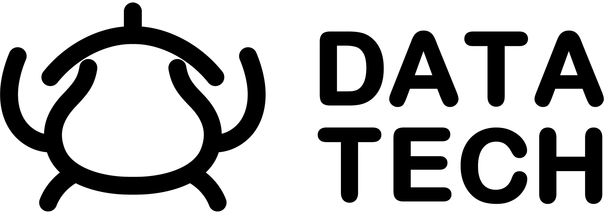

上海科技大学DataTech社团是一个专注于人工智能、数据科学研究的学生组织。我们的队伍在 Kaggle 等国内外平台斩获众多奖项，曾在校内举办过第一届 Alchimest Cup ，吸引了近60位参与者。

QQ群：161981467
我们会定期举办交流活动，欢迎进群！

官方网站: [datatech.club](https://datatech.club)

### SK8滑板社

社团：SK8滑板

Skateboarding
Club由上科大的板仔们建立，社团提供滑板教学，引领校园内滑板代步的风潮，更有tricks交流切磋。社团将滑板的街头文化带入校园，组织滑板刷街，涂鸦等活动。

滑板社QQ群：81950395 欢迎加入！

### 物理社/SPS联合会

物理社旨在为上科大各专业的物理爱好者提供学术讨论与交流的平台。

SPS全称为Society of Physics Students，中文译名为大学生物理学会，是一个面向物理学习者的专业性学术组织，总部设在美国马里兰州，其宗旨是鼓励和帮助大学生更好融入物理科学领域。SPS一直以在高校建立校园分会的形式运转，现已遍布MIT、斯坦福、耶鲁等众多名校。SPS已于2020年底在上科大建立分会，和物理社组织联合会，一同举行各类物理相关活动。

经常举办的活动有：物理研讨学习会Study Session，参观同步辐射光源、微小卫星研究所等不同物理方向的科研机构，参与报名每年一次的物理竞赛，以及其他一些物理活动。

QQ群：724996349

### Prism漫研社

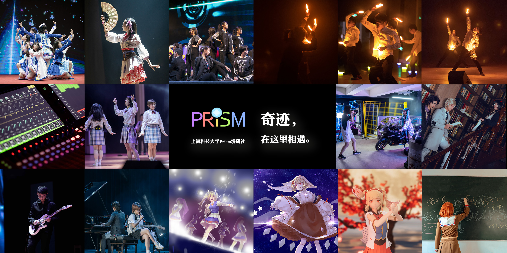

Prism漫研社成立于2014年，是上科大最早的社团之一。目前社团有成员200多人，下属五个部门和多个小组。漫研社是一个综合文艺类社团，在动漫类社团的一般活动之外，还有由各个部门和小组带来的音乐、舞蹈、美术、摄影等丰富多彩的活动。

**社团活动简介**

- 漫研社本部

  - 漫研放映会：放映动画电影和各类演出。
  - 漫展和演出的团票：漫展和演出的社团团票或赠票福利。
  - “迷你漫展”：在每年校内各种有摆摊环节的活动中的微型漫展。
  - 各种交流群：除了漫研大群之外，还有很多作品、游戏、企划的交流群。
  - 详细介绍：https://sourl.cn/gcayVU

- 轻音部

  - Plasma乐队：轻音部最初的乐队，配置为主唱、吉他、贝斯、鼓、键盘，以ACG相关歌曲和日音的翻奏为主要活动内容。
  - aBand'on乐队：一支摇滚乐队，配置为主唱、吉他、贝斯、鼓。新学年中，除了继续我们的Cover活动，我们的新目标是改编、原创和校外演出，以及新加入的你想要尝试的内容。
  - 翻唱组：以唱歌为主的小组。翻唱曲目包括ACG相关歌曲和J-pop歌曲。平日开展合唱企划、 乐队合作企划、 声乐训练等活动，对成员的个人曲目提供支持，也有登台演出的机会。
  - 后期组：涉及录音、混音等音乐制作相关的小组。负责的工作包括漫研Live的现场调音、轻音部投稿的后期制作，平时也会开展和后期有关的讲座。
  - 部门详细介绍：https://sourl.cn/UJWs6f

- 宅舞部

  - 宅舞并非单一的舞蹈类型，可爱风格的传统意义宅舞之外，更是包含了国风、街舞、代、偶像等元素的集合。风格和难度选择范围很大，有基础的人可以收获快乐、提升和挑战，零基础也能比较轻松的入门。在这里，相信总能找到适合你的风格和难度。
  - 部门开展各种团舞企划，针对不同舞蹈基础的成员进行定期分层难度练习和教学，也对成员的个人企划提供支持，并有很多上台机会。
  - 部门详细介绍：https://sourl.cn/c6ZUuP

- WOTA艺部

  - WOTA艺是表演性质的“光棒舞”，是基于挥动荧光棒表现音乐节奏的一种表现形式。
  - 我们是校内演出的常客，还负责过附属学校节目的培训。部门日常活动以WOTA艺练习和新人培养为中心，每年都带着很多新人走出新手村。同时也通过上萌会与上海各校打师有着密切交流，参与过其他高校的演出。
  - 部门详细介绍：https://sourl.cn/it2wmB

- 摄影部

  - 摄制组：视频和照片的拍摄，视频的剪辑与制作，校内演出活动的拍摄和直播等等，每学期也开展包含视频照片拍摄、视频剪辑后期等多方面的零基础和进阶讲座。
  - Cosplay组：每学期组织各类Cosplay团片企划，为成员个的人拍摄提供支持，开展面向新人的讲座。
  - 部门详细介绍：https://sourl.cn/jpSbuK

- 综合美术部
  - 美术组：组内交流、快乐摸鱼，也会开展一些如新年周边制作的集体企划，以及为社团活动画插图立绘，并参与社团的海报制作等设计工作。
  - 氪姬组：负责虚拟主播“氪姬”的运营工作，Live2D和3D形象的视频制作，以及实时动捕直播。
  - 部门详细介绍：https://sourl.cn/jkJpZv

当然只是想找组织、找同好、水群也是完全没问题的！详情见公众号&加群！

**联系我们**

- 社团哔哩哔哩官方号：https://space.bilibili.com/376373617
- 官方QQ号（人工回复）：3075193371
- 漫研2023招新群（QQ）：705388407
- 社团微信公众号：上科大Prism漫研社

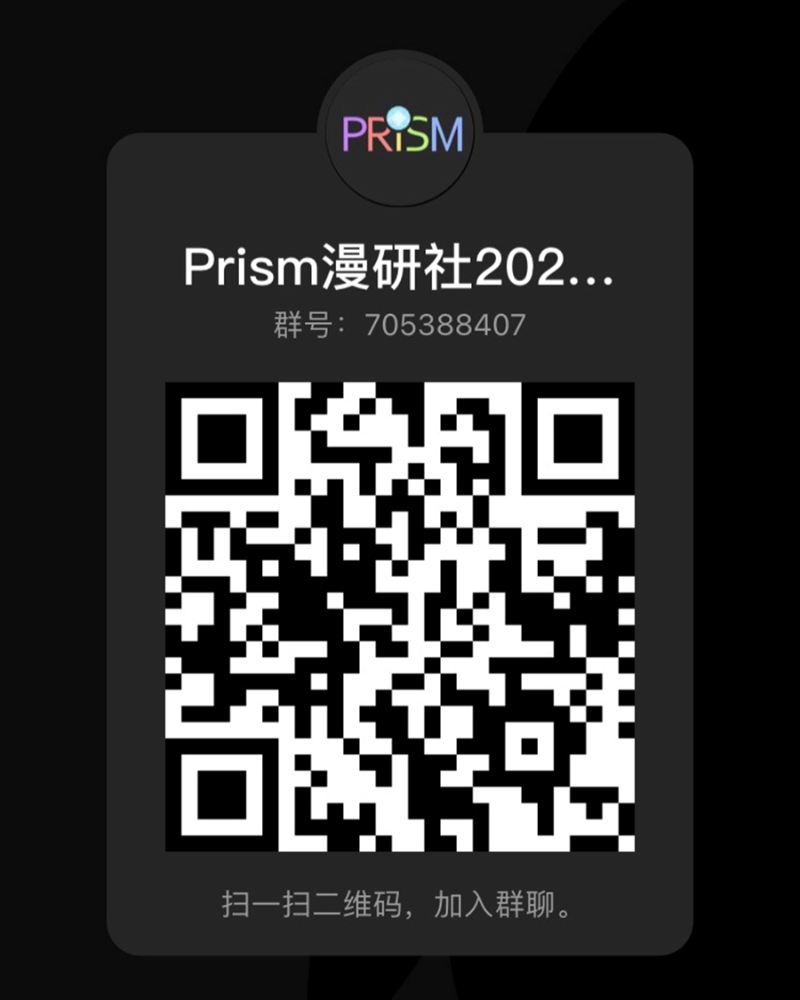

### 栖鸿文学社

陌生人，你好啊！

这里是上海科技大学文学社，始建于2014年。如果你曾有过关于文学、爱情或生活的朦胧的梦，却被一股来自身后的无形的力量推到冰冷的数据和繁复的公式之前，终日终年。相信于你而言，从不乏将诗和远方安顿在学习和工作一隅的愿景。如果你渴望在这所理工类大学中遇见另一个专注于小说温婉细腻的你、热忱于诗歌灵逸洒脱的你、精通于哲辩缜密理性的你……那么陌生人这里将成为你心灵的港湾。

在这里，我们有不定期举办（因为大家有时会咕咕咕）的读书会。围坐桌旁，捧书共读，谈古论今，随书中人的幸福而欢笑，为故事里的忧愁而落泪，时光就这样在温暖与收获中一点点流走。

在这里，也有活跃的文字内容创作。我们邀请了上科大新闻中心进行专业级的指导，并将为创作的文字提供充分的传播渠道。你笔下的欢乐或忧愁，呼喊和咏叹，将在白纸与墨香之间，连结周围所有愿意倾听的灵魂。

在这里，还有丰富多彩的各种周期性活动：三行情诗写作，线上书籍推荐……如果想要尽情燃烧上科大丰富多彩的休闲时光，这里总有一款适合你。

远道而来的旅行者，如果你愿意，请与我们同行，在生活中遇见文学，在挣扎中遇见欢乐，在平凡中遇见永恒。

### 跆拳道社

社团：跆拳道

社团：跆拳道

跆拳道精神为：礼义廉耻，忍耐克己，百折不屈。

我们秉着以武会友、以人为本、来去自由的宗旨。

希望跆拳道高手来汇合，使我们后继有人。

热烈欢迎有韧性的体育爱好者前来体验，并可增强力量、速度、柔韧与协调性。

每周由专业黑带教练于体育馆专用场地带领进行训练。

### 拳击俱乐部

拳击，是一项有趣且富有挑战性的运动，每一次训练，都是对力量、体能和敏捷性的综合考验。

戴上拳套，集中精神，让身体追随你的意志，然后拼尽全力！除了挥洒汗水的畅快淋漓，你还将

收获更强壮的体魄和更灵敏的头脑。

拳击俱乐部是一个氛围轻松愉快的大家庭，互相帮助，互相push。我们的教练是毕业于上海体育

学院的现役职业拳击手，每周带领大家一起（痛并）快乐地在专用的拳击房进行系统的训练。

欢迎热爱运动的你加入我们，不管是拳击小白还是老鸟，都可以在这里不断取得进步！

### 国风民族文化社

一弹新月白，数曲暮山青。我们追寻历史中传来的袅袅之音。

罗袖动香香不已，红蕖袅袅秋烟里。我们重现自古画走出的绵绵深情。

清颜白衫，青丝墨染，彩扇飘逸，若仙若灵。你是否向往穿上飘逸灵动的汉服，在舞台中央展现曼妙的身姿?是否渴望了解汉服知识，传承华夏几千年的文化积淀?快来加入国风民族文化社吧!

国风社成立于2014年，与学校一同成长，通过各种形式的活动，寓教于乐地推广中华优秀传统文化。现在有**民族舞团，民族乐团，国风综合部**三个分部，乐团和舞团成立后，大大小小的活动已参与了十余场，有些经验，还在成长。我们不是复古者，社长比较佛，没有什么宏大理想口号。我们是一群单纯地做着自己喜欢的事的人，2021年端午节，综合部举办了端午香囊活动，去中药房中抓取了多味传统药方，让同学们自己配出自己最爱的端午香囊；在正月的尾巴上，同学们还举办过窗花剪纸等活动；不仅线下活动办的有声有色，同学们也举办过线上活动，如三行格律情书征集等兼具古典与潮流元素的活动。国风民族文化社下属的舞团和乐团更是积极参加学校演出，以各种独具一格的活动形式，弘扬传统文化。欢迎大家了解并加入！

**国风民族舞团**

国风民族舞团衷心欢迎所有热爱舞蹈的大家加入我们的小家庭w！

这里有纯粹的古典舞，也有紧跟时代的电子国风，只要你想，我们就能一起创造无限可能(
﹡ˆoˆ﹡ )

舞蹈的世界里没有那么多的弯弯绕绕，可以尽情展现和释放自我，我们也会尽自己的努力为我们和即将加入的大家提供一个展现自我的舞台～

舞团现招收所有对中国舞有兴趣的同学，对基本功和舞蹈基础不设门槛和要求，**当然也非常欢迎和需要有基础的小可爱们加入呀**！啾咪！扫码进群

**国风民族乐团**

民乐团组建于2017年9月，作为国风社的重要组成部分，是一个**雅俗共赏、面向未来**的乐团，曾经受邀参与国际会议、文化节演出，也曾参加过快闪、在夏日信约大放光彩。2021年5月，在学校举办了首届“泮林怀音”民乐专场音乐会，**欢迎大家加入上科大民乐的艺术殿堂**。

民乐的张力很大，高山流水，下里巴人，都能掌握自如。我们既可以在云雾缭绕中弹奏出《**春江花月夜**》般的悠悠古韵，也可以在滚滚红尘中书写《**权御天下**》爱恨情仇。我们可以在古调新翻《**苏堤漫步**》中创造惊喜，也可以在天马行空、《**凤鸣九天**》中回归古法。进可怒写青春时尚潮流，表演**黑人抬棺**，退可轻吟古风小韵，共赏**残菊叶落**。在这里，**没有什么音乐的不可能**，就等你来创造不同。

民乐团招收**有一定功底**、对**乐理有一定理解**的同学，最重要的是对民乐**有热忱、有激情**。除了常规民乐以外，我们还欢迎**大提琴**、**低音提琴**以及**通乐理会编曲的**同学的加入。

欢迎关注 上科大国风民族乐团微信公众号以及加入无门槛民乐爱好者qq群：602806968。（具体怎么招新社长没说，生疏的乐器可以先练习起来啦，等社长想好怎么招新我们再一起整活！）

:

**国风综合部**

**国风综合部诚邀对中国古代习俗文化服饰礼仪感兴趣的小伙伴们加入！**

综合部成立于社团建立之初，但由于种种原因于2019年才重新恢复。综合部恢复以后，我们逐渐拿回了许多属于我们的快乐。现阶段综合部已有对古代诗词感兴趣的吃瓜群众、对茶艺有独特兴趣的可爱小姐姐、热爱古代服饰的汉服唐服发烧友........

只要你有想法，我们就热烈欢迎！期待大佬们和萌新的加入。(秃头负责人还对以后的活动做了充分的规划，只要招新状况令人满意，新活动会源源不断哦)

**更多内容加群了解！群号291582811**

### 上科大瑜伽社

_社团：上科大瑜伽社_

社团活动地点：主要为体育馆

上科大瑜伽社是由上科大学生组建，专业瑜伽老师指导，学校大力支持的非营利性学生体育社团。瑜伽社宗旨在让大家在忙碌的学习科研之余，通过定期上课形式的瑜伽锻炼来令全身心得到放松，将习练的模式和领悟融入生活，使得身体，心灵，工作获得最佳的平衡状态。这里有专业的瑜伽老师，爱好瑜伽的一群小伙伴。我们相信在瑜伽社上的每一次瑜伽课，都将会成为我们对上科大美好回忆的一部分。

### 尘音合唱团

_“即便是一粒微尘，也要唱出自己的声音。”_

不要看到合唱就觉得自己搞不来然后溜了！

不要跳过！重复！不要跳过！

如果你曾在漫步向阳河边时哼唱一曲，如果你曾驻足聆听乐与声交织的恢弘，如果你倾心歌唱亦或热爱舞台，如果你想在享受美的同时邂逅可爱而有趣的灵魂，那么不妨搭乘上尘音合唱团这一班列车。

尘音合唱团成立于2015年4月，是一支校级艺术类团队，累计拥有数百位团员。“即便是一粒微尘，也要唱出自己的声音”是社团名称“尘音”的由来，也是我们一直坚持的社团宗旨。我们致力于推广合唱艺术，让大家近距离感受、体验合唱艺术，欣赏和声之美。

我们有丰富的演出机会，是元旦晚会、迎新晚会和各类重要交流活动演出中的主力军，至今已演唱过《这世界那么多人》、《我喜欢》、《望月》、《夜来香》、《Sogno di Volare》、《君をのせて》《Danny Boy》等众多国内外优秀合唱曲目，2020年12月成功举办《飞鸿踏雪》专场音乐会；2022年4月封控期间制作的云合唱视频《这世界那么多人》发布于上海科技大学官方微信公众号推文，获得了广泛转发；2023年5月成功举办“飞泉鸣玉”主题专场合唱音乐会。

尘音合唱团希望通过我们的表演，让大家近距离感受到合唱的魅力，并为每一位可爱的尘音人带来温暖和勇气。

【招新计划】

◆ 女高音、女低音、男高音、男低音声部成员及钢琴伴奏

我们诚挚欢迎每一位受过专业训练的音乐大佬，和未经雕琢但跃跃欲试的合唱小白！

**特别尤其宇宙无敌欢迎女孩子哦~姐妹们看过来！**

◆ 作曲|编曲|摄影|运营|宣传

_敬请留意社团招新邮件......_

欢迎关注尘音合唱团的B站账号：上科大尘音合唱团（UID:670045446）

《这世界那么多人》云合唱视频可见“上海科技大学”公众号2022年4月11日发布的推文，或进入此链接：https://mp.weixin.qq.com/s/ixJMsKs-1gFxQBi1axFz_Pw

### 上科大管弦乐团

上海科技大学管弦乐团成立于2016年11月2日，含弦乐、管乐、打击乐、键盘等声部。乐团由学生自主管理，是一个充满科学气息、拥有艺术灵魂的集体。我们始终坚持的目标是为同学们带来更多更好的音乐体验，传递古典乐的美妙和魅力。与此同时，我们也非常重视同学们的综合素质培养，希望能通过音乐的力量，让同学们成为全面发展、富有创造力和想象力的人才。

乐团活跃在上科大的新年晚会、毕业季演出、学院活动、校园开放日等场合。从2017年起至今，乐团已举办了五次夏季音乐会（2017、2018、2019、2020、2023）、一次春季音乐会（2019）和两次秋季音乐会（2021、2022），并创建和运营了自己的公众号（上科大管弦乐团）和B站账号（上科大管弦乐团，UID：511095234）。2020年年底，管弦乐团代表上海科技大学参加了第六届全国大学生艺术展演，获得了非专业组市级一等奖。

在未来，我们将继续专注于团队协作能力的培养和音乐演奏技巧的提高。我们会持续每周的排练，认真准备演出。同时，我们也在尝试策划一些有创意的活动，让更多的同学接触、了解和热爱古典乐。

我们迫切地希望有乐器基础的同学、教职员工或校外同学加入我们。我们也期待着即使不会乐器但具有极大热情和责任心的同学参与乐团的谱务、宣传、协调等工作，甚至可以零基础快速学习简单的打击乐器然后加入合奏！我们想和大家一同推动和见证乐团成长为一个声部齐全、具有较高演奏水平和影响力的管弦乐团。

我们招新的方向有——

弦乐：小提琴、中提琴、大提琴、低音提琴等；

木管：短笛、长笛、单簧管、双簧管、英国管、巴松、萨克斯等（我们是需要sax的！！！）；

铜管：小号、圆号、长号、大号等；

打击乐：定音鼓、镲、钟琴、三角铁、铃鼓、小军鼓、架子鼓等；

键盘：钢琴、电子琴等（强烈推荐会钢琴的同学参与电子琴、打击声部以及谱务等乐团事务）；

拨弦乐：竖琴、古典吉他等；

职能：指挥、谱务、财务、团务、宣传等。

更多信息可关注微信公众号/b站账号：上科大管弦乐团。我们目前的排练时间是每周日晚19:00-21:00，欢迎开学后来学生活动中心201围观！

无门槛交流合作整活分享群：772906433

2023上科大管弦乐团招新群：894040697

We need you to witness our glory, past, now and future. 期待你的加入！

### 音乐社

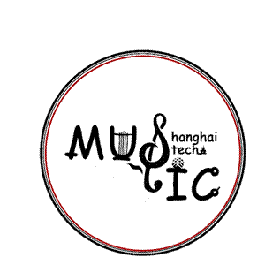

上海科技大学音乐社从属于科道书院，是校内音乐爱好者组成的学生社团。作为最早创立的社团之一，音乐社主要作为同学们交流音乐的平台，同时举办演出、交流、欣赏等活动，始终保持开放的态度和管理团队共同决策的模式。

目前我们成功举办了很多大型活动：

- 秋末live（2022，2021，2020等），一般在10月末举办，为综合型或原声音乐演出，主要使用校内设备，在露天或半露天场地。最近一次活动是2022年10月29、30日两场演出，以原声音乐（唱歌、弹唱、器乐、器乐合奏等）为主，总演出时长约4小时，实时观众数量约200人；
- 蛮瓜音乐节（2022），为校内最专业的摇滚音乐节，演出阵容包括校内外多个乐队，设备由专业舞美音响公司负责。每一届演出至少有6个乐队，总演出时长至少4小时（不包括换场）。演出场地周围有食品饮料和纪念品售卖。第一届蛮瓜音乐节于2022年11月26日在体育馆拳击房举行，总观众数达到近千人次；
- 乐手交流（2023，2022等），是校内乐手交流的聚会，以电声乐器为主。活动内容为：个人展示、随机乐队和即兴表演。本活动可以帮助同学们找到同好，组建乐队。

此外，我们还举办过各种各样多样化的活动，如原创部作曲课、吉他课、声乐课、组队观看live等等。

在下一个学年音乐社打算继续推进这些计划：

- 举办第二届蛮瓜音乐节和2023年秋末live（都在秋学期）。按计划，第三届蛮瓜音乐节将在2024年春学期-暑学期举办。我们希望蛮瓜音乐节能找到稳定的赞助方，成为上科大的名片；
- 再举办一场乐手交流；
- 发掘原声音乐部和原创部更多活动形式，如小型室内音乐会、创作人论坛等，使这两个部门成为可以独立举办小型活动的稳定组织；
- 重启线下音乐欣赏，继续开展网络推歌等活动；
- 与管弦乐团和国风音乐社等社团合作，探索更丰富的活动形式。

更多资讯，请关注

微信公众号：SHTU音乐社

Bilibili账号：上海科技大学音乐社

音乐社2023招新/活动群：893331625

音乐社交流群：311957297

### 

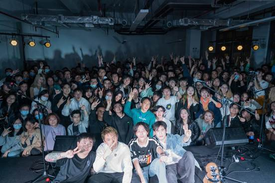

### Danceholic 街舞社

我校街舞社聘请优秀街舞教师为大家每周带来免费课程。如果你是街舞小白，我们会耐心地领你入门；如果你有一定基础并且愿意提升，我们也会安排另外的训练为你搭建舞台。目前我们教课的舞种为Hiphop和Jazz。欢迎各位同学在学期初观看我们的迎新表演并参加后续招新活动，我们在这里等着你！

### 极限飞盘社

极限飞盘社成立于2017年9月，下属上科大可积飞盘队，队内现有核心队员20余名，每周固定训练一次。曾多次外出参加比赛，在第四届全国大学生极限飞盘联赛预选赛中获得华东地区第七名。曾举办过三次科大杯极限飞盘交流赛，其中第三届分组赛吸引了上百名选手参加。

顺便介绍一下，极限飞盘是一项七人制运动，零身体接触，男女同场竞技，易于上手同时又具有足够的竞技性，是目前世界上发展最快的运动之一。

我们极限飞盘社欢迎所有新朋友的参与！

### 上科大橄榄球俱乐部

俱乐部社团正在筹建中，欢迎对橄榄球感兴趣的小伙伴加入，一起玩耍腰旗橄榄球(Flag Football)！美式橄榄球兴起于哈佛、耶鲁、普林斯顿等常春藤名校，而脱胎于美式橄榄球的腰旗橄榄球是一项新手友好，对抗小，注重团队配合，男女均可参加的户外运动。

橄榄球目前是2023杭州亚运会的比赛项目，是2022年世界运动会的正式比赛项目，也成为了2028年奥运会的候选项目。上海也是橄榄球运动氛围浓厚的城市，拥有全国最多的CNFL橄榄球俱乐部。并且还有上海交大雄狮队，复旦大学龙骑兵等高校队伍，多次获得“上海市大学生美式腰旗橄榄球锦标赛”荣誉。本活动社团旨在为了让更多的同学体会橄榄球的魅力，增强体魄。该运动蕴含尊重对手，保持热忱的理念，目前群内已有近40人。欢迎大家一起拔掉Flag，享受Football！（活动群号：824475777）

部分活动训练照片如下，期待新同学们的加入！

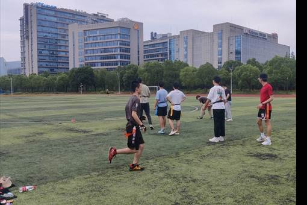

### 排球俱乐部

无论你是初学还是精通，只要你有一颗热爱排球的心，我们就是一家人！

上科大排协公众号

排球俱乐部每周有两次训练，面对全校学生开放，会有专业的教练和热情的学长学姐带领大家练习。

秋学期排球俱乐部会举行新生杯，仅限一年级和二年级的同学参加。通过比赛，你不仅可以感受到和队友并肩作战的快乐，还能更加领略到排球的魅力。

春学期排球俱乐部会举行校内联赛，以院系为单位进行比赛，胜利的队伍会获得丰厚的奖品哦~

我们也会定期与上海其他高校如上海海洋大学和上海海关学院等展开共同训练和对抗，有机会见到更多与你有共同爱好的同学！

我们每学期也会代表学校参加上海市的排球高校联赛，虽然我们还是一只年轻的队伍，但是从来不会轻言放弃！

与海洋和海关的共同训练

我们期待着每一位新同学的加入！

### 体育俱乐部、校队

目前学校内有各种体育俱乐部，跆拳道俱乐部、拳击俱乐部、舞蹈俱乐部、乒乓球俱乐部……

甚有各种足球校队（男）、篮球校队（男）、篮球校队（女）、羽毛球校队（男、女混合）……

以上这些体育组织都有相关的专业教练进行常驻带队哦\~并且已经在最近几年的大学生体育比赛中屡获佳绩。

只要你对体育项目有兴趣，并且能持之以恒训练的。不论你的体能如何，不论你一开始的技术如何，敢于拼搏，就可以加入我们！

篮球俱乐部合照——

### 上科大学生职业发展协会

上海科技大学学生职业发展协会在学校成立之初就加入了社团大家庭。社团致力于以本研合作的形式，通过和校外企业、优秀校友的联系互动，为最广泛的同学们提供职业和生涯发展的经验知识，更为同学们创造一块可以锻炼自己能力，增长自己见识的社团舞台。

社团现已组织了企业参观、企业嘉宾沙龙讲座等活动，为同学们认知行业、认知自己的职业生涯发展提供了最直接的交流机会；社团也协办了学校的一些大型活动，通过参与这些活动为很多同学提供了接触企业界的机会；社团注重成员自我能力提升，举办成员培训，针对社团和成员的发展问题寻找解决方案。

__

_（一次关于自我认知的生涯发展午间沙龙）_

_有兴趣可加qq群：_

__

### **Magician战队**

想不想从电竞游戏中解放出来，自己研发实体机器人参加比赛？Magician社团欢迎你的加入！

在Robomaster机甲大师高校系列赛由大疆举办，包括超级对抗赛、高校联盟赛、高校单项赛等等。在这里，有技术也有战术，其中技术层面分为机械、电控、视觉、硬件等多个部门。在这里，你将获得宝贵的实践技能和经验，你可以参与包括“嵌入式系统设计”、“机械控制”、“人机交互”、“惯性导航”等多个机器人相关的科学领域。此外，社团浓厚的学术氛围也将鼓励你更好地完成学业，毕竟有可能某学长学姐就是你某门硬课的助教！并且，即便你是技术小白也完全不用担心，因为会有大佬手把手教你！

让我们在Magician, 遇见热爱！

robomaster官网：https://www.robomaster.com/zh-CN

Magician2024招新群：747216887

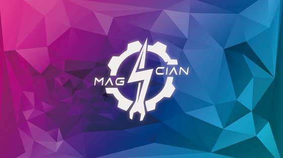

### **CSGO@ShanghaiTech**

社团：CSGO@ShanghaiTech

CSGO@ShanghaiTech于2018年成立，在没有社团招新条件的背景下，已发展为有110多名上科大CSGO玩家的非官方社团。至今已成功组织了许多次线下活动，如集体观赛、线下开黑等。社团内现有众多稳定开黑校友，包含了各种玩法（竞技、娱乐、身法等）与各个段位的玩家，欢迎你的加入！

QQ群：854671035

完美平台公会：CSGO@SHTU

Steam组https://steamcommunity.com/groups/CSGO_ShanghaiTech

### 上海科技大学志愿者协会

上海科技大学志愿者协会（简称“上科大志协”）是由志愿从事社会公益、社会服务事业的上科大青年学生组成的学校性公益团体。上科大志协成立于2014年9月，现有志愿者协会QQ群1个，近1600名志愿者成员。同时有30名管理层成员，负责社团运营，日常工作的开展。

上科大志协受学校、书院的管理，遵从社团章程，以“奉献、友爱、互助、进步”为服务精神，以“自我管理、自我教育、自我服务”、“服务他人、完善自我”为行为准则，为社会和全校师生提供志愿服务，为推动校园文化风貌建设做出贡献。

## 学生组织

### 上海科技大学学生会

全称：上海科技大学学生会（ShanghaiTech Student Union）

宗旨：全心全意为学生服务

学生会邮箱：studentunion@shanghaitech.edu.cn

学生会官方微信公众号：上海科技大学学生会

上海科技大学第三次学生代表大会于2022年11月26日顺利召开，根据《中华全国学生联合会章程》、《学联学生会组织改革方案》、《上海市学生联合会关于健全上海高等学校学生代表大会制度的若干规定》，由上海科技大学学生代表大会直选产生学生常任代表委员会和学生会主席团。

#### _基本架构_

#### _第二届学生常任代表委员会_

许腾，姜闻涛，顾子欣，刘傲，刘宇翔，赵冠钦，潘思佳

> #### **学生会成员**
>
> - 学生会主席团:
>
> 林弘扬，姜紫翔，赵世涵
>
> - 本科生分会：
> - 组织联络部
>
> 部长：徐云飞 副部长：柏艺纯、程启哲
>
> - 文艺体育部
>
> 部长：邵奎翔 副部长：李兆轩、王婧婷
>
> - 学术科技部
>
> 部长：张 冬 副部长：杨佳雨、沈哲灏
>
> - 生活权益部
>
> 部长：郑 皓 副部长：查俊晖、朱昊骋
>
> - 新媒体部
>
> 部长：杨 鸽 副部长：陆沈欢、龚海琦
>
> - 研究生分会：
> - 组织联络部
>
> 部长：徐江坤 副部长：郭庄严
>
> - 文艺体育部
>
> 部长：苏冠阳
>
> - 学术科技部
>
> 部长：潘康胤 副部长：刘  帅
>
> - 生活权益部
>
> 部长：朱祎晗 副部长：赵乘风
>
> - 新媒体部
>
> 部长：陈  瑜 副部长：海馨月

#### _部门介绍_

_组织联络部_

组织联络部常设日常事务管理、外联、社团管理、财务、记录档案考勤等多项职能，如遇全校活动，更是义不容辞。如果你认为自己执行能力很强，如果你对外联很感兴趣，如果你对社团管理与活动有自己的想法，如果你对财务工作有经验或者有兴趣，如果你有志引导科大社团走向繁荣，就请加入组织联络部！

_学术科技部_

学术科技部主要为学习与科学研究方面服务于同学的部门。工作内容主要包括组织各类大中小型讲座，建立健全完善的校内信息发布与收集平台，营造良好学习氛围，举办或组织同学参加各类学术竞赛活动等。

_文艺体育部_

文艺体育部，是负责上海科技大学本科生、研究生及全校教职员工的文化艺术活动与体育健康活动的专门职能部门。部门主要以丰富大学生校园文化生活、陶冶大学生文化艺术情操、培养大学生对各项体育活的热情以及与校内各社团和与其他高校文体部共同开展文化艺术体育方面的活动为目的来开展工作。

_生活权益部_

生活权益部是学校和同学间沟通的桥梁。主要工作为解决同学们在学校生活中可能遇到的各种问题，集中反映，集中解决，为保障学生生活而不懈努力；开展和生活相关的各类活动，如传统美食制作，每周六晚免费提供水果和桌游的相约周末等，不定期举办学生交流会，为同学们直接和校方面对面沟通架起桥梁。同时也为同学们日常碰到的生活问题答疑解惑。如果想与校领导之间轻松地谈笑风生，如果经常有合理的想法改变学校又不知道如何提交的时候，欢迎加入生活权益部！

_新媒体部_

配合各个部门完成学校各个活动的宣传、转播、舞台效果等任务。日常管理学生会公众号、微博、B站等公共平台，通过海报及上述平台及时传达校园信息。

上海科技大学学生会将在开学后启动招新，敬请期待！

### 上海科技大学团委

团委邮箱：[youth@shanghaitech.edu.cn](youth@shanghaitech.edu.cn)

团委公众号：

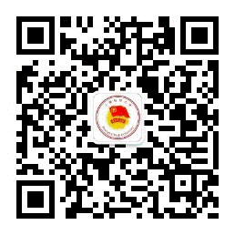

**团委组织架构及部长组成**

**学生副书记**

陈奕璇

**组织部**

闫浩东（部长）、王柯皓（副部长）、孙萌（副部长）、崔誉轩、刘思扬、查元婷、何信颐、张书翰

**宣传部**

周玉洁（部长）、赵敏萱、金宣伊、石尚轩、钱晟、于坤坤、尹秋晓

**志愿服务部**

张逸凡（部长）、梁栋（副部长）、徐晨昊、王艺璇、陈俊玮、牛育轩、任超宇、顾倩

**团委办公室**

陈悦（部长）、潘比康（副部长）、陈财源、胡芸婷

**文化发展部**

潘思佳（部长）、周雨欣（副部长）、刘奕霖、唐志昊、刘晓堃

**实践部**

林维嘉、王欣奕、栾浩明、黄嘉程、许大地、丁琳、王维箴

**青年研究部**

罗尉铭、刘仲宇、蔡济远、刘真琦、潘思佳

**科创部**

李浥菲（部长）、许睿

**部门介绍**

**组织部**

1、负责共青团组织建设及团干部队伍建设，全面掌握全校共青团组织的情况（团总支、团支部数量及人员构成，专兼职团干部的数量、比例等），及时进行团员登记和团员及团干部变动情况调查统计工作；

2、加强与基层团支部的联系，了解基层团支部的组织建设情况，对各团支部的学习、团日活动的开展进行指导、监督、检查与帮助；

3、制定落实团校培训和主题团日活动，加强对团员青年的教育引导，通过多种途径及时了解团员青年思想动态；

4、负责校内各级团组织和团干部、校级学生组织和学生干部的评优表彰工作；

5、负责团籍管理及团费收缴等工作。

**宣传部**

1、负责典型人物的推广和宣传工作，加强青年思想政治教育工作的开展；

2、针对团员青年的思想状况，组织各种教育活动，如组织、参观、报告会等，探索、研究团的宣传工作的新规律和新理论；

3、负责校团委重要活动新闻照片采集和新闻撰写宣传，向团市委及学校报送新闻；

**志愿服务部**

1、负责指导、管理我校志愿服务总队和各院系志愿服务分队志愿服务工作，支持和培育各级各类志愿者组织建设；

2、承担上级单位与校内各级各类志愿者组织联系的桥梁和纽带作用，完成上级交办的任务；

3、建立健全志愿服务项目体系，制定全校志愿服务工作制度；

4、负责全校志愿者的注册、招募、培训、评估、奖励等工作；

5、积极推进校内外志愿服务工作的交流与合作

**团委办公室**

校团委办公室负责部门间的协调、档案的整理、团学组织的培训等工作。协助学校青马工程体系建设、团员发展、推优入党。

**科创部**

主要围绕“创新”与“创业”两个主题开展工作，负责举办或协助举办各项学术科创比赛，促进项目的孵化和发展，着力营造浓厚的校园科技创新氛围。

**文化发展部**

筹办各类精品文化活动，整合校园文化资源，营造和谐、健康、多元、向上的校园文化氛围，构建上科大师生共同的文化记忆。

**实践部**

以实践育人为导向，负责组织与举办各类实践活动，如寒暑假社会实践活动、企业走访、基层挂职锻炼等，构建学校与社会的合作联系。

**青年研究部**

负责组织开展社会及校园热点收，调研青年需求和思想动态，传达青年所需，服务学校决策。

**特色团学活动及志愿服务组织：**

**青马班**

为深入贯彻学习习近平新时代中国特色社会主义思想，抓好青年马克思主义者群体中的关键少数，着力为党培养和输送一批具有忠诚的政治品格，浓厚的家国情怀，扎实的理论功底，突出的能力素质，忠恕任事、人品服众的青年政治骨干，上海科技大学第一期“青马工程”研修班招募了不同学院不同年级的本硕博团学骨干及学生共同学习党团精神，共三十余名学员参加。

**科普讲师团**

为响应《关于新时代进一步加强科学技术普及工作的意见》和习近平总书记关于推进科学普及工作的重要论述，结合学校“立志成才，报国裕民”的育人理念，在校团委指导下，上海科技大学青年科普讲师团于2022年11月成立。

截止23年6月，讲师团已经深入上海张江地区近十所中小学校开展了二十余次科普活动，活动结合授课与动手实践，覆盖对象上千人次。在开展活动的同时，讲师团也在课程质量打磨、特殊儿童科普、团队可持续发展等方面做了积极的努力。

****

## 食

### 校园餐饮服务

- 目前学校开放三个餐饮中心：**丝路餐厅**（一号餐饮中心）、**尚科美食广场/西餐厅**（二号餐饮中心）以及**白玉兰餐厅**（三号餐饮中心）。

- - 丝路餐厅供应清真美食，餐厅内还有**八度余温**供应各类奶茶果茶；
  - 尚科美食广场一层共设两个窗口，分别为小食窗口（煎饼、粥、豆浆等，7：00-19：00全时段开放）和自选餐窗口；
  - 尚科美食广场二层供应现炒与特色餐品，有麻辣烫、石锅拌饭、水饺、铁板、重庆小面、米粉、盖浇饭等；
  - 西餐厅供应披萨、意面、牛排等西式餐饮，消费水平略高；
  - 白玉兰餐厅一层设有炒饭、铁板、面食、香锅以及自选菜窗口；
  - 白玉兰餐厅二层为**教工食堂**以及**中餐厅**，提供点菜，消费水平略高。

- **海科路99号、100号食堂**凭上科大学生身份证明材料可以自行办理就餐证。

- **肯德基KFC**：位于二号餐饮中心的北侧部分（近景观河），周四学生会很多。营业时间为7:00-22:00，双休日照常营业。

- **耐思咖啡**：位于学生活动中心建筑的西侧部分（近景观河），持教师卡享受7折优惠，持学生卡享受7.5折优惠，持校园一卡通享受8折优惠。营业时间为9:00-17:00，双休日照常营业。

- **耐思烘焙**：位于一号餐饮中心东侧一楼，持学校校园卡统一享受8折优惠。营业时间：周一至周五9:00-15:00，15:00后可至耐思咖啡购买，双休日及节假日不营业。

**友情提示**：上科大基本所有的食堂都需要一卡通消费，多数食堂的饭点为（早7:00-9:00，中午11:00-1:00，晚5:00-7:00），**不接受现金以及微信支付宝转账**。西餐厅、咖啡厅或全家便利店接受非一卡通消费（也是错过饭点的选择

### 便利店与外卖

- **全家FamilyMart**：能满足一般需求的24小时便利店，位于二号餐饮中心一楼东侧（靠近3号宿舍楼）。

- **瑞幸咖啡**：位于距离学校东门400米的金创大厦园区内，可通过微信小程序“luckincoffee瑞幸咖啡”等方式线上下单后自提。

- **外卖**：外卖大部分送达时间为 30 分钟到 70分钟，学校有外卖红包分享的微信群。东门（中科路1号）设有美团外卖柜，大多数同学选择饿了么以及美团，但请注意饮食卫生安全。学校禁止外卖送入校。

### 周边餐饮中心

学校周边诸多商业建筑提供餐饮服务，包括但不限于

- 长泰广场
- 汇智商业中心
- 传奇广场
- 万科2049翡翠公园
- 盛大青春里
- 宜家家居（北蔡店）
- 复地活力城

在下一段中将有详细介绍。

## 乐

学校三号餐饮中心北侧设有礼品店，营业时间为周一至周五10:00-17:00，双休日及节假日不营业。可在此选购明信片、短袖衫、U盘等学校特色纪念品（如有特殊需求可至耐思咖啡询问及购买）。

学校周边亦有较多购物与餐饮中心：

- 长泰广场：金科路2889号，从从东门出发沿中科路步行约400米（中科路海趣路公交站）乘坐浦东58路公交车至终点站祖冲之路金科路站下车即达，位于2号线金科路站4号口。从地下到地上三层均有觅食处。地下拥有两个美食城，多为简餐、饮品店，偏中低端消费，人均50-100；地上为中高端消费，人均价格和海拔基本成正比，基本在100以上；地上也包括许多购物商店、酒吧，还有中影长泰国际影城。

- 汇智商业中心：金科路3057号，长泰广场对面，交通方式同上，位于2号线金科路站2号口。拥有颇多购物消费地点，包括5楼的萨莉亚，1楼的药房，地下的欧尚超市等。汇智内全楼层均有不少可以觅食的地点，一楼和五楼极佳。五楼亦有上影河马国际影城。

- 传奇广场：碧波路635号，从从东门出发沿中科路步行约400米（金科路中科路公交站）搭乘浦东25路公交车至终点站张江地铁站下车即达，位于2号线张江高科站5号口对面，是一个老牌的商业广场，以美食与小吃为主，但是与上两者相比，规模较小，且娱乐功能偏少。

- 宜家北蔡商场：临御路550号，从中科路地铁站乘坐13号线至莲溪路下车步行1.4km即可到达，或乘坐13号线至陈春路转乘沪南线/浦卫线至沪南路御桥路下车即到达。宜家不只是卖家具，餐饮也有口皆碑。周二会员日主食半价，人均消费30 到 50 元，每日都有传说中的“宜家一元冰淇淋”吃到饱。

- 2049翡翠公园：荣科路277号，从中科路1号门口沿中科路行至百业路右转一个路口即达，骑单车车程10分钟以内，亦可乘浦东58路前往。以餐厅、饮品店为主，花样不多。人均多为100以下；另有一家洗衣店（有干洗服务）。

- 迪士尼：这个不需要介绍吧（我们可能是全国离迪士尼最近的高校了）。可以到乘坐地铁13号线转16号线再转11号线到达，约45分钟；不着急的话可以在学校附近（金科路华夏中路）乘坐浦东70路到终点站即达，约80分钟。打车的话，时间在20分钟左右。另外有幸住在8号楼的同学还能有机会看到迪士尼的烟花！

## 住

目前而言，热水、网络、电全天候供应。本科生宿舍大部分楼层男女生分居同层两侧，中间有门禁隔开，晚10时关闭，早10时开启。

每层本科生宿舍两侧的休息室内都配有饮水机（全天有热水）和吹风机，有需要的同学可以自行前往使用。同时，为了保障学生的日常睡眠质量，目前吹风机的使用时间规定为8:30-24:00，如有需要可以到宿舍一楼洗衣房使用二十四小时开放的吹风机。

如果宿舍的热水无法供应或出现其他大规模问题，学校会酌情开放9号楼一楼的男生公共浴室和10号楼一楼的女生公共浴室，具体开放情况可以关注年级群消息。

本科生宿舍一般是三人间，上床下桌，基本为全实木家具。身高过高的同学有几率可以分到两人间。宿舍内部带淋浴设施，有洗漱台盆。家具尺寸如图所示：

研究生宿舍为两人间，带独立卫浴、大衣柜、书桌和书架，配备了落地玻璃窗以及凹式阳台。宿舍内的实木单人床尺寸一般为1m\*1.9m，床板下可储藏衣物。部分特殊位置如转角等房间布局可能不同，桌子、床、衣柜大小亦可能不同）

**值得一提的是，宿舍的衣柜有的房间会略小（学校没骗人，真的是定制）**

宿舍内半封闭阳台上安置了晾衣杆，需要注意的是风雨天气需要及时收衣服，以免淋湿甚至吹落。

冰箱位于学生公寓底楼，由物业定期清理过期食品。楼层两端的活动室内设有电吹风以及饮水机，请在活动室内使用，严禁搬移到活动室以外使用。为保证晚间寝室的安静环境，楼层两侧活动室内的电吹风可能设有规定的使用时间。寝室内严禁使用电吹风、电暖器、冰箱等违禁电器。学生公寓底楼亦设有收费洗衣机、烘干机、自动售货机等设备。

上科大学生宿舍严禁留宿非本校人员。出租床位、借床位给朋友过夜等行为都是严重违反学生公寓管理规定的，一旦被发现，轻则被严重警告，重则记过处分。

请勿将宠物诱拐入学生公寓内，以照顾过敏体质的同学，并防止宠物在各种公共设施上爬来爬去，留下排泄物。

书院底楼地面为地毯，尽量避免在书院底楼饮用有色饮料或含糖饮料，因为一旦翻在地上会给保洁阿姨带来很大的麻烦。

上科大校园内目前几乎实现了无线网络全覆盖，具体配置方法见后面Wi-Fi配置指南节。同时宿舍内也有网线接口供使用。

在上科大的北侧建有上海张江雅乐轩酒店，隶属于万豪国际集团。酒店内191间豪华“乐窝”客房，配备使用手机操作的无钥匙入住系统。雅乐轩品牌餐厅聚聚乐（Nook），提供全日制餐饮服务，有自助的早餐、单点式午餐和晚餐。每周五、周六晚上六点至九点，一楼餐厅提供自助晚餐服务，美食应有尽有，可以用于请客或聚会。

## 行

学校地处张江高科技园区核心区·中区，东临金科路，南抵华夏中路，西至集慧路，北接海科路。现在已经开通的轨道交通13号线经过校园，并在东门外设有中科路站。（从寝室到地铁站大约需要10分钟）

### 校门

目前上海科技大学有9个出入口，其中7个不同程度对学生开放，使用频率较高的是东门、东南门、北门。

1. 南门：华夏中路393号，理论上为学校正门。离教学区生活区距离均较远，很少使用。
2. 东南1门：海科路199号。位于生活区东南角、教授公寓东侧，全天开放。
3. 东南2门：门牌号同样为海科路199号，位于物质塔附近。此门目前仅供教师公寓内部使用，不向学生开放。
4. 东门：中科路1号，位于生活区东北角，毗邻中科路地铁站，是使用频率最高的门。
5. 东北1门：位于会议中心西侧，通向游泳馆和公交海科路科苑路站。此门仅能步行，11:00~21:00之间开放。
6. 东北2门：位于人字楼东侧，暂不开放。生命学院有关的供应商和外包公司会在这里递送样品。
7. 北门：海科路230号，位于生命学院与高研院海科路100号园区之间。可通向公交海科路科苑路站，对于从三大学院出发打车外出也比较方便。
8. 西北门：理论门牌号为中科路100号，位于上科大与高研院海科路100号园区之间，一般为科研用途使用，未申请门禁的学生无法直接通行。
9. 西门：集慧路249号，位于物质学院与高研院海科路100号园区之间，一般为工作日上班时间开放，具体取决于门岗值守情况。

### 校内交通

校内交通以步行为主，许多区域仅可步行，其他载具不得进入。

电动车／滑板／平衡车／自行车也可在校内交通中使用。使用各类车辆，请注意遵守校园禁行区域规定并在合适地点停放。

### 校外交通

#### _地面公交_

上海的公交车大多为单一票价、无人售票，票价多为1-2元，从前门上车时刷卡、刷码，或按刷卡机票价在投币箱处投币即可。较新的车型设置有同时支持投币、刷卡和刷码的一体机，此类机器刷卡区域设置在正上方，如投币则需将纸币或硬币单张/枚依次投入对应的投币口。部分线路实行多级票价，依据乘车里程计费，此时请告知售票员目的地，并依售票员提示刷卡、刷码或购票。若乘坐途径高速公路的线路，请按司乘人员提示系好安全带。使用公交卡（含实体卡，NFC卡）乘坐市域内公交车（机场专线和旅游专线除外）或地铁支付车费，在120分钟内公交间换乘或公交与地铁间换乘均可优惠1元。

诸多APP均提供实时公交信息，例如上海市政府推出的“上海交通”APP（推荐，但截至手册编辑时ios平台不可用）、“随申行”APP、、高德、百度等地图软件以及第三方开发者开发的APP等。此外，也可以选择在微信公众号“上海发布”底栏“市政大厅”，或在“随申办”小程序或APP中查询。

学校附近的公交线路有

- **161路（常规公交线路）**：途径曙光医院，张江高科地铁站
- **浦东25路（常规公交线路）**：途径曙光医院，张江高科地铁站
- **浦东58路（定班公交线路）**：途径曙光医院，上海中医药大学，复旦张江校区，金科路地铁站

线路均为单一票价2元。

注意：上科大东门到海科路科苑路站的最短路径，是出东门后沿临河步道向北抵达海科路，而非走中科路—金科路—海科路的干道。另外，学校北门、东北1门距离海科路科苑路站较近，也可从此二门出发乘坐公交（注意东北1门的开放时间）。

若要到达曙光医院东院，则三条线路都可乘坐。但161路站点步行距离稍远，建议乘坐浦东25路或浦东58路。

另外分享一些乘坐公交出行的小tips：

- 善用同站多条线路减少预期的等候时间，例如选择科苑路晨晖路上车回学校。
- 善用实时公交APP（例如上海交通app，各大地图app的实时公交功能），查询各线路下一班公交的位置，从而计算出目前的最优选择路线。

#### _地铁_

学校东门外步行3分钟有13号线的**中科路站**，可直接前往世博园区、南京西路、新天地等区域，换乘一次即可到达上海火车站、上海虹桥站/虹桥机场、上海西站等交通枢纽及人民广场、南京东路等站点。此外，由西门出步行10分钟亦可抵达16号线**华夏中路站**。

此外，亦可乘坐浦东58路、浦东25路、161路前往2号线**金科路站**或**张江高科站**乘车。使用此路径前往陆家嘴、龙阳路、浦东机场等地可能更便捷一些。

上海地铁票价基本按站间里程计算，6千米内票价3元，此后每10千米加收1元。各车站均张贴有本站出发的票价表，在自动售票机上可直接选择票价进行购票，也可选择目的车站进行购票，支付时可使用现金或微信、支付宝等支付平台。绝大部分车站的服务中心不办理售票、充值业务，请至自助设备办理。

使用单程票乘坐地铁，进站时刷卡，出站时需要将车票插入闸机内回收。若出站时车票从投入口弹出，请留意屏幕提示，并携带车票至服务中心处理。有些旧款三杆闸机刷卡之后没有提示音，也不会自动打开，请留意屏幕上的提示信息，显示余额或提示信息后推杆通行。

上海地铁目前亦可直接使用支付宝，微信刷码坐车。使用方式：支付宝-出行·上海-地铁；微信-“乘车码”小程序-上海公共交通乘车码。

上海地铁大部分线路设有大小交路（可以理解为全程车与区间车），同线路不同列车的终点站可能不同，乘车时请留意站台、车厢的广播及显示屏提示的终点站信息。4号线为环线，列车靠右行驶，内圈即为顺时针方向，外圈则为逆时针方向。3、4号线在宝山路至虹桥路区间共线运行，请根据列车显示屏、车门附近的贴纸、广播等信息选择列车，以避免上错线路。

部分车站换乘方式为出站换乘，在线路图上会以特殊方式标明，广播亦有“持交通卡的乘客，可在出站后30分钟内换乘X号线”的提示。此类换乘车站持单程票需出站后重新购票进站。若使用公交卡，可在出站后30分钟内换乘，享受连续计费。

#### _远途交通指南_

**重要：由于南川线已进入上海市公交调整计划列表中，在报到时公交走向及时刻可能已经有所调整，请以实际公示的行驶路线及时刻为准。**

如果选择公共交通前往学校，可考虑选择：

1. 乘坐13号线至中科路站，由4、5号口出；
2. 乘坐2号线至张江高科站，由5号口出，换乘浦东25路（运营时间07:05-20:05）/161路（板泉路新浦路往中科路地铁站方向，首发时间6：30-20：20）至金科路中科路站；
3. 乘坐2号线至金科路站，由3号口出，换乘浦东58路（运营时间07:30-22:50）公交车至中科路海趣路站。
   可通过“上海交通”APP查询161路，浦东25路和浦东58路实时到站时间及发车时刻。

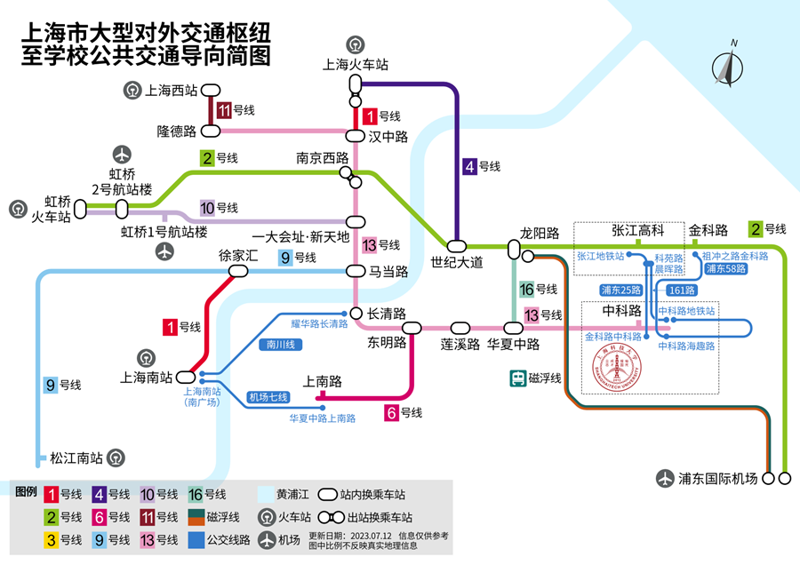

_公共交通导向简图，仅列出了下述建议方案中的出发站、换乘站与下车站_

**铁路抵达**

在获得学生证前，新生可在12306网站或车站人工窗口购买一次由家庭所在地至上海市的学生票。若在12306上购票，需将「旅客类型」选择为「学生」，并按要求在乘车前到车站售票窗口，凭录取通知书办理学生优惠资质核验，换取报销凭证后乘车。请预留充足的核验时间，并携带录取通知书乘车，以备列车工作人员检查。

- 上海虹桥站：

  - 地铁10号线往基隆路方向，至一大会址·新天地站换乘13号线往张江路方向，至中科路站下车。【预计车程1小时20分钟，票价6元】
  - 机场联络线往浦东1号2号航站楼方向，至康桥东站下车。【预计车程23分钟，票价17元】随后可乘坐浦东25路（末班车20:05），至金科路中科路站下车。【预计车程29分钟，票价2元】或打车【预计车程9分钟，4.6公里】
  - Tips:
    对于小号站台到达的乘客，就近根据指引前往虹桥2号航站楼乘坐地铁距离更近且客流较少，但缺点在于会没有座位。

- 上海站：

  - 南广场：地铁1号线往莘庄方向，至汉中路站换乘13号线往张江路方向，至中科路站下车。【预计车程50分钟，票价4元】

  - 北广场：可从地下通道至南广场乘车；或乘坐4号线内圈（开往宝山路）方向，至世纪大道站换乘2号线浦东国际机场方向，至张江高科站，由5号口换乘浦东25路（末班车20:05），至金科路中科路站下车，或至金科路站，由3号口换乘浦东58路（末班车22:55），至中科路海趣路站下车。【预计车程1小时20分钟，票价共计6元（使用交通卡可优惠至5元）】

  - Tips:
    强烈建议根据站内指示由南广场、1号线方向出站，仅需换乘一次即可到达学校，方便快捷。上海火车站的1号线和3、4号线的车站区域是分离的，购买单程票的旅客需要出站后重新购票才可在1号线和3、4号线之间换乘，使用交通卡的旅客可以在出站后30分钟之内进行换乘。3、4号线在上海火车站共线运行，请留意电视、广播及列车车身上的提示信息，选择4号线内圈（开往宝山路）乘坐。

- 上海南站：

  - 公交轨道交通混合方案：可前往南广场公交站（市区方向），乘坐机场七线（发车间隔约20分钟，末班车21:30）往浦东国际机场方向，至华夏西路上南路站，换乘至6号线上南路站，乘坐往港城路方向的列车，至东明路站换乘13号线往张江路方向，至中科路站下车。【预计车程1小时，票价8元（机场线不参与交通卡换乘优惠）。本方案中机场七线车辆自带行李架，且下车后可直接搭乘无障碍电梯抵达地铁站厅，非常适合携带大件行李的同学】

  - 轨道交通：地铁1号线往富锦路方向，至徐家汇站换乘9号线往曹路方向，至马当路换乘13号线往张江路方向，至中科路站下车。【预计车程1小时15分钟，票价5元】

  - 公交轨道交通混合方案2：可前往南广场公交站（市郊方向），乘坐南川线公交车（末班车21:00）往华戴路川环南路方向，至耀华路长清路站，换乘至地铁13号线长清路站，乘坐往张江路方向的列车，至中科路站下车。【预计车程1小时30分钟，票价共计6元（使用交通卡可优惠至5元）】

  - 上海西站：地铁11号线往迪士尼方向，至隆德路站换乘13号线往张江路方向，至中科路站下车。【预计车程1小时30分钟，票价5元】

**飞机抵达**

- 虹桥国际机场：地铁10号线往基隆路方向，至一大会址·新天地站换乘13号线往张江路方向，至中科路站下车【预计车程1小时20分钟，票价6元】或机场联络线往浦东1号2号航站楼方向，至康桥东站下车。【预计车程23分钟，票价17元】随后可乘坐浦东25路（末班车20:05），至金科路中科路站下车。【预计车程29分钟，票价2元】或打车【预计车程9分钟，4.6公里】

- 浦东国际机场：

  - 轨道交通：地铁2号线往徐泾东方向，至张江高科站，由5号口换乘浦东25路（末班车20:05），至金科路中科路站下车，或至金科路站，由3号口换乘浦东58路（末班车22:55），至中科路海趣路站下车。【预计车程1小时20分钟，票价共计7元（使用交通卡可优惠至6元）】

  - 磁浮+地铁：磁浮至龙阳路站，换乘16号线往滴水湖方向，至华夏中路站换乘13号线往张江路方向，至中科路站下车[。]()【预计车程[45]()分钟，票价共计54元（使用交通卡或凭当日机票优惠价格为44元）[。目前磁浮发车间隔约为20分钟，运行速度为300km/h]()】

- 机场联络线：往虹桥2号航站楼方向，至康桥东站下车。【预计车程13分钟，票价10元】随后可乘坐浦东25路（末班车20:05），至金科路中科路站下车。【预计车程29分钟，票价2元】或打车【预计车程9分钟，4.6公里】

**出租车**

请注意：有不少打车软件会将海科路100号门（目前为高研院）或华夏中路393号门等作为上海科技大学的默认地址，这些地址距离生活区有一定距离，推荐将地址改为中科路1号（上海科技大学东门或学生宿舍）或环科路199号（有时也称东南门、教授公寓1号门）。

参考价格：

- 由虹桥枢纽（虹桥火车站、虹桥机场） 140元

- 由上海火车站 85元

- 由上海南站 70元

- 由浦东国际机场 85元

- 由金科路地铁站
  15元（1号口一出站就能看到出租车停靠点，但由于需要绕路掉头，在此处乘车车费会多两元左右。亦可由4号口出站后打车）

**共享单车**

学校附近有各种品牌的共享单车可供选择，如需前往2号线沿线，可由中科路门出，沿金科路一路北上至祖冲之路，即可到达2号线金科路站。如果想追求最近的路程，你可以由地铁华夏中路站1号口出站，沿旁边的道路向东可直接到达学校西门，如此亦可以避免骑车爬上坡度较陡的川杨河桥。

请注意，上海科技大学张江校区目前不允许共享单车入校，故请在校门口规范停放。

关于校内非机动车管理的规定，请参阅：<https://openinfo.shanghaitech.edu.cn/2019/1028/c127a45915/page.htm>

**自驾车**

上海部分路段对悬挂外地号牌、外地临时号牌、郊区号牌（沪C）及实习期驾驶员驾驶的机动车有限制通行的措施，详见本节最后两段“沪C号牌限行”和“外省市号牌与实习期驾驶员限行”。在周六、周日和全体公民放假日，外地号牌及实习期驾驶员在高架、内环地面均不限行，但包括外地临时号牌、郊区号牌在内的部分限行措施是不分工作日休息日、全天执行的。

自驾车设置导航定位点时，请优先设置中科路1号（或上海科技大学东门、学生宿舍等，注意实际地址），若没有相应导航点，可先搜寻中科路地铁站或金科路/中科路路口。

如果需要办理自驾车停车证，请咨询公共服务处了解相关内容。

#### _上海公共交通卡_

_官方网站：_[上海公共交通卡](http://www.sptcc.com/index.html)

需要办理上海公共交通卡的同学可以前往上海各地铁站的交通卡服务中心或交通卡自助服务设备办理。普通卡押金20元，退卡时退还余额和押金（自助机仅可办理余额小于10元的押金卡退卡业务；不是所有服务中心都可以办理退卡业务，余额大于10元时需扣去5%的服务费）；同时亦有卡面多样的纪念卡出售，此类卡不可办理退卡业务。

上海目前在发行使用的公共交通卡主要分为以下两种：

- 目前主要发行带有「交通联合 China T-Union」字样的红色交通卡。除上海市内使用外，还可在全国300余所支持交通联合的城市使用，是否享受优惠政策由当地决定。

- 紫色交通卡（老卡）可适用于以下城市的公共交通服务，但不享受任何使用地的优惠：太仓（公交）、金华（公交）、宜兴（公交）、宁波（公交）、绍兴（公交）、湖州（公交）、台州（公交）、常熟（公交）、昆山（公交）、江阴（公交）、淮安（公交）、启东、无锡（公交）、南通（公交）、泰州（公交）、长兴（公交）、舟山（公交）、嘉兴（公交）、义乌（公交）、温州（公交、轮渡）。

苹果、小米、华为、三星、拉卡拉部分型号均有绑定手机/智能手环的空发卡，可直接在手机/手表
App
端开卡使用、充值，刷NFC感应区域即可用卡。手机等智能设备开通的交通卡功能与对应颜色的实体卡相同，且诸多品牌开卡是无需服务费的。但请注意虚拟卡对公交、地铁、轮渡以外的场景支持和实体卡可能略有不同，例如Apple
Pay的红色交通联合卡不支持松江有轨电车、奉浦快线BRT、出租等极个别场景。

上海公共交通卡官方提供智能手机应用，在应用中你可以进行余额查询等操作，下载地址如下：

- _iOS：_<https://itunes.apple.com/cn/app/shang-hai-jiao-tong-ka-guan/id910068158>

- _Android：_<http://online.sptcc.com:8080/handapp_update/sptcc2.apk>

使用交通卡乘坐地铁，在需要出站换乘的地铁站（如上海火车站、虹桥2号航站楼、南京西路、长清路[等]()）可在出站后30分钟内换乘其他线路，里程[、票价]()连续计算。

上海本地发行的公共交通卡的使用优惠：

- 使用公共交通卡乘坐地铁或地面公交（机场专线、旅游专线除外）的乘客，在刷卡（地铁以出站计）后2小时内换乘其他公共交通服务时可减免1元，但地铁出站后再次进站除外。例如，从金科路地铁站出站后2小时内乘坐浦东58路，用交通卡的话就可免去1元。

- 每个自然月内乘坐地铁消费满70元后，当月内乘坐地铁享受9折优惠票价。

- 使用交通卡乘坐磁浮列车可享受单程40元的优惠票价。

- 使用交通卡乘坐轮渡，当日内从第2笔交易开始享受原票价减免1元的优惠。

需要注意的是，上海公共交通卡无针对学生的任何特殊优惠。交通卡不记名，无挂失服务，因此请妥善保管。

交通卡充值：可前往部分仍支持充值交通卡的地铁服务中心，地铁站内终端机（支持支付宝和银联卡），带有NFC功能手机使用上海交通卡APP、部分便利店（校内没有）。

此外，其他城市发行的、卡面带有「交通联合 China T-Union」字样的卡也可在上海的公交、地铁、轮渡使用，但异地发行的交联卡不享受上述本地交通卡的优惠政策，不支持透支，不可在上海进行充值、退卡、坏卡维修等业务。

建议给交通卡做上特殊标记，以免乘坐出租车时被出租司机掉包。

#### _二维码乘车_

“微信”App、“上海交通卡”App以及“云闪付”App端内的“上海公共交通乘车码”均可在上海市地面公交、地铁、轮渡、金山铁路、松江有轨电车等场景“一码通行”，并享受2小时内换乘地铁与公交、或公交与公交立减1元的票价优惠。开通方法可参照“上海公共交通卡”微信公众号的这篇[文章](https://mp.weixin.qq.com/s/g8xuPCYHmizpxzlcC09vnA)。

上海地铁可使用“Metro 大都会”APP或小程序扫码乘车，并可出站换乘。Metro 大都会使用蓝牙来和闸机交换数据，因而需要手机开启蓝牙，且可能不支持部分机型，详见 APP 内的说明。

此外，北京、广州、重庆、南京、苏州、无锡、徐州、常州、杭州、宁波、温州、合肥、青岛、厦门、兰州的地铁二维码APP也内置有上海地铁的乘车码，使用方式、注意事项与 Metro 大都会相同，但可能不享受上海本地的优惠。Metro 大都会也内置上述城市的乘车码，可在当地轨道交通使用，但也可能不享受当地的优惠。

使用二维码乘车可享受上述交通卡的大部分优惠，有时会有交通卡没有的优惠活动。为提高效率，请提前打开二维码界面，扫描二维码时需与摄像头保持一定距离。如果手机带有NFC功能，且支持上海公交卡，建议使用NFC公交卡而不是二维码。

#### _出租车_

上海市市区出租车基础运价：

- 起步价14元（含3千米或15分钟等候）（途安车型起步价16元）
- 行驶里程在3千米至15千米的部分，每千米2.7元
- 行驶里程超出15千米后，每千米3.8元
- 低速行驶（车速低于12 km/h）时，每4分钟记1.5千米。当遇到堵车以至于车辆连续15分钟没有移动时，可要求司机暂停计价器。
- 夜间（每日23:00至次日5:00）行驶加收30%夜间费
- 电话订车每次加收4元电调费（使用网约车App预约车辆暂时免收）
- 重大节假日附加费：春节长假期间附加费10元/单，国庆节长假及劳动节（五一小长假）期间附加费5元/单

另外，在上述基础上采取“基准运价±浮动幅度”模式：

- 工作日7点至10点、16点至19点，符合条件的市域巡游出租汽车经营者可自主选择运价上浮5%
- 工作日10点至16点，符合条件的市域巡游出租汽车经营者可自主选择运价下浮5%
- 其他时段运价不浮动

上科大周边也有沪C牌照、橘色涂装的郊区出租车，起步价12元。如有需要进入市区请不要乘坐郊区出租车，详见“沪C号牌限行”章节。请养成索要小票收据的习惯，一旦掉落物品方便找回。

#### _沪C号牌限行_

沪C号牌（即郊区牌照）**全天**禁止在以下路段通行：

- 中环路（杨高南路立交桥至华夏高架路）

- 华夏高架路

- 外环隧道（含两侧地面泰和路）—S20外环高速（外环隧道以西至杨高南路立交桥，含两侧地面泰和路、泰和西路至顾太路）—杨高南路—龙阳路立交—龙阳路—龙东大道—金桥路—金桥立交桥—杨高中路—杨高北路—杨高北一路及长江边线、黄浦江边线所围合的区域（含上述道路）

下图所示（包含边界）即为限行范围。学校张江校区的位置不属于该限行范围。沪C牌照的出租车同样不得驶入限行范围。

#### _外省市号牌与实习期驾驶员限行_

**高架限行：**每日7-20时（周六、周日和全体公民放假日除外），以下道路禁止**外地牌照小客车、临时号牌小客车、实习期驾驶员驾驶的小客车**通行：

- 延安高架路（S20外环高速以东段）

- 南北高架路（呼玛路至鲁班立交段）

- 逸仙高架路（全线）

- 沪闵高架路（全线）

- 中环路（全线）

- 华夏高架路（全线）

- 罗山高架路（全线）

- 度假区高架路（中环路至秀浦路段）

- 内环高架路（含南浦大桥，除内圈中山北二路入口至锦绣路出口、外圈锦绣路入口至黄兴路出口以外的路段）

- 龙东高架路（罗山路至中环路段）

- 虹梅高架路（中环路至S20外环高速段）

- 北翟路地道

- 延安东路隧道

下图所示的红线即为限行路段。学校附近的罗山高架路、中环路均属于该限行范围，由外地驾车前来或考取了驾照但仍处在实习期同学，请注意相关限行规定。

**内环限行：**每日7-9时、17-19时（周六、周日和全体公民放假日除外），以下路段禁止**外地牌照小客车**通行：

杨浦大桥地面投影—宁国路—黄兴路—中山北二路—中山北一路—中山北路—中山西路—中山南二路—中山南一路—中山南路—南浦大桥地面投影—龙阳路—罗山路合围区域内的道路（不含上述道路）

下图所示（不含最外侧红圈）即为限行范围。学校张江校区的位置不属于该限行范围。

**外地临牌限行：**使用外省市公安机关核发的临时机动车号牌的机动车，全天禁止在外环线（含）以内行驶。学校的位置属于该限行范围。

## 服务网点

### 购物

校内有全家便利店，可以满足大部分生活需求且24小时营业，但价格略贵。如需购买其他物品，可选择网购，或去位于金科路地铁站2号口的欧尚超市批量补充生活用品。

### 邮政

校内设有快递服务中心（菜鸟驿站）和上海科技大学京东派，所有寄往学生公寓的快件均会集中在快递服务中心等待领取。快递服务中心代收发中国邮政，顺丰、中通、德邦、百事等主流国内物流公司，以及TNT、FedEx等国际物流公司的快件；京东派则承担京东自营商品和京东物流的收发服务。

快递服务中心包括室内的货架与室外的自提柜，对于前者会收到诸如XX-X-XXXX格式的取件码，而后者的短信提示则通常包含自提柜编号和一个六位数取件码。包括京东在内，所有室内的快件在取走时均需要扫描支付宝或菜鸟APP中的身份码，以避免冒领或丢失的情况。

校内学生公寓地址格式：

_上海市浦东新区中科路1号学生公寓×号楼×××室 ×××收_

_邮政编码：201210_

快递服务中心室内部分通常开放至晚上20:00，20:00后至24:00无人值守自助取件，双十一等快件高峰期会有所延长；室外自提柜则是24小时开放。需要注意的是，快件逾期未领将可能被移至滞留仓库或被退回，前者可能需要电话预约才能领取。**今年可能不接受正式开学前的邮递行李**，若有需要邮递的行李，请在9月正式开学前后寄来。

快递服务中心电话：20684440

我校附近（3km内）暂无中国邮政营业网点，如需寄递信函或包裹（如挂号信、挂号印刷品或国内、国际包裹），学校附近有位于春晓路/科苑路路口的春晓路邮政支局（周一-周五9：00-16：30），由中科路门外乘坐浦东25路至科苑路晨晖路站下车步行5分钟即到。周末可前往位于军民路26号的孙桥邮政所（周一-周日8：00-11：30，12：30-16：00），由华夏中路金科路站乘坐南川线至华夏中路张江路下车，步行5-10分钟可达；亦可骑车前往。**此外，出发前请务必携带好实体身份证！！！**

### 医疗

校医务室地址：校园服务中心101室，联系电话：021-20685120，邮箱：clinic@shanghaitech.edu.cn。建议非紧急情况不要拨打电话，而是发邮件询问。

学校到上海中医药大学附属曙光医院（东院）仅2公里，可步行前往，或乘坐浦东58路往祖冲之路金科路方向、浦东25路往张江地铁站方向，至张衡路科苑路站下车即可到达。危急情况下，若身体严重不适，请及时与宿管联系，以安排车辆前往医院。

关于医疗保险覆盖范围、转诊/报销要求等细节问题，请参阅[大学生医保制度及学校相关管理办法](https://openinfo.shanghaitech.edu.cn/130/list.htm)，或咨询医务室。学校开学前也会开展相关讲座具体告知。

如需自行购买非处方药，附近的零售药房有：

- 好药师大药房（华佗路店）：华佗路536号，上海中医药大学附近，价格较贵。

- 普安药房（汇智店/万科店）：前者在金科路地铁站汇智国际商业中心1楼南入口，后者在万科翡翠公园荣科路312号。

- 益丰大药房：张江盛荣路188弄4号，盛大天地青春里附近。

除此之外，急用非处方药可以通过美团购买；对于不太急用的药品，可以使用京东大药房等在线服务，优惠省事。

### 运动

体育馆内目前开放健身房等设施。羽毛球场、舞蹈房等需要预约。体育馆关门时间为晚上22:00。

现有篮球场、网球场、排球场（露天）长期开放，由于离宿舍较近也请不要运动太晚以免扰民。晚上22:30将会熄灭户外灯光。

会议中心旁边的游泳馆环境良好，设施先进。截止手册编写时，学生凭校园卡每次费用为20元（非夏季）或24元（夏季），且每学期凭校园卡会有6次免费体验次数，教职员工及未成年子女30/36元，教职员工成年家属或校内其他人员50/60元，亦可办理10次卡、月卡或年度会员以获得一定优惠。除体育课中的游泳课外，游泳馆也会开展收费的游泳培训。游泳馆营业时间以游泳馆通知为准。

### 文印

学校图书馆内有打印机可供师生使用。Windows 用户可以使用图书馆的打印软件（下载地址：<https://software.shanghaitech.edu.cn/#/softdetail?id=83>）在自己电脑上输出文件后到图书馆一楼东侧的文印室刷校园卡输出打印。其它操作系统的用户同学，可以使用设在文印室内的公共电脑输出打印。初次使用需要按照说明进行注册，双面打印、彩色打印等设置在系统打印对话框内调整即可。黑白打印价格为0.08元/面，彩色打印价格为0.8元/面。复印（尤其是身份证、学生证等）可参考墙壁上的操作提示进行操作，价格同打印。亦可携带支持格式的U盘到打印机上进行扫描，目前免费。

同时，有的同学也在宿舍内购买安装了打印机，也可以私下联系宿舍内的同学打印。

校外周边也有一些文印店，比如位于学校东门外的和舒图文快印、蔡伦路和华佗路交界口处的辉旋图文打印店（蔡伦路1378号附近）等，如果需要打印大量高质量彩色的图文，或有特殊印刷需求的可以尝试前往，并记得索要发票用于报销。

### 理发

校内：

- 理发店：位于学校丝路餐厅隔壁，使用一卡通剪发可享受优惠价30元，烫染不享受优惠。

校外：

- 佑米造型（绿地店）：海趣路218号绿地3号办公楼1层。

- V-LOOK：绿地缤纷广场4楼（电影院楼上），人均消费较高。

- 桔剪（万科翡翠店）：荣科路280号万科翡翠商场4层。

- 紫尚造型（原学城理发张江店）：蔡伦路1378号上海中医药大学附近。

- 侘寂形象（原文艺酷剪张江店）：蔡伦路1371号上海中医药大学附近。

- 星客多快剪（张江店/长泰广场店）：前者在金科路地铁站欧尚超市入口处，后者在长泰广场西区B1层。

## 安全

无论何时何地，同学们都需要注意自身安全。

河边戏水有危险！赛艇也不行！

大学不同于中学的封闭性，校园内会有很多校外人员出入，所以一定要注意保管好自己的财物。不要用手机、电脑、钱包（带钱带证的）等贵重物品占座！

你们可能在新生讲座的时候见到一个发熊（玩具）的警察怪蜀黍，他就是上海公安高校派出所的民（xióng）警，他会加进本科生群，一旦发现什么风吹草动等可疑的事情发生，请及时联系他。孙桥派出所的联系电话为58570402。

宿舍内不允许使用电饭锅，电磁炉，电吹风，电热器等用电设施，具体内容可以翻阅学生手册。由于我们的宿舍装修从床到地板皆为木制结构（来自新西兰的上好原木），为了自己和他人的安全，请不要怀有侥幸心理。

周边外卖时有传出腹泻，急性肠胃炎等新闻，所以点外卖前请尽量三思。

校内装有多台AED设备，但更要注意自己的身体健康，毕竟这东西还是永远不要用上的好。（题外话，可以利用空余时间学习一下基本的急救技能，上海市红十字会即开展包括AED使用在内的培训，通过其公众号即可报名）

偶尔会有校外人员混进宿舍楼，假装自己是学长学姐，这种时候请不要犹豫直接叫保安，如遇其他可疑人员也请及时通知宿管和保安。

校园木制家具较多，尤其是宿舍楼，校内不允许任何明火操作，诸如用酒精灯吃火锅，用酒精喷灯做烧烤的事情请不要尝试。也请不要在宿舍楼使用电烙铁，或是存放危化品、放射源等。

上科大寝室禁止外人留宿。无论父母、亲属、朋友、男女朋友等皆不允许，请勿挑战规则底线。

尽管上科大已经配备了较高标准的实验设施，但实验室安全更要靠每一个人对实验室安全管理的熟悉了解和细心遵守。2015年12月15日免化所细胞房火灾、2016年6月23日物质学院化学实验室爆炸等事故教训警钟长鸣。实验前务必仔细分析操作流程、熟记应急措施。一定要严格遵守实验规程！严格遵守实验规程！严格遵守实验规程！

# 常用信息

## 学校部门

可见：<http://www.shanghaitech.edu.cn/jgsz/list.htm>

### 与学生密切相关的部门

**格式：**名称（办公地点）：部分有关职能； @shanghaitech.edu.cn 的邮件地址

- 学生事务处（学生活动中心东侧4楼）：奖助贷勤、团学组织与活动，就业与生涯发展，校友工作，学生事务办理；studentaffairs@

- 书院（学生活动中心东侧4楼）：党团事务、本科生事务、科创与拓展中心、文化与学术中心、心灵与健康中心、管理与发展中心、艺术与体育中心；life@

- 教务处（行政中心103）：本科日常教学事务，学籍、教务、课程运行、教学评估、奖助、学籍、学业证明、排名证明、培养方案；asa@、education@、studyabroad@（国际交流）；

- 研究生院（行政中心104）：研究生招生录取、培养过程、学籍与奖助、学位授予等管理与服务工作。

  _注：打印成绩单和在读证明可至教学中心一层大厅的自助打印终端，无需前往教务处人工办理。排名证明仍需前往教务处办理，详见Egate上相关模块的说明。_

- 本科招生办公室（行政中心105）本科生招生、录取相关事务；admission@

- 校园服务中心（食堂河西侧）公共服务处：园区物业、食堂、户籍证明、校园一卡通、医疗保险；ogs@、clinic@（医务室）

  _注：被困电梯、寝室报修等事宜可直接拨打校园服务中心电话20685112；紧急状况需要医疗处置，可拨打医务室电话20685120。这两个电话均24小时有人值守，当然非紧急的事情就尽量不要半夜麻烦工作人员了。_

- 图书信息中心：图书馆一楼助管处或前台。电话：20685191。图书馆、数据库、软件正版化、信息基础建设、文印设施与服务；library@（图书馆）、it@
  it-support@（IT服务）

- 宿舍事务：各宿舍一楼管理部。电话：206855XX（备注：电话中 XX 为宿舍楼号，例如
  5 号楼=20685505，10 号楼=20685510）

### 学生不太接触的部门

综合办公室、校长办公室、科技发展处、国际事务处、人力资源处、财务处、基建管理中心、设备与资产处、技术转移办公室、环境安全与健康处

## 常用网站

### 校内常用网站

上科大官方以及诸多同学和社团都开办了很多网站服务，从基本的校园信息查询到学术交流，再到学生社交，全方位为大家提供丰富的在线体验。

- 学校官网：<https://www.shanghaitech.edu.cn>
- 学校邮箱：<https://mail.shanghaitech.edu.cn>
- 教务处：<https://oaa.shanghaitech.edu.cn/>
- 书院：<https://life.shanghaitech.edu.cn/>
- 校园服务平台Egate: <https://egate.shanghaitech.edu.cn/>
- 图书馆电子数据库目录: <https://library.shanghaitech.edu.cn/>
- 信息公开网：[https://openinfo.shanghaitech.edu.cn](https://openinfo.shanghaitech.edu.cn/)
- 活动成就签到系统：<https://grade.geekpie.club>
- `CourseBench` 评课社区：<https://coursebench.geekpie.club/>
- 开源镜像站：https://mirrors.shanghaitech.edu.cn/
- 教学管理系统：https://eams.shanghaitech.edu.cn/
- 上科大云盘：<http://pan.shanghaitech.edu.cn> （仅限校内访问）
- 上海科技大学知识管理系统（KMS）：https://kms.shanghaitech.edu.cn/

### 常用站点

- Google <https://www.google.com/>

- Wikipedia <https://www.wikipedia.org/>

- Coursera <https://www.coursera.org/>

- Piazza <https://piazza.com/>

- GradeScope <https://gradescope.com>

- LinkedIn <https://www.linkedin.com/>

- YouTube <https://www.youtube.com/>

- StackOverFlow <https://stackoverflow.com/>

- AllAboutCircuits <http://www.allaboutcircuits.com/>

- 网易公开课 <http://open.163.com/>

- 中国知网 <https://www.cnki.net/>

- WolframAlpha <https://www.wolframalpha.com/>

- arXiv <https://arxiv.org/>

- GitHub <https://github.com/>

- BiliBili <https://www.bilibili.com>

- CS自学指南 https://csdiy.wiki/

- 中国大学MOOC https://www.icourse163.org/
- 国家哲学社会科学文献中心 http://www.ncpssd.org/
- Sci-Hub http://www.sci-hub.ren/

（以上部分网站需要某些你懂我懂大家都懂的技巧，请自行解决）

## 生活类群

- 上海科技大学快递查询QQ群 254475947
- ShanghaiTech\_跳蚤市场 QQ群 454575836
- 上科大志愿者协会总群 QQ群 700279295
- 各类漫展资讯以及组团 QQ群 636457802
- 嘤一點點（奶茶拼zhang单biao群） QQ群 589096801
- 上科大本科选课互助群 QQ群 149880852
- shanghaitech-文具交流群 QQ群 498963277
- 上科player QQ群 564992681
- Surface-Tech QQ群（说是Surface群，其实是Microsoft产品讨论群） 316617658
- ShanghaiMac QQ群（说是Mac群，其实是Apple产品讨论群） 364738521
- Nintendo Power QQ群 273215657 （任天堂主机以及游戏交流群）
- 上科大狼人杀群 QQ群 878796656
- 并没有什么人的音游群 QQ群 490059120
- ShanghaiTech Outing Club QQ群 112149009
- 上科大电影交流群 490185602
- 健忘者互助协会 QQ群 134522949
- 上科神秘小猫咪 QQ群 1060985286
- 上科大琴房群 QQ群 796937432
- 非正式桌游社 QQ群 894629762
- 上科大科幻爱好者 QQ群 123437506
- SIST
  Slack:https://join.slack.com/t/shanghaitech-sist/shared_invite/zt-91yp1eeb-dMT5sXyuxDWQXJzBUGwrgg

## 技巧经验

### WiFi 配置指南

- ShanghaiTech

  - 账号:学号
  - 密码:统一身份认证密码（egate密码）

- eduroam

  - 账号:学号@shanghaitech.edu.cn
  - 密码:统一身份认证密码（egate密码）

- ShanghaiTech-Guest
  - 账号:学号
  - 密码:统一身份认证密码（egate密码）
- 有线网认证
  - 账号:学号
  - 密码:统一身份认证密码（egate密码）

有线网有时不能及时弹出认证界面，可在浏览器中输192.168.0.2进行认证

学校提供几乎完全覆盖校内的 WiFi 信号，学校在室内已经基本全范围覆盖 SSID（名称） 为 `ShanghaiTech`、`ShanghaiTech-Guest` 和 `eduroam` 。其中 `eduroam` 能够让你在国内外上千个其它教育科研机构（例如中科大、加州大学伯克利分校以及中科院各研究所）使用上科大的上网账号访问互联网。

有关网络的更多信息，请访问：

**图书信息中心：**https://it.shanghaitech.edu.cn/wlfw/list.htm
**7\*24小时服务热线：**021-20685566
**无线网络接入指南：**https://it.shanghaitech.edu.cn/2021/0423/c8423a63174/page.htm
**有线网络接入指南：**
https://it.shanghaitech.edu.cn/2021/0423/c8423a63173/page.htm
**无线eduroam接入指南：**https://it.shanghaitech.edu.cn/2021/0423/c8423a63182/page.htm

### 校园邮箱各客户端配置指南

在 [https://mail.shanghaitech.edu.cn](https://mail.shanghaitech.edu.cn) 最上方的[帮助中心](https://mail.shanghaitech.edu.cn/coremail/help/index_zh_CN.jsp)里可见详细的配置指南。

邮箱客户端的初次同步耗时一般都不短，需要耐心等待。

为安全起见，学校邮箱有密码错误登录次数限制，多次输错密码会被后台锁定，在配置邮箱的时候需要尤为注意，小心手抖哦。

如果你在正常使用过程中收到密码错误登录失败的提示，不必惊慌，一般30分钟内会自动恢复，恢复不了再慌。

近期有钓鱼邮件攻击，谨慎点击邮件中的连接。

推荐同学们在假期学习一下邮件书写格式，以及养成定期查阅邮箱的好习惯。上科大的日常信息大多通过邮件形式推送，日常与教授之间的交流更多的也是邮件的形式，今后走上工作岗位也用处颇多。望各位同学利用好这一资源。（这句话应该讲三遍！）

客户端配置请参考帮助中心的 [客户端设置](https://mail.shanghaitech.edu.cn/coremail/help/clientoption_zh_CN.jsp)。

### 校园VPN使用指南

请参阅[电子资源校外访问指南](http://library.shanghaitech.edu.cn/4032/list.htm)。在Windows和Linux下也可使用与macOS
10.12及以上版本相同的L2TP/IPSec协议进行配置，以免去安装软件的繁杂。

使用学校VPN的目的是为了访问学校内网资源，或利用学校已经购买、需要校园网IP使用的数据库。在校外通过VPN系统访问电子资源过程中，请大家注意合理使用电子资源，相关规定请参见[数字文献信息资源合理使用公告](https://library.shanghaitech.edu.cn/2017/0321/c4049a30945/page.htm)。

### 身份证过期/遗失补办指南

1.  自行前往教学中心或校园服务中心的一体机上打印学籍证明。

2.  前往校园服务中心开具户籍证明。

3.  带好学生证复印件。

4.  前往**孙桥**派出所，可在民警的帮助下先拍好照，再取号办理补办手续。

5.  办证预计需要一个月时间，派出所周日休息，请选择工作时间前往。

学生证因保管不善而损坏或因发生学籍异动确实须更换的，登录上海科技大学校园服务平台“学生证”模块进行申请，审批通过后，携本人一寸照片及“学生证办理申请表”打印件，到学生活动中心4楼学生事务处办公室办理。其他信息可查看《上海科技大学学生证管理办法》。

校园卡/银行卡/一卡通补办请先在egate上挂失后在工作时间携带身份证至上海银行。

# 相关

## 关于

上海科技大学 新生手册

主办：上海科技大学学生会

技术支持：上海科技大学学生Geek Pie社团

_代码开源：_[GitHub](https://github.com/ShanghaitechGeekPie/fresh)

### 贡献者

#### _Content_

感谢以下同学参与本新生手册的撰写工作（排名不分先后，也遗漏了许多不留名的红领巾）

吕文涛 ◇ 郑纬彤 ◇ 石嘉禾 ◇ 赵尚书 ◇ 林东吴

王娇娇 ◇ 吉星宇 ◇ 刘心哲 ◇ 陶之钰 ◇ 张 尧

陈益帆 ◇ 宗 骏 ◇ 崔振宇 ◇ 邵乾瀚 ◇ 陈 宸

周则安 ◇ 周胡蝶 ◇ 丁 鹏 ◇ 刘宇翔 ◇ 林子恒

李振扬 ◇ 赵亚妮 ◇ 覃 昕 ◇ 谢佳轩 ◇ 袁蕴哲

王粱宇 ◇ 李俊蓉 ◇ 张崔政 ◇ 荣宇阳 ◇ 张嘉鑫

李鼎弘 ◇ 李逸柯 ◇ 尹毅明 ◇ 袁可一 ◇ 罗 放

唐一丰 ◇ 张子睿 ◇ 蒋承越 ◇ 蒋  睿 ◇ 夏寅岑

方  雪 ◇ 罗宸麒 ◇ 姚宇清 ◇ 刁子豪 ◇ 方治欣

方舟扬 ◇ 曹锃钰 ◇ 王子卓 ◇ 王典卓 ◇ 任怡静

谢  余 ◇ 王一玮 ◇ 党浩然 ◇ 黄文昊 ◇ 隋 洋

高  翔 ◇ 顾娄艺 ◇ 文炫钧 ◇ 徐晨昊 ◇ 李嘉玥

许  至 ◇ 何靖涛 ◇ 靳若歆 ◇ 盛  宽 ◇ 张 冬

胡珞珈 ◇ 黄诗绮 ◇ 王凯维 ◇ 唐志昊

曹宇涵 ◇ 徐晨昊 ◇ 赵冠钦 ◇ 张涵锐

凌子傲 ◇ 薛尚非 ◇ 杨清宇 ◇ 王述白

周玉洁 ◇ 李梦飞 ◇ 佟润德 ◇ 陈嘉祥

周守琛 ◇ 周  莉 ◇ 李翰泽

#### _Program & Operation_

吕文涛 ◇ 夏寅岑 ◇ 张启煊 ◇ 秦斐然 ◇ 林弘扬

赵清澄 ◇ 龙鹏宇 ◇ 李翰泽

#### _Photography_

黄政嘉 ◇ 刘 勋 ◇ 毕 凝 ◇ 王佳琛 ◇ 马宇豪

#### _Acknowledgement_

_设计参考：_[浙江大学 求是潮](https://tech.zjuqsc.com/)https://tech.zjuqsc.com/)